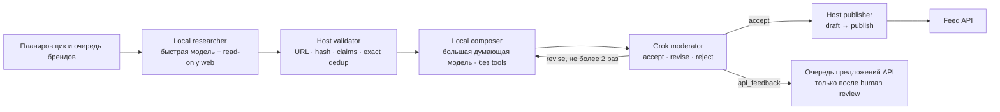

# Новостной конвейер: local GPU → Grok review → feed

> Каноническое решение оператора от 2026-07-22. Заменяет старую схему, где
> подписочная модель искала новости, а локальная модель одновременно оформляла
> и пыталась публиковать результат.

## Цель

Новостной контур должен масштабироваться на десятки брендов без расхода платных
токенов на массовый поиск, но сохранять независимую редакторскую планку.
Поэтому поиск и подготовку материала выполняют локальные модели на наших GPU, а
Grok выступает модератором уже собранной публикации и советником по развитию API.

Ни одна модель не публикует пост напрямую и не получает ключ публикации.

## Роли

### 1. Local researcher — массовый поиск

- Исполняется через OpenCode на локальных GPU.
- Использует небольшую/быструю модель и только read-only инструменты поиска.
- Предпочитает официальный сайт бренда, newsroom, документацию и release notes.
- Возвращает не статью, а `NewsCandidate`: canonical sources, факты, claims,
  даты, числовые значения, изображения-кандидаты и подсказку сообщества.
- Не получает контекст прошлых промптов, ключ публикации, shell-write и доступ к
  файловой системе сервера.

Поиск считается успешным только когда каждый существенный claim связан хотя бы
с одним источником. `no_news` — штатный результат, а не ошибка batch.

### 2. Host validator — детерминированные инварианты

До второй модели host-код:

- канонизирует URL и удаляет tracking/fragment;
- вычисляет content hash и source fingerprint;
- проверяет даты, обязательные поля и ссылки claim → source;
- выполняет exact dedup по БД;
- разрешает официальный vendor/machine community по каталогу сервера.

Модельная уверенность не заменяет эти проверки. Community из ответа модели —
только hint.

### 3. Local composer — оформление

- Исполняется большой думающей моделью на локальном GPU.
- Получает только валидированный candidate-пакет.
- Не имеет web, shell, curl, filesystem и publish tools.
- Создаёт переносимый CommonMark и закрытый набор typed blocks: source, image,
  chart и 3D model.
- Не может добавить новый факт или источник. Любая новая формулировка должна
  сохранять связь с исходными claims.

Текущая карта моделей задаётся конфигурацией runtime, а не контрактом. На старте
роль composer подходит Qwen3.6-35B-A3B с включённым reasoning; смена весов не
должна менять wire format.

### 4. Grok moderator — качество и обратная связь API

Grok не является основным ресёрчером. Он получает candidate, готовую статью,
источники и версию контракта и возвращает одно из решений:

- `accept` — материал доказан и готов к draft;
- `revise` — список evidence-linked правок для composer;
- `reject` — публикация небезопасна, устарела, дублирует другую или не доказана.

Цикл `revise → compose → moderate` ограничен двумя повторами. После лимита
результат становится `quality_rejected` или уходит человеку на разбор.

Отдельное поле `api_feedback` описывает недостающий тип блока, поле, валидацию
или инструмент. Это не команда изменения API. Предложение проходит dedup,
попадает в отдельную очередь/карточку и реализуется только после human review.

Grok может точечно перепроверить уже указанный официальный источник, но не
сканирует массово бренды и не владеет расписанием.

### 5. Host publisher — единственный писатель

- Получает только artifact с решением Grok `accept` и валидной схемой.
- Хранит `feed_ingest` key только в host env/secret seam.
- Сначала создаёт draft через `/feed/ingest`, затем отдельным идемпотентным
  действием делает его видимым.
- Проверяет публичный detail/readback, а не доверяет текстовому `success` агента.
- Никогда не публикует `example.*`, synthetic source или fixture как новость.

## Контракт и provenance

В v2 одна публикация обязана хранить раздельные runs:

| Роль | Обязательные данные |
|---|---|
| researcher | provider/model/version, prompt, run id, retrieved at, sources |
| validator | code version, canonicalization version, dedup result |
| composer | provider/model/version, prompt, run id, input hash |
| moderator | Grok model/version, run id, decision, findings, review timestamp |
| publisher | code version, idempotency key, draft id, publish/readback status |

UI может сворачивать цепочку до спокойной подписи «подготовлено агентами ·
проверено Grok», но detail должен раскрывать модели, источник и время проверки.

## Исходы и повторы

- `ready` — Grok принял, artifact прошёл host validation.
- `no_news` — свежей доказанной новости нет; rotation продолжает работу.
- `exact_duplicate` — совпал canonical source/content hash/fingerprint.
- `quality_rejected` — слабые источники, неподтверждённый claim, stale/off-topic.
- `retryable_failure` — сеть, runtime, timeout или временный 5xx; бренд не
  теряется и получает `next_attempt_at`.

Ошибка одного бренда не валит batch. `no_news`, duplicate и reject не включают
инфраструктурный alert. Метрики различают роль, brand, outcome, attempt и
duration, но не содержат prompt body и секреты.

## Границы безопасности

- Секрет публикации существует только у host publisher.
- Researcher и Grok имеют read-only внешнюю сеть; composer — tool-less.
- Никаких ключей в prompts, stdout, journal и Multica run messages.
- Появившийся в логе ключ немедленно отзывается и ротируется.
- Артефакты между стадиями проходят schema validation и content hashing.
- Запрещено искать секреты по домашним каталогам для «починки» pipeline.

## Переход с v1

`news-candidate.v1` и `normalized-news.v1` остаются читаемыми. v2 добавляется
аддитивно и становится обязательным для новых systemd runs после canary.
Старый model-driven publisher выключается только когда реальный материал прошёл
полный путь local researcher → local composer → Grok accept → draft → publish →
public readback.

Операционные карточки: MF-2052, MF-2059, MF-2060, MF-2061, MF-2062 и MF-2055.
