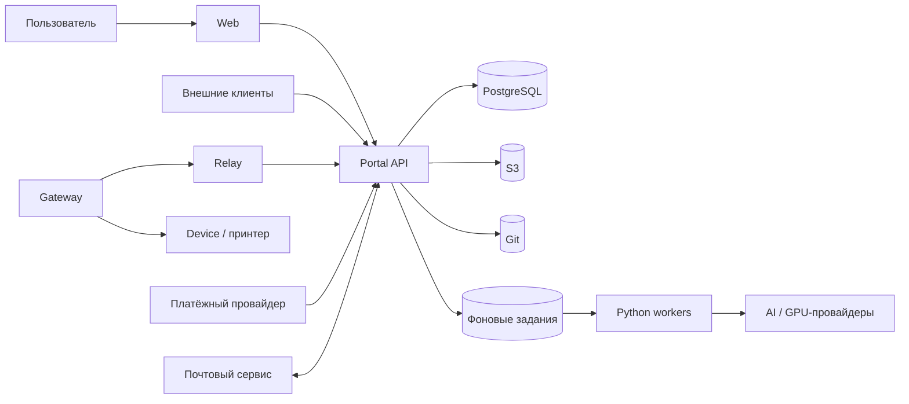
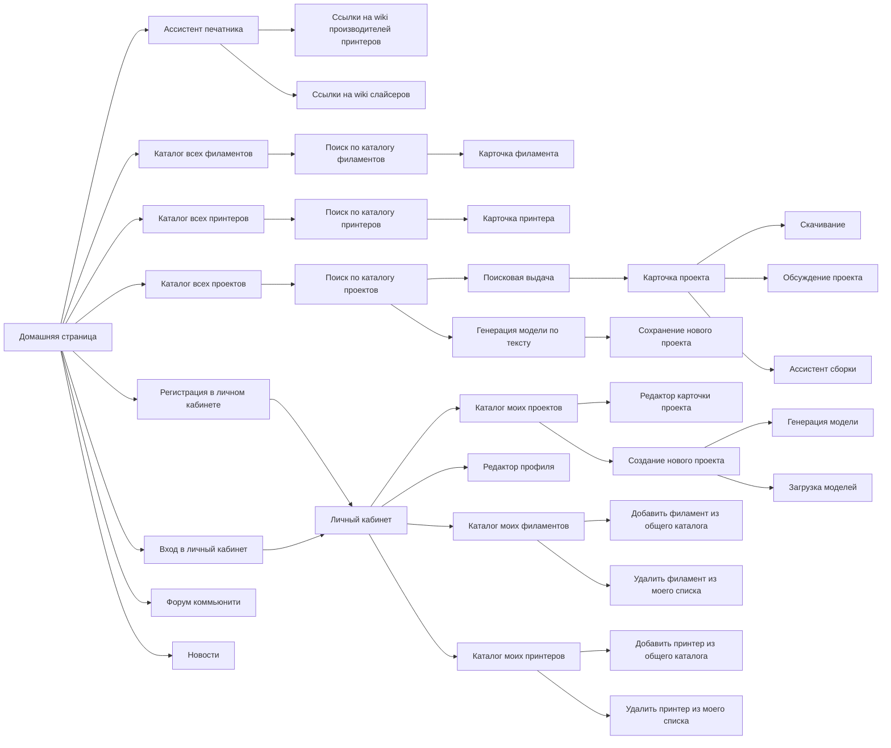
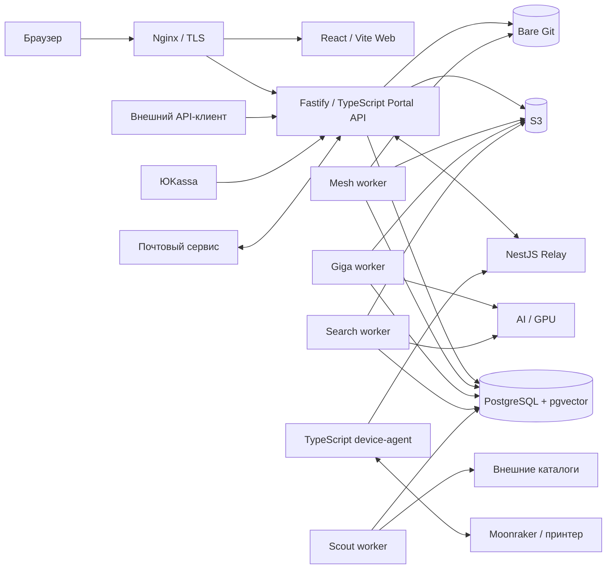
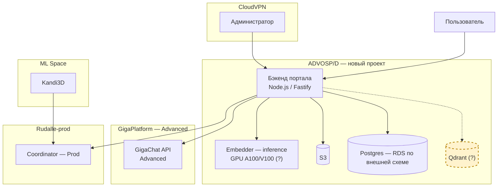
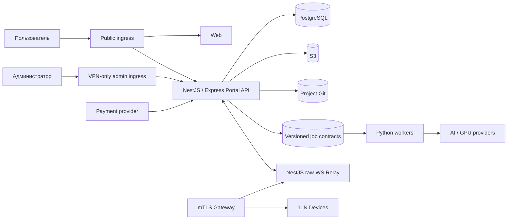

## Структура страниц

1. Обзор продукта
2. Термины и доменная модель
3. Основные пользовательские сценарии
4. Функциональные модули
5. Архитектура и взаимодействие компонентов
6. Сущности, связи и жизненные циклы
7. Интеграции
8. Доступ и безопасность
9. Открытые вопросы и расхождения

---

# 1. Обзор продукта

## Назначение

additive-ai-portal — площадка для исследования пользовательских сценариев, связанных с 3D-печатью и ИИ. Система объединяет проекты, 3D-модели, генерацию, поиск, обсуждения, сведения об устройствах и обратную связь.

Продукт используется как цифровой верстак: пользователь создаёт и публикует проект, добавляет в него готовые или сгенерированные модели, сохраняет историю изменений, обсуждает результат и получает путь от идеи до производственного артефакта. Портал также формирует продуктовые данные для оценки востребованности сценариев и качества пользовательского опыта.

## Основные возможности

- регистрация, вход и управление профилем;
- создание приватных и публикуемых проектов;
- загрузка, хранение, версионирование и просмотр 3D-моделей;
- генерация 3D-моделей по тексту и изображениям;
- выбор AI-модели или режима «Авто»;
- полнотекстовый, семантический и геометрический поиск;
- комментарии, форум и другие элементы сообщества;
- подключение локальных устройств через Gateway и Relay;
- обработка геометрии, создание превью и нарезка моделей фоновыми процессами;
- продуктовая аналитика и отдельный аудит безопасности;
- платёжные операции, включаемые независимо через capabilities.

## Пользователи

| Группа | Основная ценность |
|---|---|
| Энтузиаст или владелец 3D-принтера | Поиск, загрузка, изменение, обсуждение и подготовка модели к печати |
| Пользователь без глубокого знания 3D-инструментов | Получение понятного результата из текста или изображений |
| Автор проекта, мастер или небольшая компания | Публикация результатов, работа с аудиторией и, при включении платёжного контура, монетизация |
| Модератор или сотрудник | Модерация, управление справочниками и операции в пределах назначенных ролей |
| Внешняя система | Доступ к разрешённым операциям через версионированный API и сервисную идентификацию |

## Основные блоки системы

### Сейчас

Web реализован на React/Vite. Portal API работает на NestJS/TypeScript и является основной публичной точкой бизнес-логики. PostgreSQL хранит операционные данные и векторы поиска. S3 хранит исходные и производные файлы. Git-репозитории хранят файлы, README, манифест и историю проекта. Python-процессы выполняют обработку геометрии, генерацию, поиск и сбор внешних каталогов. Relay работает отдельным compiled NestJS process, завершает raw WSS/mTLS gateway sessions и взаимодействует с API только через typed `/internal/relay/v1/*`.

### Целевое состояние

Portal API работает на NestJS с Express adapter. `Project` является корневым агрегатом, а `Model` — дочерней 3D-сущностью. Relay остаётся отдельным stateful-компонентом, реализованным на NestJS с raw WebSocket adapter и без прямого доступа к PostgreSQL. Функции включаются типизированной capability-системой, решение о доступе вычисляется backend.

Устройства, Relay и облачная печать образуют отдельный Platform Pilot и не определяют готовность Portal V1. Платежи, выплаты и тяжёлые AI-сценарии включаются отдельно по capabilities.

## Источники

- [`docs/product/vision.md`](product/vision.md)
- [`docs/product/platform.md`](product/platform.md)
- [`docs/architecture/readme.md`](architecture/readme.md)
- [`apps/relay/readme.md`](../apps/relay/readme.md)

---

# 2. Термины и доменная модель

## Основные термины

| Термин | Определение |
|---|---|
| `User` | Пользователь системы. Сущность объединяет профиль, статус, роли, внешние и локальные способы входа, проекты, операции и пользовательские права. |
| `Project` | Корневая пользовательская сущность. Проект объединяет метаданные, настройки видимости и публикации, Git-репозиторий, инструкции, обсуждение, генерации, историю и дочерние 3D-модели. В целевой модели проект существует без загруженных моделей. |
| `ProjectRevision` | Неизменяемая версия метаданных, манифеста и конфигурации проекта, связанная с конкретным Git commit. |
| `Model` | Отдельная пользовательская 3D-модель внутри проекта. Модель описывает логическую геометрию и содержит одну или несколько ревизий. |
| `ModelRevision` | Неизменяемая версия геометрии конкретной `Model`. Ревизия фиксирует исходный файл, формат, единицы, размеры, состояние обработки и происхождение результата. |
| `GenerationOperation` | Одна операция генерации 3D-результата по тексту или изображениям. Операция хранит входы, параметры, выбранный AI-профиль, статус, provenance и связь с результатом. |
| `AIModelProfile` | Технический профиль AI-модели: capability, provider, model, version, pipeline и допустимая зона данных. Это не пользовательская 3D-модель. |
| `Gateway` | Подключаемая точка, которая устанавливает одну облачную сессию, идентифицируется индивидуальным сертификатом и обслуживает только разрешённый набор устройств. Текущая реализация использует термин `agent`/`device-agent`. |
| `Device` | Конкретное локальное устройство, например 3D-принтер. Устройство связано с Gateway, но не равно ему и не обязано иметь собственный облачный сертификат. |
| `ProductEvent` | Событие продуктовой аналитики. Оно описывает пользовательское поведение, записывается с учётом consent и использует псевдонимные идентификаторы и версионированную схему. |
| `AuditEvent` | Неизменяемый факт безопасности или значимого изменения состояния. Событие не зависит от consent продуктовой аналитики, хранится 60 дней и не содержит секретов или сырого пользовательского контента. |

## Дополнительные понятия

| Термин | Определение |
|---|---|
| `ProjectAsset` | Файл уровня проекта: инструкция, документ, изображение описания или вспомогательный материал. |
| `ModelAsset` | Файл конкретной ревизии модели: геометрия, preview, thumbnail или другой производный артефакт. |
| `GenerationInput` | Санитизированный вход генерации: текст или изображение с ролью ракурса, MIME, размерами и checksum. |
| `EmbeddingProfile` | Версионированное описание модели эмбеддингов, размерности и типа индекса. |
| `BuildSession` | Личное состояние сборки проекта конкретным пользователем. Оно не изменяет авторскую версию проекта. |
| `Capability` | Типизированное разрешение на действие, provider или payment method. Backend вычисляет итоговое состояние по окружению, роли, когорте и правилам включения. |
| `DeviceCommand` | Команда устройству с уникальным идентификатором, проверкой доступа и отдельными состояниями постановки, доставки, подтверждения и исполнения. |

## Различия, которые сохраняются во всех контрактах

### Проект и 3D-модель

`Project` описывает пользовательский результат целиком. Он хранит название, описание, публикацию, историю, инструкции и обсуждение. `Model` описывает одну геометрию внутри проекта. Удаление модели не удаляет идентичность, описание и обсуждение проекта.

### Пользовательская 3D-модель и AI-модель

`Model` является пользовательским контентом. `AIModelProfile` является технической конфигурацией генератора или модели эмбеддингов. В результате одной `GenerationOperation` AI-профиль создаёт новую пользовательскую `Model` или её ревизию.

### Gateway и принтер

`Gateway` устанавливает облачную сессию и предъявляет сертификат. `Device` является локальным принтером. Один Gateway может обслуживать несколько разрешённых устройств, а проверка binding предотвращает доступ к чужому устройству.

### Продуктовая аналитика и аудит безопасности

`ProductEvent` отвечает на вопросы о пользовательских путях и качестве продукта. `AuditEvent` фиксирует значимые действия и результаты проверок доступа. Ошибка продуктовой аналитики не отменяет пользовательскую операцию. Ошибка обязательной audit-записи обрабатывается по контракту атомарности доменной операции.

## Сейчас

Таблица `models` объединяет project-level и geometry-level данные. `project_revisions` является кэшем манифеста для legacy `model_id`, генерации принадлежат пользователю, а эмбеддинги привязаны к `model_id`, а не к отдельной ревизии. Термины `Project`, `Model` и `ModelRevision` в текущей физической схеме не полностью разделены.

## Целевое состояние

`Project` содержит `0..N Model` в черновике. Каждая `Model` содержит неизменяемые `ModelRevision`. `ProjectRevision` и `ModelRevision` имеют разные области ответственности. Генерации, комментарии и поисковые проекции связываются с проектом и конкретными ревизиями.

## Источники

- [`docs/product/projects.md`](product/projects.md)
- [`docs/product/project.as.code.md`](product/project.as.code.md)
- [`docs/epics/projects.foundation.md`](epics/projects.foundation.md)
- [`docs/epics/model.card.editor.md`](epics/model.card.editor.md)
- [`docs/epics/analytics.events.md`](epics/analytics.events.md)
- [`docs/contracts/audit-log.md`](contracts/audit-log.md)

---

# 3. Основные пользовательские сценарии

## CJM (Customer Journey Map)

`CJM` расшифровывается как **Customer Journey Map** — карта пути клиента. Схема показывает основные переходы пользователя от домашней страницы к каталогам, поиску, карточке проекта, генерации, личному кабинету и разделам сообщества. Карта фиксирует продуктовую навигацию и не определяет статус реализации каждого перехода.

### Маршруты в текстовом формате

- Домашняя страница
  - Ассистент печатника
    - ссылки на wiki производителей принтеров;
    - ссылки на wiki слайсеров.
  - Каталог всех филаментов
    - поиск по каталогу филаментов:
      - карточка филамента.
  - Каталог всех принтеров
    - поиск по каталогу принтеров:
      - карточка принтера.
  - Каталог всех проектов
    - поиск по каталогу проектов:
      - поисковая выдача:
        - карточка проекта:
          - скачивание;
          - обсуждение проекта;
          - ассистент сборки;
      - генерация модели по тексту:
        - сохранение нового проекта.
  - Регистрация в личном кабинете
    - переход в личный кабинет после завершения регистрации.
  - Вход в личный кабинет
    - личный кабинет:
      - каталог моих проектов:
        - редактор карточки проекта;
        - создание нового проекта:
          - генерация модели;
          - загрузка моделей;
      - редактор профиля;
      - каталог моих филаментов:
        - добавить филамент из общего каталога;
        - удалить филамент из моего списка;
      - каталог моих принтеров:
        - добавить принтер из общего каталога;
        - удалить принтер из моего списка.
  - Форум коммьюнити.
  - Новости.

Источник CJM — схема, предоставленная владельцем продукта 31.07.2026.

## Регистрация и вход

**Начало.** Пользователь открывает портал без действующей сессии.

**Основной путь.** Система принимает идентификационные данные, подтверждает доступность способа входа, создаёт или находит `User`, устанавливает сессию и открывает личный кабинет.

**Сущности.** `User`, `UserIdentity`, credential, session, `AuditEvent`, `ProductEvent` при наличии consent.

**Результат.** Пользователь получает активную сессию либо явный отказ с безопасным кодом причины.

**Ограничения.** Один способ идентификации связывается с одним пользователем. Заблокированный или удалённый пользователь не получает новую сессию. Секреты и коды не записываются в логи и аудит.

**Сейчас.** Доступны корпоративный email OTP и PlagID; SberID представлен незавершённым контуром. В закрытой фазе гость видит только страницу входа.

**Целевое состояние.** Основным способом является локальный email/password с подтверждением email, блокировкой после неуспешных попыток и восстановлением. Альтернативные identities включаются раздельно для регистрации, входа и linking.

## Создание проекта

**Начало.** Авторизованный пользователь открывает личный кабинет и запускает создание проекта.

**Основной путь.** Система создаёт пустой `Project`, назначает владельца, сохраняет метаданные и видимость, создаёт Git-репозиторий и начальную историю. Пользователь добавляет модели позднее.

**Сущности.** `Project`, `ProjectRevision`, Git repository, `AuditEvent`, `ProductEvent`.

**Результат.** Проект находится в черновике и доступен владельцу.

**Ограничения.** Создание проекта не требует модели. Повтор запроса обрабатывается идемпотентно. Изменение чужого приватного проекта запрещено.

**Сейчас.** Операция представлена legacy-доменом `models`, где создание карточки и загрузка геометрии связаны.

**Целевое состояние.** Проект существует независимо от дочерних моделей и владеет публикацией, Git, обсуждением, генерациями, поиском и историей.

## Добавление готовой 3D-модели

**Начало.** Пользователь выбирает проект и файл поддерживаемого формата.

**Основной путь.** Система проверяет файл, сохраняет исходник, фиксирует изменение в Git, создаёт `Model` и `ModelRevision`, ставит обработку в очередь, получает preview и производные артефакты.

**Сущности.** `Project`, `Model`, `ModelRevision`, `ModelAsset`, background job.

**Результат.** Ревизия получает состояние `ready` либо terminal-ошибку, доступную пользователю.

**Ограничения.** Повреждённые, неподдерживаемые и превышающие лимит файлы отклоняются. Частично записанный результат не публикуется как успешный.

## Генерация модели по тексту

**Начало.** Пользователь выбирает проект, вводит описание и выбирает `Авто` или конкретную AI-модель.

**Основной путь.** API создаёт `GenerationOperation`, сохраняет параметры и выбранный `AIModelProfile`, передаёт задание worker, получает артефакты, выполняет базовую проверку и создаёт дочернюю `Model`.

**Сущности.** `GenerationOperation`, `AIModelProfile`, background job, `Model`, `ModelRevision`.

**Результат.** Результат сохраняется в проекте со статусом проверки и полным provenance.

**Ограничения.** Silent fallback на другого provider запрещён. Недоступность выбранной модели завершается явной ошибкой или новым явно выбранным запуском.

## Генерация модели по изображениям

**Начало.** Пользователь выбирает проект, AI-профиль и загружает один основной ракурс и до четырёх дополнительных.

**Основной путь.** Система проверяет MIME и размеры, декодирует и повторно кодирует изображения, удаляет EXIF, сохраняет санитизированные входы и запускает `GenerationOperation`.

**Сущности.** `GenerationOperation`, `GenerationInput`, `AIModelProfile`, `Model`, `ModelRevision`.

**Результат.** Результат получает статус `preview_only` или `basic_validated` и сохраняется как дочерняя модель.

**Ограничения.** Поддерживаются JPEG, PNG и WebP; не более 10 МБ на файл и 40 МБ на операцию; размер стороны 512–4096 px; не более 16 Мп. Расширенная оценка пригодности к печати не входит в базовую проверку.

**Сейчас.** Пользовательский multi-view image-to-3D отсутствует; текущий text-сценарий формирует изображения внутри генератора.

## Публикация проекта

**Начало.** Владелец открывает черновик проекта.

**Основной путь.** Система проверяет доступ, наличие готовой модели и обязательных публичных данных, создаёт неизменяемую ревизию, обновляет публикацию и поисковую проекцию.

**Сущности.** `Project`, `ProjectRevision`, `Model`, `ModelRevision`, search projection, `AuditEvent`.

**Результат.** Публичная проекция проекта доступна разрешённой аудитории.

**Ограничения.** Для содержательной публикации требуется не менее одной готовой модели. Точный обязательный набор инструкции, preview и лицензии остаётся открытым вопросом. В текущей закрытой фазе анонимный доступ отключён для всего портала.

## Поиск проектов

**Начало.** Пользователь вводит текстовый запрос.

**Основной путь.** Система объединяет лексическое ранжирование и text embeddings проекта, фильтрует результаты по видимости и возвращает `Project`.

**Сущности.** `ProjectRevision`, `ProjectTextEmbedding`, `EmbeddingProfile`.

**Результат.** Пользователь получает ранжированный список доступных проектов.

**Ограничения.** Недоступные пользователю проекты исключаются до выдачи.

## Поиск похожих моделей

**Начало.** Пользователь выбирает конкретную ревизию модели.

**Основной путь.** Система строит или получает embedding ревизии, находит совместимые `ModelRevision`, агрегирует совпадения до проектов и применяет ACL.

**Сущности.** `ModelRevision`, `ModelEmbedding`, `EmbeddingProfile`, `Project`.

**Результат.** Ответ содержит project/model/revision IDs, similarity, profile/version и причину совпадения.

**Ограничения.** Сравниваются совместимые версии профиля. Устаревшая ревизия не участвует. `text→model` не входит в утверждённый V1-сценарий.

**Сейчас.** Публичный сценарий model-to-model отсутствует, а действующий нейропоиск ориентирован прежде всего на текст.

## Комментарии

**Начало.** Авторизованный пользователь открывает доступный проект.

**Основной путь.** Система создаёт корневой комментарий или ответ, обновляет счётчики и применяет модерацию.

**Сущности.** `ProjectComment` или `Post` с ролью комментария, `User`, `Project`, `AuditEvent`.

**Результат.** Комментарий отображается в обсуждении проекта либо получает состояние модерации.

**Ограничения.** Доступ определяется ACL проекта и статусом пользователя. Удаление дочерней модели не удаляет обсуждение проекта.

## Форум

**Начало.** Пользователь открывает активное сообщество.

**Основной путь.** Система создаёт тему, сохраняет ответы, поддерживает вложенные связи и применяет роли участника, модератора и владельца.

**Сущности.** `Community`, membership, `Thread`, `Post`, `AuditEvent`.

**Результат.** Обсуждение доступно по стабильной ссылке.

**Ограничения.** Архивированное сообщество не принимает новые публикации. Закрытая или заблокированная тема ограничивает ответы. Контент может быть скрыт или удалён модерацией.

## Подключение устройства

**Начало.** Владелец создаёт одноразовый код подключения и запускает Gateway в локальной сети устройства.

**Основной путь.** Gateway обменивает код на credential, регистрирует связь с устройством, устанавливает исходящее WSS-соединение с Relay и передаёт heartbeat и telemetry.

**Сущности.** `Gateway`, credential/certificate, `Device`, binding, `DeviceState`, `DeviceTelemetry`, `AuditEvent`.

**Результат.** Устройство отображается как подключённое и получает только разрешённые команды.

**Ограничения.** Код одноразовый и имеет TTL. Сессия обслуживает только устройства из актуального binding. Отзыв Gateway прекращает облачное управление, но не локальную работу принтера.

## Запуск печати

**Начало.** Пользователь выбирает готовый артефакт и доступное управляемое устройство.

**Основной путь.** Система проверяет роль и capability, создаёт `DeviceCommand` или файловую передачу, Relay доставляет запрос Gateway, device-agent передаёт файл или команду локальному драйверу и возвращает результат.

**Сущности.** `ModelRevision` или slice artifact, `Device`, `DeviceCommand`, delivery attempt, device job.

**Результат.** Пользователь видит отдельно постановку, подтверждение доставки и подтверждённое состояние исполнения.

**Ограничения.** `acknowledged` не означает `executed`. Исполнение подтверждается только авторитетным состоянием устройства. Сценарий относится к отдельному Platform Pilot; полная сквозная доступность API→Relay→Gateway→принтер на текущем baseline не подтверждена.

## Источники

- [`docs/product/projects.md`](product/projects.md)
- [`docs/epics/community.foundation.md`](epics/community.foundation.md)
- [`docs/architecture/printer.server.md`](architecture/printer.server.md)
- [`docs/contracts/relay-command-result.v1.md`](contracts/relay-command-result.v1.md)

---

# 4. Функциональные модули

## 4.1. Авторизация и профиль

### Назначение

Модуль идентифицирует пользователя, создаёт сессии, хранит профиль и применяет статус пользователя ко всем credential-путям.

### Основные сущности

`User`, `UserIdentity`, local credential, session, API key, role, capability.

### Как работает

Система начинает flow анонимно на маршрутах авторизации. После проверки identity API создаёт собственную сессию для домена портала. Все пользовательские identities связываются с одним `User`.

### Статусы и правила

Пользователь имеет статус `active`, `banned` или `deleted`. Target-модель также использует промежуточный статус до подтверждения email. Ban, reset и logout-all применяются ко всем связанным сессиям и API-ключам.

### Взаимодействия

Web, Portal API, PostgreSQL, S3 auth, почтовый сервис, PlagID и SberID.

### Ошибочные и альтернативные ситуации

Неверный или истёкший код, повторный email, заблокированный пользователь, недоступность почты и повтор callback завершаются безопасным результатом без раскрытия лишних сведений об аккаунте.

### Сейчас

Корпоративный email использует passwordless OTP. PlagID работает как внешний identity-provider. SberID-контур не завершён. Глобальная отзывчивость существующих JWT и API keys к статусу пользователя не обеспечена единым механизмом.

### Целевое состояние

Local email/password является основным способом. Пароль содержит от 12 до 20 символов. После трёх неуспешных попыток вход блокируется на 30 минут. Подтверждение email выполняется отдельным четырёхзначным кодом. Имя и email являются обязательными данными активного пользователя; пол и возраст заполняются опционально. Один нормализованный email связывается только с одним уникальным идентификатором пользователя.

Внешние providers включаются независимо для регистрации, входа и linking. Backend применяет общую revocation policy.

### Источники

- [`docs/epics/auth.triple.md`](epics/auth.triple.md)
- [`docs/product/access.policy.md`](product/access.policy.md)
- [Внешняя продуктовая спецификация «Портал аддитивный AI v1»](https://docs.google.com/document/d/1QXpCWQsOX86FBdU2VXr07uom00j5iFFIwUYB-FayTD0/edit?tab=t.0), проверено 31.07.2026

## 4.2. Проекты и модели

### Назначение

Модуль управляет пользовательскими проектами, дочерними 3D-моделями, публикацией и основными связями контента.

### Основные сущности

`Project`, `ProjectRevision`, `ProjectAsset`, `Model`, `ModelRevision`, `ModelAsset`.

### Как работает

При создании проекта система сохраняет project-level данные и Git identity. Пользователь добавляет загруженные или сгенерированные модели. Изменение геометрии создаёт новую ревизию модели. Публикация относится к проекту.

### Статусы и правила

Проект проходит логические состояния черновика, приватной публикации, публичной публикации и архива. Для публикации требуется не менее одной готовой модели. Модель всегда принадлежит одному проекту. Неизменяемая ревизия не редактируется на месте.

### Взаимодействия

Auth, Git, S3, Mesh, Generations, Search, Community, Analytics и Audit.

### Ошибочные и альтернативные ситуации

Конфликт параллельных изменений, ошибка Git/S3, удаление отдельной модели и повтор публикации не меняют идентичность проекта. Частичный результат обработки не становится опубликованной готовой моделью.

### Сейчас

Legacy `models` одновременно представляет карточку проекта и геометрию. Дочерние файлы и meshes частично выполняют роль нескольких артефактов.

### Целевое состояние

`Project` и `Model` являются отдельными сущностями с независимыми ревизиями и владельцами записей.

### Источники

- [`docs/epics/projects.foundation.md`](epics/projects.foundation.md)
- [`docs/epics/model.card.editor.md`](epics/model.card.editor.md)

## 4.3. Файлы, ревизии и Git

### Назначение

Модуль сохраняет исходные файлы, инструкции, манифест, историю изменений и связь между project-level и geometry-level версиями.

### Основные сущности

Git repository, Git commit, `ProjectRevision`, `ProjectAsset`, `ModelRevision`, `ModelAsset`, `portal.project.yaml`.

### Как работает

Portal API управляет bare Git-репозиторием проекта. Git хранит файлы, README, переносимый манифест и историю. PostgreSQL хранит операционные индексы и ссылки. S3 хранит крупные и производные артефакты, включая preview и thumbnail.

### Статусы и правила

Ревизия неизменяема и связана с checksum и источником. Git является источником истины для project-as-code файлов. S3 locator не заменяет проверку владельца. Derived-артефакт восстанавливается из исходника и параметров обработки.

### Взаимодействия

Projects, Models, Portal API, PostgreSQL, S3 и Mesh. Внешние Git-источники относятся к целевой quarantine import specification.

### Ошибочные и альтернативные ситуации

Ошибка Git, S3 или PostgreSQL не завершается ложным success. Повтор операции использует идемпотентность.

Целевая спецификация внешнего Git-import использует quarantine-модель и не выполняет прямой доверенный fetch в рабочее хранилище. На текущем baseline внешний Git-import по этой спецификации не реализован.

### Источники

- [`docs/product/project.as.code.md`](product/project.as.code.md)
- [`docs/architecture/project.manifest.md`](architecture/project.manifest.md)
- [`docs/architecture/git.module.md`](architecture/git.module.md)
- [`docs/architecture/git.import.security.md`](architecture/git.import.security.md)
- [`docs/epics/project.git.md`](epics/project.git.md)

## 4.4. Генерация 3D

### Назначение

Модуль превращает текст или набор изображений в 3D-результат и сохраняет его в проекте с provenance.

### Основные сущности

`GenerationOperation`, `GenerationInput`, `AIModelProfile`, generation job, `Model`, `ModelRevision`.

### Как работает

#### Сейчас

API создаёт user-level generation и задание. Python worker вызывает provider из конкретной generation branch, сохраняет артефакты и обновляет статус. Связь с созданной карточкой хранится через `source_generation_id`.

#### Целевое состояние

API валидирует вход, фиксирует resolved profile и создаёт project-owned operation. Worker вызывает выбранный AI/GPU-профиль, сохраняет промежуточные и итоговые артефакты и связывает результат с проектом.

### Статусы и правила

#### Сейчас

Операция использует `queued`, `running`, `done`, `error`, `timed_out`. Публичный UX поддерживает text-сценарий, а provider-конфигурация распределена между отдельными ветками и clients.

#### Целевое состояние

Результат image-to-3D получает `preview_only` или `basic_validated`. Provider, model, version и pipeline сохраняются в операции. Silent fallback запрещён.

### Взаимодействия

Projects, S3, PostgreSQL job tables, Giga, Mesh, AI model registry и внешние AI/GPU providers.

### Ошибочные и альтернативные ситуации

#### Сейчас

Недоступность provider, timeout и invalid input могут завершить операцию terminal-состоянием. Crash Mesh/Giga worker может оставить задание в `processing`/`running`, поскольку единый lease/reclaim lifecycle отсутствует.

#### Целевое состояние

Crash или истечение lease приводит к reclaim, контролируемому retry либо terminal failure. Повтор сохраняет связь с исходной операцией и использует idempotency key; stale worker не перезаписывает результат новой попытки.

### Сейчас

Multi-view image-to-3D отсутствует.

### Целевое состояние

Text и multi-view image-to-3D используют общий registry, единый operation lifecycle и project-owned result.

## 4.5. Реестр AI-моделей

### Назначение

Модуль описывает доступные AI-возможности и обеспечивает воспроизводимый выбор provider/model/version/pipeline.

### Основные сущности

`AIModelProfile`, `EmbeddingProfile`, capability, provider configuration, enabled cohorts.

### Как работает

#### Сейчас

Provider и model выбираются в отдельных generation/search clients и настройках окружения. Единого backend registry с общей выдачей resolved profile нет.

#### Целевое состояние

Backend вычисляет список доступных профилей. Пользователь выбирает профиль явно или использует `Авто`. Операция сохраняет resolved profile. Worker вызывает только выбранный профиль.

### Статусы и правила целевого состояния

Профиль включается отдельно по capability, окружению и когорте. Внутренние модели имеют приоритет. Внешний provider используется только при явном разрешении и известной зоне данных.

### Взаимодействия

Generation, Search, capabilities, configuration/secrets, Kandinsky, GigaCode, GigaChat, HYPERPC/ComfyUI и другие providers.

### Ошибочные и альтернативные ситуации

Недоступный профиль возвращает явную ошибку. Система не заменяет его незаметно другим provider. Результаты разных версий не смешиваются без сохранённого provenance.

### Открытый вопрос

Начальный набор профилей, Auto-default, пороги качества, latency, stability и допустимые зоны данных не утверждены.

### Источники

- [`docs/architecture/neural.search.md`](architecture/neural.search.md)

## 4.6. Поиск

### Назначение

Модуль находит проекты по тексту и похожие модели по геометрии.

### Основные сущности

`ProjectTextEmbedding`, `ModelEmbedding`, `EmbeddingProfile`, search document, index job.

### Как работает

Текстовый поиск сочетает lexical ranking и embeddings проекта. Геометрический поиск сравнивает embeddings конкретных ревизий моделей и агрегирует результаты до проектов.

### Статусы и правила

Индекс привязан к версии профиля и ревизии. ACL применяется до выдачи. Результат указывает фактический режим, degraded state и provenance профиля.

### Взаимодействия

Projects, Models, PostgreSQL/pgvector, Search worker, AI/GPU provider и Web.

### Ошибочные и альтернативные ситуации

Пустой запрос, отсутствующий embedding, частичный backfill или недоступность provider возвращают пустой либо явно деградированный результат без раскрытия приватных проектов.

### Сейчас

Доступен текстовый контур, ориентированный на legacy `model_id`. Публичный model-to-model query отсутствует.

### Целевое состояние

Поддерживаются `text→Project` и `ModelRevision→ModelRevision→Project`. `text→model` не входит в V1.

### Источники

- [`docs/epics/neural.search.md`](epics/neural.search.md)
- [`docs/architecture/neural.search.md`](architecture/neural.search.md)

## 4.7. Комментарии и форум

### Назначение

Модуль обеспечивает обсуждение проектов и тематические сообщества.

### Основные сущности

`ProjectComment`, `Community`, membership, `Thread`, `Post`, moderation state.

### Как работает

Пользователь создаёт комментарий к проекту или тему в сообществе. Система проверяет доступ, роль и состояние объекта, сохраняет иерархию ответов и формирует события.

### Статусы и правила

Сообщество имеет состояния `active` и `archived`. Тема имеет `open`, `closed`, `locked`. Публикация имеет `visible`, `hidden`, `deleted`. Membership использует роли `member`, `moderator`, `owner`.

### Взаимодействия

Projects, Auth, moderation, Analytics и Audit.

### Ошибочные и альтернативные ситуации

Заблокированный пользователь, архивированное сообщество, locked thread, неверный parent или отсутствие доступа завершаются отказом. Повтор создания не увеличивает счётчики дважды.

### Сейчас

Forum-сущности существуют отдельно. Комментарии связаны с legacy model subject.

### Целевое состояние

Project discussion принадлежит проекту и не зависит от жизненного цикла дочерней модели.

### Источники

- [`docs/epics/community.foundation.md`](epics/community.foundation.md)
- [`docs/epics/backend.foundation.md`](epics/backend.foundation.md)

## 4.8. Устройства, Gateway и Relay

### Назначение

Модуль связывает облачный Portal API с устройствами в локальной сети и передаёт состояние, команды и файлы.

### Основные сущности

`Gateway`, certificate/credential, `Device`, binding, `DeviceState`, `DeviceTelemetry`, `DeviceCommand`, device job.

### Как работает

Gateway устанавливает исходящее WSS-соединение с Relay. Relay проверяет session и binding, передаёт heartbeat/telemetry в Portal API и доставляет команды и файлы. Device-agent взаимодействует с локальным Moonraker или другим connector.

### Статусы и правила

Gateway и устройство имеют состояния связности `online` и `offline`, а также признаки revoke. Роли доступа к устройству включают `owner`, `operator`, `viewer`, `guest`; команды разрешены owner/operator. Один cloud session обслуживает только разрешённые device IDs.

### Взаимодействия

Web, Portal API, Relay, device-agent, connector/driver, PostgreSQL, локальный принтер и Public API.

### Ошибочные и альтернативные ситуации

Неизвестное устройство, чужой binding, offline session, timeout ACK, replay или отозванный credential завершаются детерминированным отказом. Локальная работа устройства сохраняется при потере облака.

### Сейчас

Relay реализован отдельным NestJS/TypeScript data-plane и не обращается напрямую к PostgreSQL. Device-agent также реализован на TypeScript и использует общий `device-protocol/v1`. Один gateway может обслуживать только device IDs из API-authorized session snapshot. Revoke блокирует reconnect и закрывает активную cloud session fail-closed не позднее пяти секунд.

### Целевое состояние

Relay реализован как отдельное NestJS-приложение с raw WebSocket. Gateway использует индивидуальный mTLS-сертификат, protocol строго `v1` без N-1 fallback, а revoke прекращает cloud-control не позднее пяти секунд.

### Источники

- [`apps/relay/readme.md`](../apps/relay/readme.md)
- [`docs/architecture/printer.server.md`](architecture/printer.server.md)
- [`docs/api.public.md`](api.public.md)

## 4.9. Платежи

### Назначение

Модуль создаёт покупки, принимает уведомления провайдера, ведёт ledger и поддерживает выплаты авторам.

### Основные сущности

Purchase, payment, provider webhook event, ledger entry, payout request, entitlement.

### Как работает

API создаёт purchase и вызывает ЮKassa с idempotency key. Webhook считается недоверенным входом; система повторно получает состояние платежа у provider, обновляет pending purchase и создаёт ledger entries в транзакции.

### Статусы и правила

Purchase использует `pending`, `paid`, `failed`, `refunded`, `cancelled`. Ledger является append-only. Снимок продавца, цены и разделения суммы сохраняется в purchase. Текущая модель допускает одну оплаченную покупку модели одним покупателем.

### Взаимодействия

Portal API, PostgreSQL, ЮKassa, capabilities, Projects/Models и staff payout flow.

### Ошибочные и альтернативные ситуации

#### Сейчас

Portal API повторно получает payment status у provider и обновляет purchase и ledger транзакционно. Webhook event фиксируется до полного завершения обработки. Поэтому повтор после частичного сбоя может быть ошибочно принят за уже обработанный, а новый checkout создаёт новый purchase и idempotency key. Billing связан с `model_id`, а payout-реквизиты сохраняются в JSONB без подтверждённой tokenization.

#### Целевое состояние

Webhook inbox различает `received` и `processed`. Повтор одного provider event создаёт не более одной ledger mutation, а повтор одной клиентской операции использует стабильный operation key. До включения реальных денег capability остаётся выключенной при отсутствии безопасного retry/idempotency и защиты payout-реквизитов.

### Открытый вопрос

Не определено, что именно продаётся в целевой модели: проект, модель, ревизия или download artifact.

### Источники

- [`docs/epics/domain.model.md`](epics/domain.model.md), раздел «Биллинг»

## 4.10. Продуктовая аналитика

### Назначение

Модуль фиксирует продуктовые события и формирует данные о пользовательских путях, качестве генерации, поиске и активности сообщества.

### Основные сущности

Consent record, `ProductEvent`, event taxonomy, pseudonymous user/session ID.

### Как работает

Система принимает событие только при действующем consent, сохраняет его в PostgreSQL и связывает с пользователем или анонимной сессией. Серверное terminal event является авторитетным для результата бизнес-операции.

### Статусы и правила

Consent хранится как append-only история `granted/revoked`. Событие содержит `event_name`, version, source, timestamps, environment, release, outcome и allowlisted properties. Ошибка аналитического транспорта не отменяет пользовательскую операцию.

### Взаимодействия

Web, Portal API, workers, PostgreSQL и будущий банковский аналитический контур.

### Ошибочные и альтернативные ситуации

Отсутствие consent завершает запись fail-closed. Сырые email, password, token, prompt, image и search query не попадают в event properties без отдельного утверждённого основания.

### Сейчас

События сохраняются в PostgreSQL. ClickHouse рассматривается только после роста объёма примерно до 300 тысяч событий в месяц.

### Открытый вопрос

Не определены банковский target, delivery guarantees, retention продуктовых событий, ad-hoc access и raw-data policy.

### Источники

- [`docs/epics/analytics.events.md`](epics/analytics.events.md)

## 4.11. Аудит безопасности

### Назначение

Модуль фиксирует обязательные факты безопасности и значимые изменения состояния.

### Основные сущности

`AuditEvent`, actor, subject, resource, action, outcome, request/correlation ID, evidence reference.

### Как работает

Событие создаётся в той же транзакционной границе, что и доменное изменение, либо по определённому надёжному контракту доставки. Записи доступны только уполномоченным сотрудникам и сами обращения к журналу аудируются.

### Статусы и правила

Audit append-only. Срок хранения составляет 60 дней. Idempotency предотвращает дублирование при повторе операции. Product analytics consent не влияет на обязательный audit.

### Взаимодействия

Все домены Portal API, Gateway/Relay, staff access и защищённое audit storage.

### Ошибочные и альтернативные ситуации

Audit не содержит raw passwords, tokens, prompts, images, message bodies и request bodies. Вместо содержимого используются безопасные metadata, hashes и ссылки на evidence.

### Сейчас

События распределены между journald, device audit и product events; единого обязательного журнала для всех цепочек нет.

### Целевое состояние

Система формирует единый append-only audit для регистрации, авторизации, восстановления, операций с проектом, генерации, публикации новостей и форума.

### Источники

- [`docs/contracts/audit-log.md`](contracts/audit-log.md)

## 4.12. Фоновые Python-процессы

### Назначение

Фоновые процессы выполняют тяжёлые или длительные операции вне HTTP-запроса.

### Основные сущности

Job, attempt, lease, heartbeat, result, error, source artifact, derived artifact.

### Как работает

Portal API создаёт запись задания в PostgreSQL. Worker забирает доступное задание, обрабатывает данные, сохраняет артефакты и выполняет terminal-переход. Mesh обслуживает геометрию и slicing, Giga — AI-сценарии, Search — индексацию, Scout — внешние каталоги.

### Статусы и правила

Текущие таблицы используют разные state machine. Generation использует `queued`, `running`, `done`, `error`, `timed_out`; pipeline модели использует `uploaded`, `pending`, `processing`, `ready`, `failed`. Target-контракт включает lease, heartbeat, attempt, reclaim и fencing от устаревшей записи.

### Взаимодействия

Portal API, PostgreSQL, S3, Git, AI/GPU providers, внешние каталоги и локальные инструменты обработки.

### Ошибочные и альтернативные ситуации

Crash, timeout, недоступность provider, повреждённый input и stale completion приводят к контролируемому retry, reclaim или terminal failure. Старый worker не перезаписывает результат более новой попытки.

### Сейчас

Mesh, Giga и Search получают задания через PostgreSQL polling; единый lifecycle между очередями отсутствует. Архитектурные документы синхронизированы с фактическим PostgreSQL worker-контрактом.

### Целевое состояние

Все worker-контракты являются версионированными и используют общий lifecycle, сохраняя возможность PostgreSQL polling.

### Источники

- [`docs/epics/backend.foundation.md`](epics/backend.foundation.md)
- [`docs/epics/v1.device.cloud.md`](epics/v1.device.cloud.md)

---

# 5. Архитектура и взаимодействие компонентов

## Общая схема: сейчас

Portal API является control-plane: он проверяет пользователя, применяет бизнес-правила и хранит долговременное состояние. Relay является stateful data-plane для постоянных соединений и не обращается к PostgreSQL напрямую. Python workers обслуживают тяжёлую обработку и используют общую операционную БД.

## Текущий внешний AI- и инфраструктурный контур

Схема ниже фиксирует актуальную интеграционную топологию, предоставленную владельцем продукта 31.07.2026. Внешние названия `GigaPlatform (Advanced)`, `Rudalle-prod`, `ML Space`, `Kandi3D` и `CloudVPN` описывают действующий контур на уровне операторской схемы. Репозиторий подтверждает только используемые приложением интерфейсы и внутренние компоненты; расположение и конфигурация внешних платформ не выводятся из исходного кода.

Знак `?` сохранён для элементов, точная конфигурация которых не подтверждена.

### Результат сверки

| Элемент схемы | Статус | Подтверждение и граница знания |
|---|---|---|
| Бэкенд портала на Node.js | Подтверждено | Текущий Portal API реализован на Fastify/TypeScript и работает в Node.js runtime |
| S3 | Подтверждено | API и Python workers сохраняют исходные и производные артефакты в S3-compatible storage |
| PostgreSQL | Подтверждено частично | PostgreSQL является основной БД; внешний рисунок указывает RDS, а текущая infra-спецификация описывает PostgreSQL 16 на VDS |
| GigaChat API | Подтверждено частично | В коде присутствует GigaChat client, а операторская схема называет `GigaChat API Advanced`. Внешняя продуктовая спецификация называет LLM-контур `GigaCode`; эквивалентность этих названий не установлена |
| Embedder | Подтверждено частично | Search-контур использует HYPERPC embedder и сохраняет векторы в PostgreSQL/pgvector; тип GPU `A100/V100` не зафиксирован |
| Qdrant | Не подтверждено | В актуальном приложении vector storage реализован через PostgreSQL/pgvector; Qdrant отмечен на исходной схеме знаком `?` |
| CloudVPN | Подтверждено только операторской схемой | Репозиторий описывает Tailscale и целевую VPN-only admin boundary, но не содержит контракта сервиса с названием CloudVPN |
| GigaPlatform Advanced | Подтверждено только операторской схемой | Приложение знает GigaChat API, но не хранит описание внешней платформы и её размещения |
| Rudalle-prod / Coordinator Prod | Подтверждено только операторской схемой | Endpoint, authentication и versioned contract внешнего Coordinator в репозитории не зафиксированы |
| ML Space / Kandi3D | Подтверждено только внешними источниками с расхождением | Операторская схема показывает `ML Space → Kandi3D → Rudalle-prod Coordinator`, а продуктовая спецификация размещает `Kandinsky 3D` внутри УСМО. Точное размещение и маршрут вызова не установлены |

## Общая схема: целевое состояние

## Основные потоки

| Поток | Передаваемые данные | Результат |
|---|---|---|
| Браузер → Web → API | Сессия, профиль, проекты, файлы, prompts, queries, community data | Доменный ответ с применённым ACL и resolved capabilities |
| API → PostgreSQL | Пользователи, проекты, индексы, задания, состояния, события | Транзакционно сохранённое операционное состояние |
| API → S3 | Исходные и производные файлы, generation inputs/results, preview | Объект с checksum, storage class и owner metadata |
| API → Git | Манифест, README, проектные файлы, commits | Версионированное состояние проекта |
| API → job table → worker | Job ID, owner/project/model IDs, immutable input reference, params | Result, status, error code и ссылки на артефакты |
| Worker → AI/GPU provider | Санитизированный prompt/input и выбранный profile | AI-результат с provider/model/version provenance |
| Gateway → Relay → API | Identity, heartbeat, telemetry, ACK, ошибки | Обновлённые device state, history и audit |
| API → Relay → Gateway | Command ID, device ID, authorization context, file | Delivery/ACK и подтверждённое состояние исполнения |
| Платёжный provider → webhook → API | Provider event и payment ID | Проверенное состояние purchase и ledger mutation |
| API ↔ почтовый сервис | Адрес, шаблон и одноразовый verification/recovery flow | Статус доставки без сохранения секрета в логах |

## Правила взаимодействия

- Только Portal API является публичной business/control-plane точкой.
- Web не является точкой enforcement и отображает уже вычисленное backend-состояние.
- Relay не хранит бизнес-ACL и не обращается к Portal DB напрямую.
- Worker получает минимальные service credentials и изменяет только принадлежащие ему поля результата.
- Ссылка на S3/Git object не заменяет object-level ACL.
- Длительная операция имеет operation/job ID, terminal status и безопасный retry.
- Product events, audit events и technical logs остаются разными потоками.

## Источники

- [`docs/architecture/readme.md`](architecture/readme.md)
- [`docs/architecture/neural.search.md`](architecture/neural.search.md)
- [`docs/architecture/services.md`](architecture/services.md)
- [`docs/architecture/service.map.md`](architecture/service.map.md)
- [`docs/epics/neural.search.md`](epics/neural.search.md)
- [`docs/infra/readme.md`](infra/readme.md)
- [`apps/relay/readme.md`](../apps/relay/readme.md)

---

# 6. Сущности, связи и жизненные циклы

## Карта ключевых связей

```mermaid
erDiagram
  USER ||--o{ PROJECT : owns
  PROJECT ||--o{ PROJECT_REVISION : versions
  PROJECT ||--o{ MODEL : contains
  MODEL ||--o{ MODEL_REVISION : versions
  PROJECT ||--o{ GENERATION_OPERATION : requests
  GENERATION_OPERATION ||--o{ MODEL : produces
  AI_MODEL_PROFILE ||--o{ GENERATION_OPERATION : executes
  PROJECT ||--o{ PROJECT_COMMENT : discussed_by
  GATEWAY ||--o{ DEVICE : serves
  DEVICE ||--o{ DEVICE_COMMAND : receives
  USER ||--o{ PRODUCT_EVENT : produces
  USER ||--o{ AUDIT_EVENT : acts_in
```

## Жизненный цикл проекта

| Аспект | Описание |
|---|---|
| Назначение | Контейнер пользовательского результата, истории, публикации, обсуждения и моделей |
| Владелец данных | Владелец проекта; Portal API применяет mutation rules |
| Логические состояния | `draft` → `published`; `draft/published` → `archived`; видимость public/private хранится отдельно от processing state |
| Причины перехода | Создание, сохранение изменений, успешная проверка условий публикации, архивирование владельцем или модерацией |
| Удаление | Удаление дочерней модели не удаляет проект; soft-delete/retention проекта и orphan asset policy остаются не полностью определены |
| Повтор | Повтор create/publish использует idempotency и не создаёт дубликат публикации |

### Сейчас

Project lifecycle выражен через legacy `models`, где публикация отделена от per-file processing не во всех слоях одинаково.

### Целевое состояние

Project lifecycle не зависит от processing state отдельных моделей. Публикация создаёт явную project revision и поисковую проекцию.

## Жизненный цикл ревизии модели

| Аспект | Описание |
|---|---|
| Назначение | Неизменяемая версия геометрии и provenance |
| Владелец данных | Models/Mesh; пользователь создаёт вход, worker меняет только processing/result fields |
| Текущие состояния pipeline | `uploaded`, `pending`, `processing`, `ready`, `failed` |
| Причины перехода | Upload, постановка обработки, claim worker, успешная конвертация/preview, terminal error |
| Удаление | Удаление ревизии не удаляет проект и discussion; удаление объектов S3/Git, deindex и retention определяются отдельной policy |
| Повтор | Новая геометрия создаёт новую ревизию; существующая immutable revision не переписывается |

## Жизненный цикл генерации

| Аспект | Описание |
|---|---|
| Назначение | Связать пользовательский запрос, выбранный AI-профиль, попытки и результат |
| Владелец данных | Generations API создаёт операцию; worker публикует результат |
| Текущие состояния | `queued`, `running`, `done`, `error`, `timed_out` |
| Дополнительная оценка результата | `preview_only`, `basic_validated` |
| Причины перехода | Создание, claim worker, completion, provider/input error, timeout |
| Повтор | Retry сохраняет provenance и не подменяет provider без явного выбора |
| Удаление | Retention prompts, images и failed inputs не утверждён и относится к open raw-data policy |

## Жизненный цикл фонового задания

| Аспект | Описание |
|---|---|
| Назначение | Выполнить тяжёлую операцию вне HTTP request |
| Владелец данных | Создающий API-домен и один worker-владелец результата |
| Target-механизм | Claim с lease, heartbeat, attempts, reclaim и fencing |
| Причины перехода | Создание, claim, heartbeat, success, failure, timeout, истечение lease |
| Crash/restart | Истёкший lease делает job доступным для reclaim; stale worker не публикует результат поверх новой попытки |
| Открытый вопрос | Единый точный набор статусов для всех worker-очередей не утверждён |

## Жизненный цикл команды устройству

| Состояние | Значение |
|---|---|
| `queued` | Команда принята control-plane и ожидает доставки |
| `acknowledged` | Gateway подтвердил приём; физическое исполнение ещё не доказано |
| `executed` | Авторитетное состояние устройства подтверждает результат |
| `rejected` | Проверка доступа, capability, sequence или локальный driver отклонили команду |
| `failed` | Доставка или исполнение завершились terminal-ошибкой |

Raw-состояния `delivered` и `acked` сохраняются для диагностики, но не выдаются пользователю как доказанное исполнение. Повтор с тем же command ID не выполняет terminal-команду повторно.

## Жизненный цикл Gateway

| Аспект | Описание |
|---|---|
| Enroll | Владелец создаёт одноразовый код; Gateway обменивает его на credential |
| Active | Gateway устанавливает WSS, получает разрешённые devices и отправляет heartbeat |
| Offline | Таймаут heartbeat или разрыв закрывает session и переводит устройства offline |
| Recovery | Новый credential сохраняет идентичность устройства при подтверждённом recovery flow |
| Revoke | Новые подключения запрещаются; целевое состояние закрывает active cloud-control за ≤5 секунд |

## Жизненный цикл платежа

| Состояние | Значение |
|---|---|
| `pending` | Purchase создан, terminal-состояние provider не применено |
| `paid` | Платёж подтверждён provider, ledger записан |
| `failed` | Provider или обработка завершили операцию отказом |
| `refunded` | Оплата возвращена, связанные права пересчитаны по entitlement policy |
| `cancelled` | Purchase отменён до завершения оплаты |

### Сейчас

Webhook `received` фактически фиксируется до полного `processed`. Повтор после частичного сбоя может не дойти до повторной доменной обработки.

### Целевое состояние

Webhook `received` не равен `processed`. Повтор одного provider event не создаёт вторую ledger mutation.

## Источники

- [`docs/epics/domain.model.md`](epics/domain.model.md)
- [`docs/contracts/relay-command-result.v1.md`](contracts/relay-command-result.v1.md)
- [`docs/architecture/printer.server.md`](architecture/printer.server.md)

---

# 7. Интеграции

## Каталог интеграций

| Интеграция | Назначение | Инициатор | Передаваемые данные | Ответ | Недоступность | Сохранение результата |
|---|---|---|---|---|---|---|
| PostgreSQL / pgvector | Операционные сущности, задания, события и векторный индекс | API и workers | Структурированные доменные данные, status, embeddings | Transaction result или DB error | Операция не объявляется успешной; worker сохраняет retry/terminal state | PostgreSQL |
| S3 / MinIO-compatible storage | Исходные файлы, preview, generation inputs/results и защищённые артефакты | API и workers | Binary object, checksum, MIME, owner/project/model metadata | Object key/version или error | Partial object не публикуется; повтор использует checksum/idempotency | S3; ссылка и metadata — PostgreSQL/Git |
| Bare Git repositories | Файлы проекта, README, манифест и история | Portal API | Project files, commit metadata | Commit/revision ID или error | Доменная операция не завершается ложным success | Git; operational projection — PostgreSQL |
| Внешний Git — целевая спецификация | Импорт project-as-code; на baseline не реализован | Пользователь через API | Repository reference и выбранный ref | Quarantined snapshot или validation error | Импорт остаётся изолированным; рабочий repo не изменяется | Quarantine, затем project Git после проверки |
| AI/GPU providers | Генерация, embeddings и AI-обработка | Giga/Search worker | Санитизированные inputs и resolved model profile | Artifact, embedding, provider status | Явный timeout/error; silent fallback запрещён | S3 и PostgreSQL с provenance |
| HYPERPC / ComfyUI | Внутренний GPU inference | Python worker | Prompt/image/model parameters | Generated assets и progress | Retry/terminal error по operation contract | S3 и generation record |
| Kandinsky | Кандидат внутренней генерации | AI worker после разрешения profile | Prompt/images и параметры | Generated artifact | Профиль остаётся недоступным до подтверждённой конфигурации | S3 и generation provenance |
| GigaCode / GigaChat | Кандидат LLM/code/embedding capability | Giga/Search worker | Prompt или text payload в разрешённой зоне данных | Text/code/embedding | Явная ошибка выбранного profile | Operation/search record и производный артефакт |
| ЮKassa | Приём платежей и provider status | Portal API; webhook инициирует provider | Amount, currency, purchase ID; provider event/payment ID | Payment object/status | Сейчас provider status перепроверяется, но retry после частичного сбоя небезопасен; target разделяет `received`/`processed` | Purchase, webhook inbox и ledger в PostgreSQL |
| Relay / Gateway | Облачная связь с локальными устройствами | Gateway для session; API для команд | Identity, device bindings, heartbeat, telemetry, commands, file chunks, ACK | Session/command/file result | Offline/timeout/reconnect; локальная работа устройства сохраняется | Device state, telemetry, command result и audit |
| Почтовый сервис | Подтверждение email и recovery | Auth API | Адрес, template data, одноразовый flow ID | Delivery status | Повтор отправки по policy; пользователь получает безопасный статус | Auth state; секрет кода хранится hash-only |
| Внешние каталоги | Кандидаты станков, материалов и release events | Scout worker | Source URL/content и provenance | Normalized candidate | Ошибка источника изолируется от других sources | PostgreSQL candidate/release tables |

## Правила интеграций

- Инициатор сохраняет correlation/operation ID.
- Целевой idempotency contract связывает повтор внешнего вызова с одной доменной операцией; текущие исключения перечислены в разделе открытых вопросов.
- Provider/model/version сохраняются для AI-результата.
- Webhook body не считается достаточным доказательством платёжного статуса.
- Приватный контент передаётся внешнему provider только при разрешённой data-zone policy.
- Secret, token и raw credential не записываются в логи и audit.

## Источники

- [`docs/architecture/readme.md`](architecture/readme.md)
- [`docs/infra/email.md`](infra/email.md)
- [`docs/epics/domain.model.md`](epics/domain.model.md)

---

# 8. Доступ и безопасность

## Виды идентификаторов

| Вид | Использование |
|---|---|
| Пользовательская сессия | Web и обычные Portal API operations |
| Staff role | Moderation, справочники и административные операции |
| Bearer API key | Версионированный Public API со scopes `read`/`control` |
| Worker service identity | Ограниченный доступ к job/result tables, S3/Git и provider |
| Relay service identity | Закрытый internal HTTP contract с Portal API |
| Gateway credential/certificate | WSS/mTLS identity конкретного Gateway |
| Payment provider identity | Проверка webhook через provider-authenticated API |

## Вход пользователя

### Сейчас

Весь портал закрыт auth-gate. Без сессии доступны только `/health`, `/auth/*` и LoginPage. Корпоративный email использует OTP, PlagID предоставляет внешний flow, SberID не завершён. Dev bypass разрешён только вне production.

### Целевое состояние

Local email/password является основным способом. Все identities принадлежат одному `User`. Ban, reset и logout-all применяются ко всем sessions и API keys. Альтернативные providers включаются отдельными capabilities.

## Доступ к проекту

Доступ определяется статусом пользователя, ролью в проекте, видимостью, состоянием публикации и resolved capability. Backend проверяет object-level ownership для каждой mutation и перед выдачей search result или S3 object.

Приватный проект доступен владельцу и явно назначенным участникам. Публичный проект раскрывает только allowlisted published projection. Draft files, prompts, input images и Git source private by default.

В текущей закрытой фазе даже опубликованная проекция недоступна анонимному гостю. Открытие публичного режима является отдельным решением оператора.

## Роли и capabilities

Capability задаётся типизированным ключом действия, provider или payment method. Правило может учитывать staff, beta cohort, percentage rollout, public state и окружение. Backend вычисляет итоговый доступ и передаёт resolved state Web. Скрытие UI не заменяет backend-проверку.

## Идентификация Gateway

### Сейчас

Device-agent предъявляет mTLS client certificate и agent JWT. Relay получает актуальный список разрешённых устройств через Portal API. Schema допускает multi-device agent, но отдельные runtime credentials ещё содержат device-level привязку.

### Целевое состояние

Gateway имеет индивидуальный сертификат и отдельный certificate lifecycle. Одна session обслуживает `1..N` devices только через действующий binding. Общий сертификат организации и fleet-wide Gateway identity не используются. Поддерживаются protocol `N/N-1`; окно N-1 составляет 90 дней.

## Обязательные audit-события

- запрос, успешное завершение и отказ регистрации;
- успешная, неуспешная и заблокированная авторизация;
- запрос и завершение восстановления доступа;
- создание проекта;
- изменение, публикация и архивирование проекта;
- запрос, завершение и ошибка генерации;
- создание и публикация новости;
- создание темы, сообщения и moderation action на форуме;
- device enroll, connect/disconnect, command и revoke;
- административный доступ к audit и защищённым данным.

## Данные, которые не записываются в audit и логи

- raw password и password hash;
- OTP, session token, API key и Gateway private key;
- Authorization header и provider secret;
- raw prompt, input image и message/request body;
- полный текст search query без отдельного утверждённого основания;
- plaintext payout requisites;
- свободный exception text, если он может содержать пользовательские данные.

Audit сохраняет безопасные actor/resource/outcome, request/correlation IDs, allowlisted metadata, hash или evidence reference.

## Сетевые границы

### Сейчас

- Код содержит backend RBAC и документированный closed-mode auth gate.
- Web и Portal API описаны как доступные через TLS ingress.
- Mesh, Giga, Search, Scout и Relay не имеют публичной business surface в архитектурном контракте.
- Gateway инициирует исходящее соединение и не требует входящего доступа из Internet.
- Relay не имеет прямого доступа к Portal PostgreSQL.

Фактические DNS, firewall, VPN, TLS routing и deployed ingress rules не подтверждаются одним репозиторием и требуют runtime evidence.

### Целевое состояние

- Admin hostname/ingress доступен только через VPN.
- Public ingress не маршрутизирует admin endpoints.
- Backend применяет RBAC независимо от сетевой границы.

## Источники

- [`docs/product/access.policy.md`](product/access.policy.md)
- [`docs/api.public.md`](api.public.md)
- [`docs/architecture/printer.server.md`](architecture/printer.server.md)
- [`docs/contracts/audit-log.md`](contracts/audit-log.md)

---

# 9. Открытые вопросы и расхождения

Основной текст выше не устраняет расхождения предположениями. Таблица фиксирует вопрос, источники и уже принятое решение.

| № | Вопрос или расхождение | Источники                                                                                                                                                    | Уже принято | Пока не определено |
|---|---|--------------------------------------------------------------------------------------------------------------------------------------------------------------|---|---|
| 1 | `Project` как отдельный агрегат против legacy-решения «project = models» | [`projects.foundation.md`](epics/projects.foundation.md); [`model.card.editor.md`](epics/model.card.editor.md)                                               | D-02 утверждает отдельный `Project` с `0..N Model` в draft и минимум одной ready Model для публикации; `/models` остаётся compatibility contract | Физическая схема, mapping legacy данных и обновление конфликтующих внутренних спецификаций |
| 2 | Runtime Relay | [`apps/relay/readme.md`](../apps/relay/readme.md); [`architecture/readme.md`](architecture/readme.md);                                                       | Отдельный compiled NestJS raw-WS/mTLS app без DB, canonical protocol и internal API v1 | Production deployment и traffic operations выполняются отдельным Ops change |
| 3 | Единый lifecycle PostgreSQL-очередей | [`backend.foundation.md`](epics/backend.foundation.md); [`v1.device.cloud.md`](epics/v1.device.cloud.md); [`architecture/readme.md`](architecture/readme.md) | Mesh/Giga/Search jobs используют PostgreSQL polling; транспорт зафиксирован для текущего scope | Унификация lease/heartbeat/reclaim/fencing между worker-контрактами |
| 4 | Основной способ входа | D-06 и §7; [`auth.triple.md`](epics/auth.triple.md); [`architecture/readme.md`](architecture/readme.md); [внешняя продуктовая спецификация](https://docs.google.com/document/d/1QXpCWQsOX86FBdU2VXr07uom00j5iFFIwUYB-FayTD0/edit?tab=t.0) | Target: local email/password основной; пароль 12–20 символов; 3 ошибки блокируют вход на 30 минут; email подтверждается четырёхзначным кодом; внешние identities gated | Миграция текущих OTP/PlagID пользователей, exact linking rules и дальнейшая роль corporate OTP |
| 5 | SberID или GigaID/id.ru как третий provider | [`auth.triple.md`](epics/auth.triple.md); [`architecture/readme.md`](architecture/readme.md)                                                                 | Более новый auth epic фиксирует SberID и заменяет GigaID/id.ru | Обновление устаревших упоминаний и фактическая доступность SberID credentials |
| 6 | Shape search входит в V1 или является post-MVP | ,D-04; [`neural.search.md`](epics/neural.search.md); [`vision.md`](product/vision.md)                                                                        | D-04 утверждает `text→Project` и `ModelRevision→Model→Project` для V1 | Синхронизация scope во внутренних спеках и фактические quality thresholds |
| 7 | Начальный AI model registry | D-05 и открытый вопрос 5                                                                                                                                     | Internal-first, явный `Авто`/model choice, provenance и запрет silent fallback утверждены | Состав profiles, Auto-default, quality/latency/stability thresholds, credentials и data zones; статус Kandinsky/GigaCode после сравнительной проверки |
| 8 | Полный набор условий публикации проекта | -                                                                                                                                                            | Проект владеет публикацией; минимум одна ready Model | Обязательность инструкции, preview, лицензии и поведение при частично готовых моделях |
| 9 | Единый lifecycle фоновых jobs | текущие worker specs                                                                                                                                         | Lease, heartbeat, attempts, reclaim и fencing утверждены как свойства target lifecycle | Точный общий набор статусов, max attempts и retention failed inputs |
| 10 | Граница device/printing scope | [`v1.device.cloud.boundaries.md`](product/v1.device.cloud.boundaries.md); [`printer.server.md`](architecture/printer.server.md)                              | Device-agent/Relay/slicing являются отдельным Platform Pilot и не блокируют Portal V1 | Какие device capabilities включены в каждом окружении и когда print flow считается доступным пользователю |
| 11 | Gateway certificate lifecycle | -                                                                                                                                                            | Individual Gateway certificate, `N/N-1`, N-1 = 90 дней, revoke ≤5 секунд | CA, issuance, key storage, rotation, initial protocol versions и доставка `upgrade_required` |
| 12 | Публичный доступ к опубликованным проектам | [`access.policy.md`](product/access.policy.md); [внешняя продуктовая спецификация](https://docs.google.com/document/d/1QXpCWQsOX86FBdU2VXr07uom00j5iFFIwUYB-FayTD0/edit?tab=t.0) | Текущая closed development policy закрывает оба контура; продуктовая спецификация относит пользовательский контур к сети Интернет; target поддерживает public/private projects | Момент открытия, anonymous route inventory и опубликованный allowlist полей |
| 13 | Что продаётся и когда включаются платежи | [`domain.model.md`](epics/domain.model.md); [`vision.md`](product/vision.md)                                                                                 | Billing включается granular capability; текущая модель связана с `model_id` | Target entitlement Project/Model/revision/artifact, refund effect, safe webhook lifecycle и способ защиты payout-реквизитов |
| 14 | Целевая продуктовая аналитика | [`analytics.events.md`](epics/analytics.events.md)                                                                                                           | Текущие consent-gated events сохраняются в PostgreSQL; audit отделён от analytics | Банковский target, delivery guarantees, retention, ad-hoc access, schema registry и raw-data policy |
| 15 | Срок хранения security audit | [`audit-log.md`](contracts/audit-log.md); [внешняя продуктовая спецификация](https://docs.google.com/document/d/1QXpCWQsOX86FBdU2VXr07uom00j5iFFIwUYB-FayTD0/edit?tab=t.0) | D-10 и внешняя спецификация фиксируют не менее 60 дней | Синхронизация audit contract и физический retention mechanism |
| 16 | Поведение удаления и архивирования | -                                                                                                                                                            | Удаление Model не удаляет Project/discussion; immutable revisions не редактируются | Soft-delete/retention, orphan assets, Git history, search deindex, pseudonymization и backup lifecycle |
| 17 | Immutable snapshot внешней бизнес-спецификации | -                                                                                                                                                            | Внешняя спецификация имеет приоритет для бизнес-scope, подтверждённые решения изменяют target | Версия snapshot и формальный источник scope changes |
| 18 | Диапазон физических размеров для `basic_validated` | -                                                                                                                                                            | Форматы, число ракурсов, byte/pixel limits, sanitation и статусы проверки утверждены | Допустимый диапазон физических размеров |
| 19 | Начальные capability rules | -                                                                                                                                                            | Типизированная backend-authoritative система, staff/beta/percentage/public rules и отдельные payment actions утверждены | Значения по окружениям и когортам, provider/payment-method availability и precedence конкретных правил |
| 20 | Размещение PostgreSQL: RDS или VDS | Актуальная операторская схема 31.07.2026; [`infra/readme.md`](infra/readme.md) | PostgreSQL является основной операционной БД | Операторская схема указывает RDS, а infra-документ — PostgreSQL 16 на VDS; не определено, относятся ли источники к разным окружениям |
| 21 | Qdrant или PostgreSQL/pgvector для векторов | Актуальная операторская схема 31.07.2026; [`neural.search.md`](epics/neural.search.md); [`architecture/neural.search.md`](architecture/neural.search.md) | Текущий код и schema используют PostgreSQL/pgvector | Назначение Qdrant, отмеченного на схеме знаком `?`, и наличие отдельного runtime |
| 22 | CloudVPN или Tailscale для административного доступа | Актуальная операторская схема 31.07.2026; [`infra/readme.md`](infra/readme.md) | Административный доступ проходит через закрытый сетевой контур | Соответствие CloudVPN и действующего Tailscale-контура, а также конкретные ingress/firewall boundaries |
| 23 | Контракт Kandi3D через Rudalle-prod Coordinator | Актуальная операторская схема 31.07.2026; раздел «Реестр AI-моделей» | Внешняя схема фиксирует Kandi3D, Coordinator Prod и GigaChat API Advanced как текущие интеграции | Endpoint, authentication, version, retry/timeout, data zone и provenance внешних вызовов |
| 24 | Размещение и GPU-профиль Embedder | Актуальная операторская схема 31.07.2026; [`architecture/neural.search.md`](architecture/neural.search.md) | Embedder-контур и HYPERPC-профиль присутствуют | Используется A100 или V100, где размещён inference runtime и к какому окружению относится схема |
| 25 | GigaCode или GigaChat для LLM-сценариев | [Внешняя продуктовая спецификация](https://docs.google.com/document/d/1QXpCWQsOX86FBdU2VXr07uom00j5iFFIwUYB-FayTD0/edit?tab=t.0); актуальная операторская схема 31.07.2026; текущие Giga clients | LLM-возможность входит в продуктовый контур; provider/model/version сохраняются в resolved AI-профиле | Являются ли `GigaCode` и `GigaChat API Advanced` разными providers, заменой друг друга или разными capabilities; какой профиль используется для V1 и V1.1 |
| 26 | Размещение и маршрут вызова Kandi3D | [Внешняя продуктовая спецификация](https://docs.google.com/document/d/1QXpCWQsOX86FBdU2VXr07uom00j5iFFIwUYB-FayTD0/edit?tab=t.0); актуальная операторская схема 31.07.2026 | Kandi3D/Kandinsky 3D относится к внешнему AI-контуру генерации | Продуктовая спецификация указывает размещение внутри УСМО, а операторская схема — `ML Space → Kandi3D → Rudalle-prod Coordinator`; не определено, описывают ли источники разные окружения или одну цепочку |
| 27 | Интерфейс доступа к PostgreSQL: JDBC или нативные драйверы | [Внешняя продуктовая спецификация](https://docs.google.com/document/d/1QXpCWQsOX86FBdU2VXr07uom00j5iFFIwUYB-FayTD0/edit?tab=t.0); текущие зависимости Portal API и Python workers | PostgreSQL является основной реляционной БД | Внешняя спецификация называет JDBC, тогда как Node.js использует `pg`, а Python workers — `psycopg`; не определено, является ли JDBC общим обозначением интерфейса или отдельным интеграционным требованием |
| 28 | Состав B2B-модуля инженерного анализа | [Внешняя продуктовая спецификация](https://docs.google.com/document/d/1QXpCWQsOX86FBdU2VXr07uom00j5iFFIwUYB-FayTD0/edit?tab=t.0) | Малый и средний бизнес входит в целевую аудиторию; инженерный анализ заявлен как часть продуктовой концепции | Функции, сущности, пользовательские сценарии, входные и выходные данные модуля, а также его принадлежность к актуальному scope |

## Каталог основных источников

### Внешняя продуктовая спецификация

- [«Портал аддитивный AI v1»](https://docs.google.com/document/d/1QXpCWQsOX86FBdU2VXr07uom00j5iFFIwUYB-FayTD0/edit?tab=t.0), актуальное содержимое проверено 31.07.2026

### Продукт и домен

- [`docs/product/vision.md`](product/vision.md)
- [`docs/product/platform.md`](product/platform.md)
- [`docs/product/projects.md`](product/projects.md)
- [`docs/product/project.as.code.md`](product/project.as.code.md)
- [`docs/product/access.policy.md`](product/access.policy.md)
- [`docs/product/v1.device.cloud.boundaries.md`](product/v1.device.cloud.boundaries.md)
- [`docs/epics/domain.model.md`](epics/domain.model.md)
- [`docs/epics/projects.foundation.md`](epics/projects.foundation.md)
- [`docs/epics/model.card.editor.md`](epics/model.card.editor.md)
- [`docs/epics/community.foundation.md`](epics/community.foundation.md)
- [`docs/epics/auth.triple.md`](epics/auth.triple.md)
- [`docs/epics/analytics.events.md`](epics/analytics.events.md)

### Архитектура и контракты

- [`docs/architecture/readme.md`](architecture/readme.md)
- [`docs/architecture/services.md`](architecture/services.md)
- [`docs/architecture/service.map.md`](architecture/service.map.md)
- [`docs/architecture/git.module.md`](architecture/git.module.md)
- [`docs/architecture/project.manifest.md`](architecture/project.manifest.md)
- [`docs/architecture/neural.search.md`](architecture/neural.search.md)
- [`docs/architecture/printer.server.md`](architecture/printer.server.md)
- [`docs/api.public.md`](api.public.md)
- [`docs/contracts/audit-log.md`](contracts/audit-log.md)
- [`docs/contracts/relay-command-result.v1.md`](contracts/relay-command-result.v1.md)
- [`apps/relay/readme.md`](../apps/relay/readme.md)
