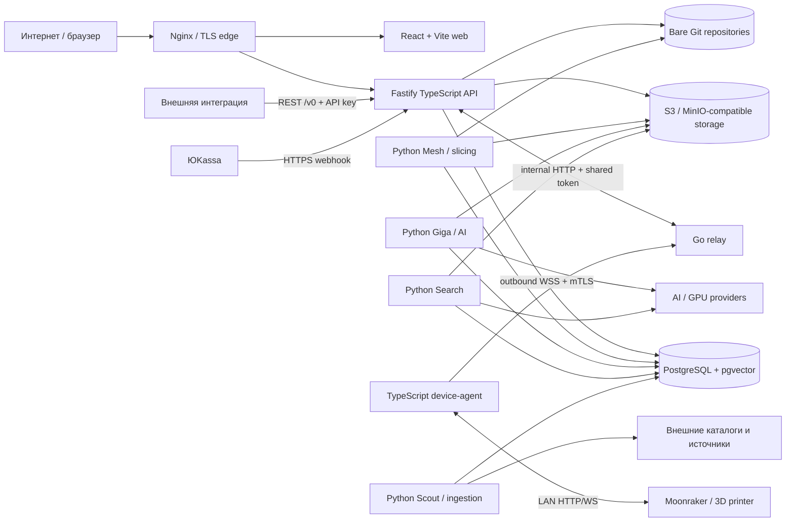
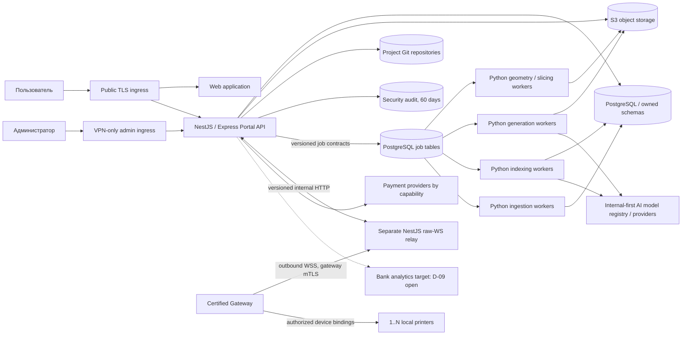
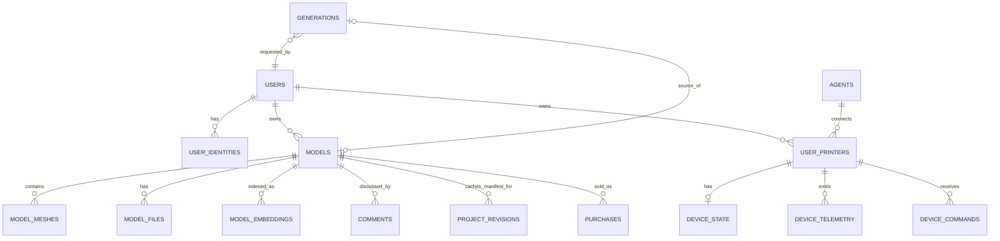
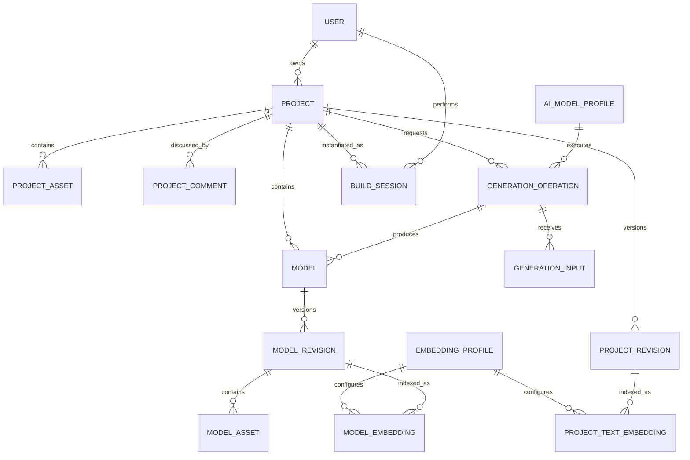
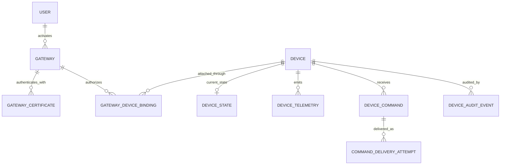

# Аналитическая база требований и работ — additive-ai-portal

Baseline анализа: ветка `dev`, commit `2b36131e5ccf4f99fa94dc3851b3656053681ba2`, 31.07.2026.

Документ предназначен для продуктовой аналитики, декомпозиции, оценки и планирования. Это не описание только найденных дефектов: структура документа следует от бизнес-требований и пользовательских сценариев к текущей реализации, нарушениям, принятым соглашениям и работам.

## 0. Источники истины и обозначения

### 0.1. Приоритет источников

1. Внешняя [бизнес-спецификация](https://docs.google.com/document/d/1QXpCWQsOX86FBdU2VXr07uom00j5iFFIwUYB-FayTD0/edit?tab=t.0) и требования, приведённые заказчиком в постановке, определяют обязательные бизнес-сценарии, ИБ, DoD и аналитику.
2. Подтверждённые заказчиком соглашения из раздела 0.3 и решения `D-01`–`D-15` из раздела 0.5 определяют целевую архитектуру и правила планирования. Исключение из внешней спецификации допустимо только как формально утверждённое изменение scope.
3. Код на указанном commit является источником истины для AS-IS. Документ или roadmap не считается доказательством реализации.
4. `docs/product`, `docs/architecture`, `docs/epics`, `docs/design` и `docs/contracts` используются как внутренние спецификации. Их расхождения с внешней спецификацией, кодом или принятыми соглашениями отмечаются отдельно.
5. Поведение DEV/PROD, наличие секретов, сетевых правил, данных и deployed revision не выводится только из кода и требует runtime-проверки.

### 0.2. Метки

- `SPEC` — обязательное требование внешней спецификации.
- `CODE` — подтверждено кодом текущего `dev`.
- `VIOLATION` — код или внутренний документ противоречит внешней спецификации.
- `DOC-DRIFT` — внутренние документы противоречат друг другу или текущему коду.
- `AGREEMENT` — подтверждённое заказчиком целевое соглашение.
- `RUNTIME` — требуется проверка на DEV/целевом контуре.
- `PRODUCT` — остаётся решение заказчика.
- `ARCH` — архитектурная декомпозиция или рекомендация, не самостоятельный бизнес-дефект.

Статусы соответствия:

- `DONE-CODE` — путь реализован в коде; runtime и бизнес-приёмка могут оставаться.
- `PARTIAL` — реализована только часть сценария.
- `MISSING` — обязательный сценарий отсутствует.
- `CONFLICT` — одновременно существуют несовместимые требования.
- `OUT-OF-SCOPE` — функция есть в коде, но не входит во внешний релизный перечень.

### 0.3. Принятые соглашения

| ID | Принятое соглашение | Статус решения | Следствие для оценки |
|---|---|---|---|
| `AD-01` | Перенести relay с Go в отдельное NestJS/TypeScript-приложение | `AGREEMENT`, не обсуждается как опция | Оценивается отдельный stateful data-plane deployable с raw WebSocket protocol и сохранением эксплуатационных свойств |
| `AD-02` | Полностью перенести текущую Fastify API-логику в NestJS/Express до разработки новых бизнес-функций | `AGREEMENT`, не обсуждается как опция | Сначала полная contract-parity migration и вывод Fastify; только затем feature development V1 |
| `AD-03` | Навести порядок во frontend, разделить состояния и выполнить измеримые оптимизации | `AGREEMENT` | Оцениваются transport/API client, server-state, local UI state, error boundaries, router, code splitting и performance baseline; отсутствие Redux/Zustand само по себе дефектом не считается |
| `AD-04` | Навести порядок в Python: удалить доказанный мёртвый код, убрать копипаст, ввести typecheck и единый lifecycle очередей | `AGREEMENT` | Удаление возможно только после inventory/coverage; PostgreSQL polling не считается дефектом сам по себе |
| `AD-05` | Перейти от GitVerse polling/deploy scripts к стандартному GitLab CI/CD | Ранее подтверждённое соглашение | Нужны immutable artifacts, обязательный CI gate, DEV→PROD promotion, provenance и rollback |

### 0.4. Направления работ

| Направление | Основной scope | Где раскрыто |
|---|---|---|
| Security и revocation | Local auth, password policy, ban/reset/logout-all, API keys, обязательный audit, TLS/VPN | Разделы 7, 11 и 12.3 |
| Device-agent/relay/protocol | Go→отдельный NestJS relay, Gateway identity/multi-device, source of truth протокола, mTLS, revoke, interop/load | Разделы 9.1, 11 и 12.4 |
| API и границы доменов | Полный Fastify→NestJS/Express cutover до feature work, Project/Model split, data ownership | Разделы 9.2, 11 и 12.4 |
| Python workers и очереди | Dead code/copy-paste/typecheck, lease/heartbeat/fencing/recovery; polling допустим | Разделы 9.4, 11 и 12.6 |
| Frontend | Transport, server/local state, errors, router, code splitting, измеримые оптимизации | Разделы 9.3, 11 и 12.5 |
| Платежи ЮKassa | Webhook retry/idempotency, provider/DB gap, payout data | Разделы 10, 11 и 12.7 |
| Аналитика и аудит событий | Product event tracking, ad-hoc datasets, security audit, retention/delivery | Разделы 7.1, 8, 11 и 12.8 |
| CI/CD и эксплуатация | GitLab pipeline, immutable artifacts, promotion, provenance, backup/rollback | Разделы 9.5, 11 и 12.9 |
| Общая архитектура и данные | AS-IS/TARGET topology, trust boundaries, API flows, Project/Model/Gateway entity model | Разделы 2.3–2.6 |

### 0.5. Реестр решений заказчика

| ID | Принятое решение | Статус |
|---|---|---|
| `D-01` | Внешняя спецификация определяет scope и приёмку; код — AS-IS; этот документ — traceability register; roadmap действует при отсутствии конфликта, исключения оформляются отдельным изменением scope | Принято |
| `D-02` | Вводится отдельный aggregate `Project`: он владеет metadata, публикацией, Git-репозиторием, комментариями, поиском, генерациями и ревизиями; `Model` — дочерняя сущность. Legacy `/models` — временный compatibility contract | Принято; реализовать при переходе на NestJS |
| `D-03` | Image→3D: один обязательный и до четырёх дополнительных ракурсов; JPEG/PNG/WebP; ≤10 МБ на файл, ≤40 МБ на operation; 512–4096 px и ≤16 Мп; decode/re-encode, EXIF removal, MIME validation. В V1 только простые geometry checks и статусы `preview_only`/`basic_validated`; расширенная printability — позже | Принято |
| `D-04` | Два режима поиска V1: `text→project` по lexical+text embeddings и `model→model→project` по embedding ревизии дочерней модели. Ответ shape-поиска содержит project/model/revision IDs, similarity, embedding profile/version и причину совпадения. `text→model` отложен | Принято |
| `D-05` | Приоритет внутренним моделям; Kandinsky/GigaCode сначала сравниваются на DEV. В 3D есть `Авто` и явный выбор модели; provider/model/version/pipeline сохраняются, silent fallback запрещён. AI-agent также проектируется с возможностью выбора через общий model registry | Принято |
| `D-06` | Local email/password auth — основной. Corporate OTP, PlagID и SberID отключены по умолчанию и управляются отдельными flags для login/registration/linking; все identities принадлежат одному `User` и общей revocation policy | Принято |
| `D-07` | Node/Nest relay, gateway/device и slicing образуют отдельный Platform Pilot и не блокируют Portal V1.0; включаются только после собственной приёмки | Принято |
| `D-08` | Используется типизированная иерархическая capability-система с управлением действиями, providers и payment methods; доступны staff/beta/percentage/public rules. Backend вычисляет доступ, frontend отображает resolved state; один boolean на подсистему запрещён | Принято |
| `D-09` | Аналитика остаётся в формулировке внешней спецификации; target, delivery guarantees, product retention, ad-hoc access и raw-data policy пока не конкретизируются | Отложено до отдельной analytics specification |
| `D-10` | Все обязательные audit-события хранятся 60 дней; raw passwords/tokens/prompts/images/message bodies/request bodies в audit не пишутся | Принято |
| `D-11` | Admin UI/API публикуются через отдельный hostname/ingress только в VPN; public ingress не маршрутизирует admin endpoints; backend независимо применяет RBAC. Network evidence — DevOps, authorization evidence — backend, приёмка — ИБ | Принято |
| `D-12` | Полная миграция Fastify→NestJS выполняется до feature development; dual runtime допустим только для миграции/проверки, после parity весь трафик переключается на NestJS | Принято; срок V1 переоценивается после inventory |
| `D-13` | API — NestJS с Express adapter. Relay — отдельное NestJS-приложение с raw WebSocket adapter без Socket.IO, без прямого доступа к PostgreSQL; связь с API через versioned internal HTTP contract | Принято |
| `D-14` | mTLS завершается в relay; индивидуальный сертификат получает `Gateway`, который через одну session обслуживает разрешённые `device_id`. Один org-wide сертификат запрещён. Protocol `N/N-1`, окно N-1 — 90 дней; gateway revoke SLA ≤5 секунд; локальная работа принтеров сохраняется; WireGuard — только дополнительный tunnel | Принято |
| `D-15` | Комбинированный frontend budget: p75 LCP ≤2,5 с, INP ≤200 мс, CLS ≤0,1; initial JS уменьшается ≥20% от baseline и не регрессирует >10% без согласования; route-chunk limits фиксируются после production baseline | Принято |
| `D-16` | Acceptance owner и формат финального DoD sign-off | Отложено, сейчас не определяется |

## 1. Резюме для руководителя

1. `D-01` закрепляет внешний business spec как default scope/acceptance, код как AS-IS, а этот документ как traceability register. Конфликтующий roadmap не меняет scope без formal exception.
2. `D-02` вводит отдельный `Project` aggregate с 1..N дочерними `Model`; project владеет metadata/publication/Git/comments/search/generations/revisions. Это обязательная data/domain migration, а не переименование UI.
3. `D-12/D-13` требуют сначала полностью перенести Fastify API в NestJS/Express и вывести Fastify, только затем разрабатывать новые V1 features. Поэтому дата 30.09 должна быть переоценена после полного inventory; долгоживущий dual runtime не допускается.
4. V1 включает два search режима (`text→Project`, `ModelRevision→Model→Project`) и multi-view image→3D (1+до 4 views) с выбором внутренней модели и только basic validation. Текущий код покрывает эти сценарии частично и требует нового Project model.
5. Relay переносится в отдельное NestJS-приложение и работает через индивидуально сертифицированные multi-device Gateways. Этот Platform Pilot, как и slicing, не блокирует Portal V1 (`D-07/D-14`).
6. Local auth остаётся основной; альтернативные identities gated. Доступ к дополнительным функциям определяется backend-authoritative typed capability system, а не крупными booleans или UI hiding.
7. Analytics target/delivery/retention остаются в исходной формулировке спецификации до отдельного решения `D-09`; обязательный audit хранится 60 дней. Платежи нельзя включать до исправления webhook/idempotency и защиты payout-реквизитов.

## 2. Бизнес-контекст

### 2.1. Цель продукта

`SPEC`: создать площадку для исследования нового клиентского опыта и клиентских путей, связанных с 3D-печатью и ИИ; привлекать целевую аудиторию, проверять новые сценарии, ИИ-инструменты и технологии, собирать обратную связь и аналитику для решений о дальнейшем развитии Аддитивного ИИ.

Внутренняя vision согласуется с идеей площадки и сообщества: портал описан как верстак с проектами, историей и обсуждениями, а не только файловое хранилище: [`vision.md`](/Users/horuzhenko/Projects/sber/additive-ai-portal/portal.ru/docs/product/vision.md:9). Одновременно внутренний V1 делает отдельный акцент на каталогах, устройствах и данных: [`vision.md`](/Users/horuzhenko/Projects/sber/additive-ai-portal/portal.ru/docs/product/vision.md:76).

### 2.2. Целевые аудитории и аналитические следствия

| Сегмент | Ожидаемая ценность | Обязательные сценарии | Что измерять |
|---|---|---|---|
| Энтузиаст/владелец принтера | Найти, загрузить, обсудить, изменить и напечатать модель | Проекты, файлы, semantic/shape search, комментарии, форум, генерация, скачивание | Activation до первого проекта/поиска/скачивания; успешность печатного артефакта; возврат; contribution rate |
| Пользователь результата без глубокого погружения | Получить понятный результат из текста/картинки без изучения toolchain | Простая генерация, понятный статус результата, сохранение в проект, путь к печати/услуге | Time-to-result; success/failure; доля сохранений; abandonment по шагам; запрос помощи |
| ИП/малый и средний бизнес | Использовать 3D-печать как услугу или источник дохода | Управление проектами, публикация, входящие обращения, в будущем услуги/выплаты | Supply activation; опубликованные проекты; обращения; повторные клиенты; unit economics после утверждения monetization |

`PRODUCT`: внешний V1 не содержит отдельного сценария заказа печати или витрины услуг для второго и третьего сегментов. Наличие этих аудиторий без соответствующего customer journey является пробелом требований, а не автоматически задачей V1.

### 2.3. Общая архитектура для аналитического обоснования

Этот раздел задаёт общий контекст для бизнес-аналитики, архитектурной оценки и подготовки материалов для ИБ. Он не заменяет детальную миграционную декомпозицию раздела 9.

- `AS-IS` ниже подтверждён кодом текущей ветки `dev`.
- `TARGET` основан на принятых `D-02`, `D-07`, `D-08`, `D-11`–`D-14` и `AD-01`–`AD-05`.
- Названия будущих физических таблиц и URL, если они ещё не приняты отдельным контрактом, являются `ARCH`-рекомендацией. Границы агрегатов и владения, уже закреплённые решениями, не являются опциональными.
- Размещение, firewall rules, сертификаты, реальные service accounts, deployed versions и сетевые маршруты требуют проверки на DEV/целевой инфраструктуре.

#### 2.3.1. AS-IS: фактическая система

Подтверждённые свойства AS-IS:

- `apps/api` — единая HTTP control-plane точка на Fastify; процесс слушает loopback, а доменные роуты автоматически загружаются из `src/<domain>/routes.ts`: [`main.ts`](/Users/horuzhenko/Projects/sber/additive-ai-portal/portal.ru/apps/api/src/main.ts:1), [`server.ts`](/Users/horuzhenko/Projects/sber/additive-ai-portal/portal.ru/apps/api/src/server.ts:209), [`routeLoader.ts`](/Users/horuzhenko/Projects/sber/additive-ai-portal/portal.ru/apps/api/src/routeLoader.ts:10).
- Глобальный Fastify pre-handler разделяет public, session и machine-to-machine paths, но исключения и конкретные credential checks распределены между `server.ts` и доменными обработчиками: [`server.ts`](/Users/horuzhenko/Projects/sber/additive-ai-portal/portal.ru/apps/api/src/server.ts:20), [`server.ts`](/Users/horuzhenko/Projects/sber/additive-ai-portal/portal.ru/apps/api/src/server.ts:313).
- API и Python-процессы используют общую PostgreSQL. Mesh, Giga и Search получают задания через таблицы/статусы, а не через единый брокер; сам факт polling допустим, но lifecycle отличается между очередями: [`mesh/worker.py`](/Users/horuzhenko/Projects/sber/additive-ai-portal/portal.ru/apps/mesh/src/mesh/worker.py:105), [`giga/db.py`](/Users/horuzhenko/Projects/sber/additive-ai-portal/portal.ru/apps/giga/src/giga/db.py:85), [`search/index_lease.py`](/Users/horuzhenko/Projects/sber/additive-ai-portal/portal.ru/apps/search/src/portal_search/index_lease.py:112).
- Файлы моделей и генераций находятся в S3-compatible storage; часть публичных и защищённых объектов разводится префиксами, а воркер Giga пишет generation artifacts, которые API читает для выдачи: [`s3.ts`](/Users/horuzhenko/Projects/sber/additive-ai-portal/portal.ru/apps/api/src/storage/s3.ts:49), [`s3.ts`](/Users/horuzhenko/Projects/sber/additive-ai-portal/portal.ru/apps/api/src/storage/s3.ts:151).
- Git-репозиторий сейчас физически привязан к legacy `models.repo_path`; один bare repository хранится на проект/карточку, а `apps/api` является основным писателем: [`git.module.md`](/Users/horuzhenko/Projects/sber/additive-ai-portal/portal.ru/docs/architecture/git.module.md:14), [`paths.ts`](/Users/horuzhenko/Projects/sber/additive-ai-portal/portal.ru/apps/api/src/git/paths.ts:5).
- Relay — stateful data-plane: он не обращается к PostgreSQL и работает с device state через `/internal/relay/*` API; device-agent держит исходящий WSS и локально подключается к Moonraker: [`relay/readme.md`](/Users/horuzhenko/Projects/sber/additive-ai-portal/portal.ru/apps/relay/readme.md:3), [`relayInternal.ts`](/Users/horuzhenko/Projects/sber/additive-ai-portal/portal.ru/apps/api/src/devices/relayInternal.ts:28), [`device-agent/main.ts`](/Users/horuzhenko/Projects/sber/additive-ai-portal/portal.ru/apps/device-agent/src/main.ts:15).
- Локальный `compose.yaml` поднимает только инфраструктурные зависимости PostgreSQL и MinIO и прямо помечен как не-production описание: [`compose.yaml`](/Users/horuzhenko/Projects/sber/additive-ai-portal/portal.ru/compose.yaml:1). Фактическую топологию DEV/PROD необходимо снимать отдельно.

Архитектурная интерпретация: AS-IS — модульный API-монолит с отдельными Python workers и stateful relay, общей реляционной схемой и несколькими файловыми хранилищами. Название папки `apps/*` не доказывает изоляцию данных или независимость security boundary: её необходимо подтверждать отдельными credentials, ACL и сетевыми правилами.

#### 2.3.2. TARGET: принятая целевая схема

Целевые границы:

1. `Portal API` является единственной внешней business/control-plane точкой и владельцем авторизации, capabilities, доменных команд и транзакций. NestJS/Express — принятое средство миграции, но модульные границы определяются доменами, а не framework folders.
2. `Project` — корневой агрегат контента. `Model` — дочерняя 3D-сущность. Создание проекта не требует немедленной загрузки файла; project-level и geometry/processing writes имеют разных владельцев.
3. Python workers остаются отдельными процессами для тяжёлой обработки. Они получают минимально необходимые service credentials и работают по versioned job/result contracts. PostgreSQL polling может сохраняться при общем lease/heartbeat/fencing/recovery contract.
4. Relay остаётся отдельным stateful deployable без прямого доступа к Portal DB. Его ответственность — gateway session, protocol validation, backpressure, delivery и быстрое прекращение cloud-control при revoke; бизнес-ACL и долговременное состояние остаются в Portal API.
5. Gateway идентифицируется индивидуальным сертификатом и обслуживает только явно разрешённые `device_id`. Сертификат организации или общий fleet secret не является допустимой identity.
6. Web получает resolved capability state от backend и не является security enforcement point. Admin surface имеет отдельный VPN-only ingress, но backend RBAC применяется независимо.
7. Product events, security audit и технические logs — три разных потока. Для audit принят срок 60 дней; целевая банковская analytics integration остаётся открытой по `D-09`.

### 2.4. API, межсервисные связи и потоки данных

#### 2.4.1. Каталог интерфейсов

| Поток | AS-IS интерфейс и аутентификация | Передаваемые данные | Целевой контракт | Статус/что обосновать для ИБ |
|---|---|---|---|---|
| Browser → Web/API | HTTPS через ingress; API использует cookie/JWT session, CORS с credentials: [`server.ts`](/Users/horuzhenko/Projects/sber/additive-ai-portal/portal.ru/apps/api/src/server.ts:249) | Профиль, проекты, файлы, prompts, search queries, community data | Versioned REST/JSON API, local auth, central revocation, typed errors, backend capabilities | `CODE + TARGET`; описать session lifetime, CSRF/CORS, rate limits, object-level ACL, redaction |
| Public integration → API | `/v0/*`, Bearer API key со scopes `read/control`; ключи хранятся hash-only: [`20260711010000_public_api_v0.sql`](/Users/horuzhenko/Projects/sber/additive-ai-portal/portal.ru/apps/api/db/migrations/20260711010000_public_api_v0.sql:35) | Device read/control commands | Сохранить отдельную machine identity, связать с общей revocation policy и capabilities | `CODE VIOLATION` по ban/revoke; проверить scope enforcement, expiry/rotation и owner status |
| Admin → API | В коде применяется role/RBAC, но реальная VPN boundary не доказана | Пользователи, справочники, moderation, security evidence | Отдельный admin hostname/ingress только из VPN + обязательный backend RBAC (`D-11`) | `TARGET + RUNTIME`; нужны DNS/ingress/firewall/VPN evidence и negative Internet test |
| Gateway → Relay | Сейчас device-agent открывает WSS с client certificate и agent JWT: [`client.ts`](/Users/horuzhenko/Projects/sber/additive-ai-portal/portal.ru/apps/device-agent/src/relay/client.ts:118), [`relay/readme.md`](/Users/horuzhenko/Projects/sber/additive-ai-portal/portal.ru/apps/relay/readme.md:20) | Identity, heartbeat, telemetry, command/file ACK, errors | Gateway mTLS; one session → authorized 1..N devices; protocol `N/N-1`; revoke ≤5 s (`D-14`) | `PARTIAL/TARGET`; доказать certificate issuance/storage/rotation/revoke, device binding и replay protection |
| Relay → Portal API | Internal HTTP `/internal/relay/*` + shared `x-relay-internal-token`; relay не ходит в DB: [`relayInternal.ts`](/Users/horuzhenko/Projects/sber/additive-ai-portal/portal.ru/apps/api/src/devices/relayInternal.ts:28) | Session open/close, allowed devices, telemetry, command poll/result | Versioned internal HTTP, private network, independently rotatable service identity, timeouts/idempotency/correlation | `ARCH`; точный workload-auth механизм ещё не принят; общий static token не должен становиться gateway identity |
| Portal API → Relay | Internal HTTP для команд/файлов; file call ждёт terminal ACK или timeout: [`relayFileClient.ts`](/Users/horuzhenko/Projects/sber/additive-ai-portal/portal.ru/apps/api/src/devices/relayFileClient.ts:25) | Device command, signed authorization context, bounded file payload | Versioned command/file contract; async lifecycle для долгих операций; idempotent command ID | `PARTIAL`; различать accepted/delivered/acknowledged/executed, ограничить размер и время ожидания |
| Portal API → Python workers | Запись job rows в PostgreSQL; единого lifecycle сейчас нет | Job identity, owner/project/model IDs, params, status | Versioned job payload/result + lease/heartbeat/fencing/attempts; один write-owner каждой таблицы | `CODE + ARCH`; нужны service roles, row ownership, crash/reclaim и stale-write tests |
| Python workers → PostgreSQL/S3/Git | Общий `DATABASE_URL`; Mesh/Giga/Search имеют собственные S3 clients; Mesh читает Git artifacts | Модели, derived artifacts, generation results, embeddings, errors | Least-privilege credentials по сервису и bucket/prefix; immutable input reference; atomic result publication | `CODE + TARGET`; проверить реальные grants, secret distribution, path traversal, malware/quarantine, partial writes |
| Portal API/Web → object storage | API проксирует или выдаёт публичные/presigned paths; protected/public роли разделены префиксом: [`s3.ts`](/Users/horuzhenko/Projects/sber/additive-ai-portal/portal.ru/apps/api/src/storage/s3.ts:54) | Project/model files, previews, images, generated artifacts | Private-by-default object ACL; short-lived authorized access; project/model ownership encoded in metadata, не только в path | `PARTIAL`; проверить bucket policy, object ownership, URL TTL, cache leakage, delete/backup lifecycle |
| Workers → AI/GPU providers | Giga/Search используют HTTP clients к OpenRouter/HYPERPC/ComfyUI и другим контурам: [`openrouter_client.py`](/Users/horuzhenko/Projects/sber/additive-ai-portal/portal.ru/apps/giga/src/giga/openrouter_client.py:103), [`hyperpc_client.py`](/Users/horuzhenko/Projects/sber/additive-ai-portal/portal.ru/apps/search/src/portal_search/hyperpc_client.py:62) | Prompts, изображения, derived inputs, embeddings, generated artifacts | Общий model registry, explicit provider/model/version, no silent fallback, capability/data-zone policy (`D-05`) | `PRODUCT + RUNTIME`; подтвердить допустимость данных, endpoints, credentials, retention провайдера и timeout/retry |
| YooKassa → Portal API | Public webhook, статус платежа перепроверяется у provider; inbox/dedup существует | Provider event/payment ID, purchase status, provider payload | Retry-safe inbox state machine: received ≠ processed; одна business/ledger mutation; granular payment capabilities | `CODE VIOLATION`; нужны signature/status verification, replay, out-of-order, PII minimization и sandbox evidence |
| Portal → analytics target | Сейчас consent-gated события сохраняются в PostgreSQL `events`: [`20260709000001_baseline.sql`](/Users/horuzhenko/Projects/sber/additive-ai-portal/portal.ru/apps/api/db/migrations/20260709000001_baseline.sql:605) | Product events и context; security audit должен идти независимо от behavioral consent | Внешняя спецификация без дополнительной конкретизации; target/delivery/retention остаются `D-09 OPEN` | `PARTIAL/PRODUCT`; аналитики не должны обещать банковскую доставку до отдельного решения |

#### 2.4.2. Общие требования к контрактам

Для оценки каждая связь из каталога должна получить отдельный contract card со следующими полями:

1. producer, consumer, business owner и technical owner;
2. protocol, direction, endpoint/topic/table и versioning rule;
3. authentication, authorization и проверяемая resource ownership;
4. request/event/job ID, correlation ID, idempotency key и deduplication scope;
5. timeout, retry/backoff, terminal states, cancellation и recovery после crash;
6. schema request/response/error, обязательность полей, размер и частота;
7. классификация данных, masking/redaction, retention и допустимый target environment;
8. observability: metrics, structured logs, audit event и evidence location;
9. compatibility window и порядок producer/consumer rollout;
10. DEV negative tests, включая cross-user/cross-project/cross-gateway доступ.

`ARCH`: для REST нужен один versioned error envelope с `code`, `request_id`, безопасным `message` и опциональными field errors. Для jobs и WebSocket frames тот же принцип применяется через language-neutral schema и общие valid/invalid fixtures. TypeScript type сам по себе не доказывает совместимость Go/Python или runtime payload.

#### 2.4.3. Логические группы Portal API

URL ниже показывают рекомендуемую resource hierarchy для оценки и threat modeling, но не являются утверждённым physical contract. Точные paths фиксируются OpenAPI/contract tests в ходе `M0/M1`; legacy `/models` сохраняется только как compatibility surface по `D-02`.

| API group | Основные ресурсы и операции | Клиенты | Авторизация/владение | AS-IS evidence и целевая граница |
|---|---|---|---|---|
| Auth/Profile | register, verify email, login, logout, recovery, sessions, profile | Web, admin | Anonymous для начала flow; затем User/session; central revoke | Сейчас auth агрегирует email/PlagID/SberID: [`auth/routes.ts`](/Users/horuzhenko/Projects/sber/additive-ai-portal/portal.ru/apps/api/src/auth/routes.ts:8). Target — local primary + granular gated identities |
| Projects | create/read/update/archive/publish Project; Git history; project assets/revisions | Web, public read client | Owner/editor for mutation; public allowlist для published read | Новый Nest `ProjectModule`; project создаётся пустым; `projects/:projectId` — логическая target hierarchy |
| Models | add/list/update/remove child Model; revisions/assets/processing status | Web, Mesh, compatibility clients | Project ACL + model membership; worker write scope только на processing/result fields | Сейчас один `models` domain регистрирует upload, assets, Git, comments, slicing и social operations вместе: [`models/routes.ts`](/Users/horuzhenko/Projects/sber/additive-ai-portal/portal.ru/apps/api/src/models/routes.ts:22) |
| Generations | create operation, upload sanitized inputs, status/progress, cancel/retry, attach result | Web, Giga worker | Project contributor + generation capability; worker identity для result transition | Сейчас create/list/detail/assets/catalog-draft собраны вокруг user-level `generations`: [`generations/routes.ts`](/Users/horuzhenko/Projects/sber/additive-ai-portal/portal.ru/apps/api/src/generations/routes.ts:10) |
| Search | text→Project и ModelRevision→similar Model→Project | Web, internal ranking/evaluation | Visibility/ACL filtering до выдачи; capability по profile/provider | Target logical resources: project search и model similarity должны иметь разные request/response schemas |
| Community | project comments, forum communities/threads/posts, moderation | Web, admin/moderator | Auth для mutations; subject/project ACL; moderator/staff actions audit | Текущий forum domain уже разделяет community/membership/thread/post routes: [`community/routes.ts`](/Users/horuzhenko/Projects/sber/additive-ai-portal/portal.ru/apps/api/src/community/routes.ts:20); project comments мигрируют из models |
| Device/Gateway | enroll/activate/revoke gateway, device binding, state, command, incident | Web, relay, gateway, public API client | Owner/operator/viewer roles; gateway service identity; per-device binding | Сейчас device domain смешивает user, relay-internal и operational routes: [`devices/routes.ts`](/Users/horuzhenko/Projects/sber/additive-ai-portal/portal.ru/apps/api/src/devices/routes.ts:10). Target отделяет public control-plane от internal relay contract |
| Public API | API-key lifecycle и versioned external device/project integrations | External scripts/services | Bearer key, scopes, owner status, capabilities, rate limits | Текущий `/v0` регистрируется отдельно: [`publicapi/routes.ts`](/Users/horuzhenko/Projects/sber/additive-ai-portal/portal.ru/apps/api/src/publicapi/routes.ts:7) |
| Billing | purchase/payment status, webhook inbox, ledger, payout | Web, payment provider, staff | Buyer/seller/staff; provider verification; granular payment-method capability | Сейчас billing напрямую привязан к `model_id` и объединяет checkout/webhook/payout transitions: [`billing/routes.ts`](/Users/horuzhenko/Projects/sber/additive-ai-portal/portal.ru/apps/api/src/billing/routes.ts:43). Target entitlement resource требует продуктового решения Project vs Model |
| Analytics | consent, product event ingestion/health, future export/delivery | Web, API domains, workers, data platform | Consent для behavioral events; service auth; pseudonymous IDs | Текущий routes aggregator содержит consent/health: [`analytics/routes.ts`](/Users/horuzhenko/Projects/sber/additive-ai-portal/portal.ru/apps/api/src/analytics/routes.ts:6); target destination открыт по `D-09` |
| Audit/Admin | immutable audit query/export, user/moderation/reference management | Security, authorized staff | VPN ingress + staff role + purpose-specific access; все чтения audit themselves | Target-only cross-cutting modules; не объединять audit access с обычным product analytics API |

### 2.5. Доменная модель сущностей

#### 2.5.1. Термины, которые нельзя смешивать

| Термин | Значение в целевой модели |
|---|---|
| `Project` | Пользовательский проект и корневой aggregate: metadata, publication, Git, instructions, discussion, search projection, generations и history |
| `Model` | Дочерняя 3D-модель/геометрический результат внутри Project; один Project содержит 0..N моделей в draft и не менее одной для содержательной публикации |
| `ModelRevision` | Неизменяемая версия геометрии и processing/provenance конкретной Model |
| `ProjectRevision` | Неизменяемая версия project-level metadata/manifest/configuration, связанная с Git commit |
| `AIModelProfile` | Техническое описание AI/embedding provider+model+version+pipeline; это не пользовательская `Model` |
| `GenerationOperation` | Одна пользовательская операция text/image→3D с входами, выбранным AI profile, статусом и результатами |
| `Gateway` | Подключаемая точка с индивидуальным сертификатом, которая держит одну cloud session и обслуживает разрешённые устройства |
| `Device` | Конкретный локальный принтер; не равен Gateway и не обязан иметь собственный cloud certificate |

#### 2.5.2. AS-IS: где сущности смешаны

Подтверждённые расхождения AS-IS:

- `models` содержит owner/title/description/publication/Git/price/social counters одновременно с source format/status/bbox, то есть project-level и geometry-level state: [`20260709000001_baseline.sql`](/Users/horuzhenko/Projects/sber/additive-ai-portal/portal.ru/apps/api/db/migrations/20260709000001_baseline.sql:88), [`20260709000001_baseline.sql`](/Users/horuzhenko/Projects/sber/additive-ai-portal/portal.ru/apps/api/db/migrations/20260709000001_baseline.sql:401), [`20260709000001_baseline.sql`](/Users/horuzhenko/Projects/sber/additive-ai-portal/portal.ru/apps/api/db/migrations/20260709000001_baseline.sql:752).
- `model_meshes` уже является дочерней геометрической детализацией текущей карточки, но внутренняя миграция прямо запрещала отдельный верхнеуровневый `projects`; это конфликтует с принятым `D-02`: [`20260709000001_baseline.sql`](/Users/horuzhenko/Projects/sber/additive-ai-portal/portal.ru/apps/api/db/migrations/20260709000001_baseline.sql:715).
- `project_revisions` по факту является read-cache манифеста для legacy model и использует `model_id`; имя не означает наличия самостоятельного Project aggregate: [`20260719190000_project_build_session.sql`](/Users/horuzhenko/Projects/sber/additive-ai-portal/portal.ru/apps/api/db/migrations/20260719190000_project_build_session.sql:1), [`20260719190000_project_build_session.sql`](/Users/horuzhenko/Projects/sber/additive-ai-portal/portal.ru/apps/api/db/migrations/20260719190000_project_build_session.sql:32).
- `generations` принадлежит пользователю, но не Project; связь с созданной карточкой добавлена как `models.source_generation_id`: [`20260709000001_baseline.sql`](/Users/horuzhenko/Projects/sber/additive-ai-portal/portal.ru/apps/api/db/migrations/20260709000001_baseline.sql:192), [`20260720190000_models_source_generation_unique.sql`](/Users/horuzhenko/Projects/sber/additive-ai-portal/portal.ru/apps/api/db/migrations/20260720190000_models_source_generation_unique.sql:15).
- Text/model embeddings привязаны к `model_id`, а не к отдельной revision и Project search document: [`20260720110000_versioned_search_index.sql`](/Users/horuzhenko/Projects/sber/additive-ai-portal/portal.ru/apps/api/db/migrations/20260720110000_versioned_search_index.sql:43), [`20260720110000_versioned_search_index.sql`](/Users/horuzhenko/Projects/sber/additive-ai-portal/portal.ru/apps/api/db/migrations/20260720110000_versioned_search_index.sql:106).
- Текущий device aggregate использует `agents` + расширенную `user_printers`; схема уже допускает один agent → несколько printers, но runtime enrollment сейчас дополнительно связывает credential с одним `deviceId`: [`20260710310000_device_fleet_foundation.sql`](/Users/horuzhenko/Projects/sber/additive-ai-portal/portal.ru/apps/api/db/migrations/20260710310000_device_fleet_foundation.sql:25), [`relayInternal.ts`](/Users/horuzhenko/Projects/sber/additive-ai-portal/portal.ru/apps/api/src/devices/relayInternal.ts:97).

#### 2.5.3. TARGET: логическая модель Project/Model

Логические сущности и ответственность:

| Сущность | Основные данные и связи | Владелец/инвариант | AS-IS mapping и миграционное замечание |
|---|---|---|---|
| `User` | id, name, email, status, roles | Auth/Profile; email уникален; ban участвует во всех credential checks | `users`; добавить локальные credentials и разделить public profile/PII |
| `UserIdentity/Credential` | local password hash, verified email, gated external identities, sessions/API keys | Auth; hash/secret never returned; одна revocation policy | `user_identities`, `email_otp`, JWT, `api_keys`; provider taxonomy меняется по `D-06` |
| `Project` | owner, title, description, visibility, publication, repository ID, tags, counters | Projects; создаётся без Model; project-level writes только через ProjectModule | Новая сущность; project-level поля извлекаются из `models` |
| `ProjectRevision` | project_id, Git commit, manifest/config digest, metadata/instruction snapshot | Projects/Git; immutable; одна связь с source commit | Текущую `project_revisions` нельзя механически переименовать без reconciliation: она содержит configuration cache legacy model |
| `ProjectAsset` | instruction images, documents, auxiliary files, checksums, storage class | Projects/Storage; private by default; immutable revision reference | Часть `model_files` с project-level roles и Git files |
| `ProjectComment` | project_id, author, parent, moderation/deletion state | Community/Projects; удаление Model не удаляет discussion | Текущие polymorphic `comments(subject_type='model')` переносятся на Project |
| `Model` | project_id, logical name, ordering, active revision, source generation | Models; всегда принадлежит ровно одному Project | Геометрическая часть legacy `models` и существующие `model_meshes` требуют явного mapping rule |
| `ModelRevision` | model_id, immutable source/checksum, format, units, bbox, processing state, provenance | Models/Mesh; stale worker не меняет новую revision | Новой first-class revision нет; текущие `model_meshes`, Git commit и file rows дают части данных |
| `ModelAsset` | model_revision_id, role, S3/Git locator, size, MIME, checksum | Models/Storage; locator не заменяет ownership ACL | Geometry/preview rows из `model_files` |
| `GenerationOperation` | project_id, requester, input mode, params, status, provider/model/version/pipeline, idempotency key | Generations; все входы одной operation; no silent provider fallback | `generations` расширяется project ownership, input assets и model registry provenance |
| `GenerationInput` | operation_id, view role, sanitized object, MIME, dimensions, checksum | Generations/Storage; 1 primary + 0..4 additional; EXIF removed | Новая сущность для `D-03`; raw upload lifecycle и deletion policy требуют ИБ решения |
| `AIModelProfile` | capability, provider, model, version, pipeline, data zone, enabled cohorts | Platform/AI; distinguish from user Model; decision persisted per operation | Сейчас provider/model распределены по env/branch-specific clients |
| `EmbeddingProfile` | name, provider/model/version, dimension, modality, index status | Search/AI; profile version обязателен в result/provenance | Частично `embedding_model/version/dim` в search tables |
| `ProjectTextEmbedding` | project_revision_id, profile, text hash, vector, state | Search; индекс title/description/instructions/tags конкретной revision | Новая проекция для `text→project` |
| `ModelEmbedding` | model_revision_id, profile, vector, state | Search; similarity считается между совместимыми profile/version | Миграция `model_embeddings(model_id, ...)` на revision identity |
| `BuildSession` | user, project revision/configuration, private step states | Projects; пользовательский прогресс не меняет author project | Текущие `build_sessions` привязаны к legacy model и требуют смены FK |
| `AuditEvent` | actor, action, resource, outcome, request/correlation IDs, timestamp, safe metadata | Security; append-only; 60 дней; без raw secrets/content | Унифицировать разрозненные audit/log paths; не смешивать с behavioral consent |
| `ProductEvent` | pseudonymous user/session, event name, schema version, context | Analytics; consent и target по внешней спецификации/`D-09` | Текущая `events` taxonomy остаётся AS-IS до отдельной analytics specification |

#### 2.5.4. TARGET: Gateway и устройства

| Сущность | Назначение и обязательные свойства | AS-IS mapping |
|---|---|---|
| `Gateway` | Подключаемая точка, owner/organization context, version, protocol version, status, revoked_at | Эволюция `agents`; термин фиксируется `D-14` |
| `GatewayCertificate` | gateway_id, serial/fingerprint, issuer, valid_from/to, revoked_at, key reference | Новой DB-модели lifecycle нет; private key остаётся только на gateway/secure store |
| `Device` | Конкретный принтер, owner, catalog reference, local identity, capabilities | Выделяется из перегруженной `user_printers` либо оформляется её строгой эволюцией после migration inventory |
| `GatewayDeviceBinding` | gateway_id + device_id + validity/status; единственный разрешающий список relay | Сейчас связь `user_printers.agent_id`; runtime дополнительно ограничен credential.deviceId |
| `DeviceState` | Один текущий snapshot, monotonic sequence, updated_at | `device_state` уже существует: [`20260710310000_device_fleet_foundation.sql`](/Users/horuzhenko/Projects/sber/additive-ai-portal/portal.ru/apps/api/db/migrations/20260710310000_device_fleet_foundation.sql:122) |
| `DeviceTelemetry` | Append-only/batched time series с отдельной retention policy | `device_telemetry`; целевой retention ещё требует объёмов и ИБ решения |
| `DeviceCommand` | command ID, device, actor/capability, desired action, lifecycle, idempotency | `device_commands`; статусы должны различать queue/delivery/ack/execution |
| `CommandDeliveryAttempt` | command_id, gateway session, attempt, timestamps, terminal result | Нужна для reconnect/retry/fencing и доказательства exactly-once effect на стороне agent |

#### 2.5.5. Решения по физической модели, необходимые до оценки миграции

| Вопрос | Зафиксированная граница | Что ещё требуется решить |
|---|---|---|
| Project publication | Project — владелец публикации; Model — child | Минимальный publishable состав: ≥1 ready Model, обязательность инструкции/preview/license и правила частично готовых моделей |
| Project/Model deletion | Удаление Model не удаляет Project discussion/identity | Soft-delete/retention, orphan assets, Git history, search deindex и audit references |
| Revision identity | ProjectRevision и ModelRevision различаются; embeddings привязаны к конкретной revision | Формат revision ID, связь с Git commit, mutable draft vs immutable revision и optimistic concurrency |
| Files | ProjectAsset и ModelAsset имеют разных владельцев | Роли файлов, S3/Git source of truth, antivirus/quarantine, versioning и delete/backup lifecycle |
| Generation result | Operation принадлежит Project и может создать child Model | Один или несколько outputs, повторный run/fork, failed input retention и ручное attachment существующей Model |
| Search aggregation | Text возвращает Projects; model similarity сначала находит ModelRevision, затем агрегирует Project | Dedup/best-child rule, score normalization между profiles, ACL timing и pagination stability |
| Comments/community | Project discussion не зависит от child Model | Нужны ли model-specific annotations отдельно от project comments; migration polymorphic subjects |
| Payments | Billing включается granular capability | Entitlement продаётся на Project, конкретную Model/revision или download artifact; refund impact на access |
| Gateway/device | Gateway и Device — разные entities; binding разрешает обслуживание device | Один активный gateway на Device или controlled overlap при migration; ownership/share transfer и certificate reissue |
| Analytics/audit references | Audit хранится 60 дней и не зависит от consent | Pseudonymization после user deletion, stable resource IDs и допустимые безопасные metadata |

### 2.6. Классификация данных и trust boundaries для ИБ

Ниже — рабочая аналитическая классификация, а не замена банковского классификатора. Аналитики должны сопоставить её с обязательными категориями ИБ и оформить конкретные controls/evidence.

| Класс данных | Примеры | Где возникают/хранятся | Минимальные целевые меры | Открытая проверка |
|---|---|---|---|---|
| Публичный контент | Опубликованные project metadata, public preview, forum post | Portal DB, S3 public projection, search index | Явный publish state; allowlist полей; cache purge; защита от публикации private source | Проверить anonymous routes и bucket policy |
| Персональные данные | Имя, email, возраст/пол при наличии, profile links | Auth/Profile DB, email provider | Минимизация, field-level access, encryption at rest по инфраструктурному стандарту, deletion/export process, запрет raw PII в analytics | Уточнить правовые основания и процедуру удаления |
| Credentials и security secrets | Password hashes, OTP hashes, session/API tokens, gateway private keys, service secrets | Auth DB, gateway secure storage, secret manager/env | Hash/encryption, rotation/revocation, least privilege, no logs/audit bodies, secret scanning | Проверить фактическое хранение env и issued certificates |
| Приватный пользовательский контент | Draft projects, source files, prompts, input images, search queries | DB, S3, Git, AI providers | Private-by-default ACL, purpose limitation, provider data-zone gate, retention/deletion, signed access | Решение raw prompts/images/search policy отложено `D-09/D-05` |
| Device/control data | Gateway identity, device IDs, commands, telemetry, LAN-derived metadata | Relay memory, Portal DB, audit/logs | Gateway mTLS, per-device binding, command authorization, replay protection, bounded telemetry retention | Проверить N/N-1, revoke≤5s, cross-gateway denial |
| Финансовые данные | Purchase/payment IDs, ledger, payout method | Billing DB, YooKassa, KMS/tokenization service | Minimal storage, tokenization/encryption, strict staff access, immutable ledger, retry-safe webhook | Payout requisites сейчас plaintext JSONB — release gate |
| Security audit | Auth attempts, recovery, project mutations, generation, news/forum actions | Unified audit storage | Append-only, immutable access trail, safe metadata, 60-day retention, независимость от behavioral consent | Проверить все 8 цепочек, expiry и доступ ИБ |
| Product analytics | Funnel/events, pseudonymous IDs, operation outcomes | Сейчас PostgreSQL `events`; target не выбран | Consent where applicable, schema/version, pseudonymization, approved destination | Отдельное решение `D-09` |

Основные trust boundaries, которые должны попасть в модель угроз: Internet→public ingress; VPN→admin ingress; ingress→Portal API; Gateway→relay; relay→Portal API; workers→DB/S3/Git; workers→AI providers; YooKassa→webhook; CI/CD→runtime/secrets; operators→production data/evidence.

## 3. Релизные требования и соответствие коду

### 3.1. V1.0 — 30.09.2026

| ID | Требование `SPEC` | AS-IS по коду | Нарушение/расхождение | Целевое состояние | Критерии приёмки | Основные зависимости | DEV-проверка |
|---|---|---|---|---|---|---|---|
| `BR-1.0-01` | Сценарий регистрации | Email OTP создаёт пользователя при успешной проверке кода: [`email.ts`](/Users/horuzhenko/Projects/sber/additive-ai-portal/portal.ru/apps/api/src/auth/email.ts:120). PlagID также создаёт пользователя; отдельной локальной регистрации с паролем нет | `VIOLATION`: регистрация совмещена с passwordless login и ограничена корпоративными доменами; внешний контракт требует локальный аккаунт | Локальная регистрация с уникальным email, паролем 12–20, обязательным именем и отдельным подтверждением email | Новый уникальный email создаёт ровно одного пользователя; duplicate не создаёт второй аккаунт; пароль не хранится/логируется открыто; регистрация аудируется | `SEC-01`, email provider, schema migration, Nest auth module | Happy path, duplicate email, слабый пароль, повтор запроса, сбой email, истёкший код |
| `BR-1.0-02` | Сценарий авторизации | Сессия — stateless JWT на 30 дней: [`session.ts`](/Users/horuzhenko/Projects/sber/additive-ai-portal/portal.ru/apps/api/src/auth/session.ts:18). Email использует 6-значный OTP и 5 попыток: [`email.ts`](/Users/horuzhenko/Projects/sber/additive-ai-portal/portal.ru/apps/api/src/auth/email.ts:62) | `VIOLATION`: нет локального пароля, password recovery, правила 3 ошибок/30 минут; OTP имеет другую роль и длину | Login по email+паролю; 3 неудачи блокируют вход на 30 минут; восстановление пароля; 4-значный код используется для подтверждения email | Конкурентные попытки не обходят lock; старые сессии отзываются после ban/reset; все исходы аудируются | `SEC-01`, `SEC-02`, clock/lock model, email provider | 3 ошибки, lock 30 минут, успешный вход после окна, reset, ban существующей cookie/API key |
| `BR-1.0-03` | Личный кабинет с управлением своими проектами | Профиль и owned models/routes существуют; отдельного `Project` aggregate нет: [`schema.sql`](/Users/horuzhenko/Projects/sber/additive-ai-portal/portal.ru/apps/api/db/schema.sql:3473). Текущий продукт исторически использует `model` как проект: [`vision.md`](/Users/horuzhenko/Projects/sber/additive-ai-portal/portal.ru/docs/product/vision.md:67) | `VIOLATION / D-02`: текущая сущность смешивает project-level и geometry/processing данные | Отдельный `Project` владеет metadata, visibility/publication, Git repository, comments, search, generations и revisions; одна или более `Model` принадлежат проекту | Пользователь управляет проектом и его набором моделей; project/model ACL разделены; legacy запись мигрирует в один project+child model | Полная NestJS migration, schema/data migration, compatibility `/models`, frontend state | Create/edit/publish/archive проекта; несколько моделей; direct URL; 403/404; concurrent edit |
| `BR-1.0-04` | Добавление проекта | `POST /models` создаёт модель, S3-объект, Git-репозиторий и индексную job: [`upload.ts`](/Users/horuzhenko/Projects/sber/additive-ai-portal/portal.ru/apps/api/src/models/upload.ts:268) | `VIOLATION / D-02`: создание проекта привязано к первой модели/загрузке | `Project` создаётся независимо от файлов и моделей и сразу владеет metadata и Git repository; дочерние models добавляются позже | Повтор operation возвращает тот же project ID; пустой draft допустим; первая и последующие models не меняют identity проекта | Nest ProjectModule, idempotency, Git/DB strategy, legacy migration | Create empty project, затем upload/generation нескольких models; retry и Git/DB faults |
| `BR-1.0-05` | Загрузка готовых файлов проекта | Multipart upload, format validation, S3 и Git commit реализованы: [`upload.ts`](/Users/horuzhenko/Projects/sber/additive-ai-portal/portal.ru/apps/api/src/models/upload.ts:245) | `DONE-CODE / RUNTIME`: необходимо подтвердить форматы, лимиты, antivirus/quarantine, rollback и UX | Версионируемая загрузка допустимых форматов с прогрессом, idempotency, безопасной обработкой и понятным terminal state | Поддерживаемые форматы утверждены; вредоносный/битый/слишком большой файл отклонён; retry не дублирует; файл доступен владельцу | S3, Git, Mesh conversion, security limits, frontend transport | STL/OBJ/3MF и отрицательные fixtures; обрыв upload; повтор; S3/Git/DB failure |
| `BR-1.0-06` | Добавление в проект генерации К3D по пользовательской картинке или тексту | UI принимает текст; ветки `openscad`, `kzd`, `hueforge`, `trellis` зарегистрированы: [`branches/__init__.py`](/Users/horuzhenko/Projects/sber/additive-ai-portal/portal.ru/apps/giga/src/giga/branches/__init__.py:21). `trellis` сам генерирует reference images из текста: [`trellis.py`](/Users/horuzhenko/Projects/sber/additive-ai-portal/portal.ru/apps/giga/src/giga/branches/trellis.py:276). Пользовательского image-input нет | `VIOLATION / D-03`: отсутствует согласованный multi-view input; `kzd` выдаёт только изображение: [`kzd.py`](/Users/horuzhenko/Projects/sber/additive-ai-portal/portal.ru/apps/giga/src/giga/branches/kzd.py:1) | Text→3D и image→3D создают дочернюю Model. Image operation принимает 1 обязательный+до 4 дополнительных JPEG/PNG/WebP, ≤10 МБ каждый/≤40 МБ суммарно, 512–4096 px/≤16 Мп, с re-encode и EXIF removal | Входы проходят MIME/decode/limits; terminal result имеет `preview_only` или `basic_validated`; basic checks: readable mesh, finite coordinates, non-zero bbox, allowed dimensions, mm contract, export/reopen | Model registry, provider DEV evaluation, queue lifecycle, S3, ProjectModule | Ракурсы/лимиты/spoof/animation; model choice; timeout/reclaim; несколько generated models в project |
| `BR-1.0-07` | Комментирование проектов | GET/POST/DELETE comments привязаны к legacy model с ACL и soft-delete: [`comments.ts`](/Users/horuzhenko/Projects/sber/additive-ai-portal/portal.ru/apps/api/src/models/comments.ts:74) | `PARTIAL / D-02`: discussion должно принадлежать Project, а не одной дочерней Model | Project comments/replies работают независимо от количества models, с модерацией и аудитом | Добавление/удаление child model не теряет discussion; owner модерирует; private project скрыт | Project migration, local auth, audit, moderation | Root/reply/delete, multi-model project, private project, banned user, concurrency |
| `BR-1.0-08` | Поиск проектов, включая семантический | Публичный API реализует lexical + text-semantic hybrid: [`list.ts`](/Users/horuzhenko/Projects/sber/additive-ai-portal/portal.ru/apps/api/src/models/list.ts:242), [`searchEmbedClient.ts`](/Users/horuzhenko/Projects/sber/additive-ai-portal/portal.ru/apps/api/src/models/searchEmbedClient.ts:21). Индексатор имеет view-профили, но публичного model-query нет: [`profiles.py`](/Users/horuzhenko/Projects/sber/additive-ai-portal/portal.ru/apps/search/src/portal_search/profiles.py:20) | `CONFLICT / PARTIAL / D-04`: roadmap исключает semantic из V1; project text-index и законченный model→model flow отсутствуют | `text→project` по lexical+project text embeddings и `model revision→similar model→project`; `text→model` отложен | Model result содержит project/model/revision IDs, similarity, profile/version и reason; ACL применяется до выдачи; два режима имеют отдельные quality datasets | Project/model/revision migration, versioned embeddings, Search worker/CI, HYPERPC, backfill | Text paraphrases; model similarity; best-child aggregation; stale revision; fallback/latency/empty index |
| `BR-1.0-09` | Обсуждение на форуме | Communities, threads и posts имеют schema/API; создание thread реализовано: [`threads.ts`](/Users/horuzhenko/Projects/sber/additive-ai-portal/portal.ru/apps/api/src/community/threads.ts:74) | `PARTIAL / RUNTIME`: внутренние docs содержат forum/feed/makes overlap; обязательные moderation/audit/notification scenarios не сведены в один contract | Лёгкий форум: community list/detail, thread create/read, reply, moderation, pagination, search/links по утверждённому scope | Два пользователя создают thread/reply; permissions и moderation; deleted/locked states; audit/event tracking | Local auth, Nest community module, frontend state, moderation policy | Full forum E2E, lock/delete, abuse limits, pagination, deep-link, audit |

### 3.2. V1.1 — 16.11.2026

| ID | Требование `SPEC` | AS-IS по коду | Нарушение/расхождение | Целевое состояние | Критерии приёмки | Зависимости и DEV |
|---|---|---|---|---|---|---|
| `BR-1.1-01` | Генерация модели с точными размерами по тексту через GigaCode или согласованный аналог | `openscad` генерирует код и STL, проверяет watertight/max dimension, но использует OpenRouter: [`openscad.py`](/Users/horuzhenko/Projects/sber/additive-ai-portal/portal.ru/apps/giga/src/giga/branches/openscad.py:1). `trellis` масштабирует mesh по одному `target_size_mm`: [`trellis.py`](/Users/horuzhenko/Projects/sber/additive-ai-portal/portal.ru/apps/giga/src/giga/branches/trellis.py:237) | `PARTIAL / VIOLATION`: provider расходится со спецификацией; точность по нескольким размерам и tolerances не доказана | Утверждённый provider создаёт printable model по dimensional constraint schema, результат измеряется валидатором | Для набора эталонов X/Y/Z и feature dimensions в допуске; invalid/contradictory request объясним; provider/model/version сохранены | Доступ к GigaCode, размерный DSL/schema, eval corpus, geometry validator, queue lifecycle; DEV на эталонном наборе |
| `BR-1.1-02` | Генерация рельефных картинок на Kandinsky по тексту | `hueforge` создаёт изображение, heightmap и layers ZIP, но image provider — OpenRouter: [`hueforge.py`](/Users/horuzhenko/Projects/sber/additive-ai-portal/portal.ru/apps/giga/src/giga/branches/hueforge.py:1) | `PARTIAL / VIOLATION`: функциональный прототип есть, но provider и формат результата не согласованы со спецификацией; runtime не подтверждён | Kandinsky/утверждённый provider → preview + printable relief artifact + параметры материала/слоёв | Валидный heightmap/mesh или согласованный HueForge package; preview совпадает; размеры/слои валидны; результат добавляется в проект | Kandinsky credentials/API, output contract, filament palette, S3, eval/print sample; DEV и физический print acceptance |

### 3.3. Отдельная матрица «внешняя спецификация ↔ внутренний roadmap»

| Область | Внешняя спецификация | Внутренний roadmap/docs | Противоречие и принятое правило |
|---|---|---|---|
| Semantic search V1.0 | Обязателен к 30.09.2026 | Явно не входит в v1 и перенесён в v2: [`roadmap.md`](/Users/horuzhenko/Projects/sber/additive-ai-portal/portal.ru/docs/product/roadmap.md:187) | `CONFLICT`: для планирования внешний V1.0 приоритетен; снять требование может только заказчик |
| Генерация 3D по тексту/изображению V1.0 | Обязательны оба input mode | Text→3D назван единственным stretch и может уехать в v2: [`roadmap.md`](/Users/horuzhenko/Projects/sber/additive-ai-portal/portal.ru/docs/product/roadmap.md:183); user image→3D отдельно не зафиксирован | `CONFLICT`: оба режима остаются релизными требованиями до формального изменения внешней спецификации |
| Device-agent/relay/slicing | Не перечислены среди ключевых сценариев V1.0 | Включены в limited pilot V1: [`v1.command.md`](/Users/horuzhenko/Projects/sber/additive-ai-portal/portal.ru/docs/product/v1.command.md:14) | `D-07`: отдельный Platform Pilot; не блокирует Portal V1.0 и включается только после собственной приёмки |
| Каталоги принтеров/материалов | Не входят в ключевой внешний release list | Названы центральной ставкой и флагманом V1: [`roadmap.md`](/Users/horuzhenko/Projects/sber/additive-ai-portal/portal.ru/docs/product/roadmap.md:160) | `SCOPE CONFLICT`: отдельный internal scope; нельзя подменять им обязательные внешние journeys |
| Аналитика продукта | Must уже в требованиях продукта | Roadmap относит product analytics к v2: [`roadmap.md`](/Users/horuzhenko/Projects/sber/additive-ai-portal/portal.ru/docs/product/roadmap.md:193) | `CONFLICT`: минимальный event/ad-hoc contract и evidence нужны в V1; расширенные витрины могут этапироваться |
| SberID/RBAC | Внешняя спецификация требует локальную авторизацию | Внутренний roadmap относит SberID/RBAC к v2, а auth-doc сохраняет OTP/PlagID/SberID: [`roadmap.md`](/Users/horuzhenko/Projects/sber/additive-ai-portal/portal.ru/docs/product/roadmap.md:207), [`auth.triple.md`](/Users/horuzhenko/Projects/sber/additive-ai-portal/portal.ru/docs/epics/auth.triple.md:49) | `CONFLICT`: локальная авторизация — обязательный V1 baseline; внешние методы только отдельно согласованным дополнением |

## 4. Функциональные требования, выведенные из бизнес-релизов

Внешний раздел Functional Requirements пока является шаблоном. Ниже — обязательная аналитическая декомпозиция; она не заменяет утверждение заказчиком.

| ID | Система должна | Нефункциональные ограничения | Связанные сценарии |
|---|---|---|---|
| `FR-AUTH-01` | Регистрировать локального пользователя по имени, email и паролю | Уникальность email, password policy, anti-bruteforce, audit, privacy | `UC-01`, `UC-02` |
| `FR-AUTH-02` | Подтверждать email 4-значным кодом и восстанавливать пароль | TTL/retry/attempt policy должны быть утверждены; код и email не попадают в логи | `UC-01`, `UC-02` |
| `FR-PROJ-01` | Создавать независимый `Project` с 1..N дочерними `Model`; проект владеет metadata, publication, Git, comments, search, generations и revisions | Идемпотентность, ACL, optimistic conflict, legacy migration, audit | `UC-03` |
| `FR-FILE-01` | Загружать и версионировать файлы проекта | Форматы/лимиты/quarantine/S3/Git consistency/recovery | `UC-04` |
| `FR-GEN-01` | Создавать дочернюю Model из текста либо 1+до 4 пользовательских ракурсов и прикреплять к Project | Model choice/provenance, input limits, moderation, retry, lease/fencing, `preview_only/basic_validated` | `UC-05` |
| `FR-COMM-01` | Комментировать проект и вести форумные обсуждения | ACL, moderation, pagination, audit, abuse limits | `UC-06`, `UC-08` |
| `FR-SEARCH-01` | Искать Project через `text→project` и `model revision→model→project` | Раздельные embedding profiles/eval sets, revision freshness, качество, degradation/backfill | `UC-07` |
| `FR-GEN-02` | Создавать модель с точными размерами | Dimensional schema, tolerance, geometry validation, reproducibility | `UC-09` |
| `FR-GEN-03` | Создавать рельеф по тексту | Provider/output/print contract, palette/material parameters | `UC-10` |
| `FR-AN-01` | Собирать событийную и ad-hoc аналитику по каждому основному journey | Consent, pseudonymization, versioned schema, delivery/retention | Все |
| `FR-AUD-01` | Независимо от behavioral consent хранить обязательный security audit | Append-only, actor/resource/outcome/request ID, ≥60 дней | Все mutation/auth |
| `FR-OPS-01` | Поставлять воспроизводимый и проверяемый релиз | CI gate, immutable artifact, migrations, health, rollback, provenance | Все |

## 5. Пользовательские сценарии / Use Cases

### `UC-01` Регистрация и подтверждение email

- Актор: новый пользователь из любой целевой группы.
- Предусловия: email не занят; пользователь принял обязательные документы.
- Happy path: ввод имени/email/пароля → валидация → создание pending account → отправка 4-значного кода → ввод кода в личном кабинете → account active → audit и product events.
- Альтернативы: email занят; слабый пароль; код неверный/истёк; повторная отправка; email provider недоступен; повтор одного запроса.
- AS-IS: passwordless corporate OTP создаёт account при verify, использует 6 цифр и 5 попыток: [`email.ts`](/Users/horuzhenko/Projects/sber/additive-ai-portal/portal.ru/apps/api/src/auth/email.ts:77).
- Приёмка: один email → один user; pending account не получает полный доступ; код одноразовый; ошибки не раскрывают существование email сверх утверждённой policy.

### `UC-02` Авторизация, блокировка и восстановление

- Happy path: email+пароль → проверка статуса/lock → session issuance → открытие ЛК.
- Альтернативы: 1–2 ошибки; третья ошибка и lock 30 минут; blocked/banned/deleted user; password recovery; logout; reset со старой cookie/API key.
- AS-IS: глобальный preHandler проверяет только JWT signature, а статус читается только отдельным session endpoint: [`server.ts`](/Users/horuzhenko/Projects/sber/additive-ai-portal/portal.ru/apps/api/src/server.ts:313). API key не проверяет status владельца: [`apiKey.ts`](/Users/horuzhenko/Projects/sber/additive-ai-portal/portal.ru/apps/api/src/publicapi/apiKey.ts:105).
- Приёмка: ban/reset/logout-all отзывают все соответствующие credentials в принятом SLA; auth audit находится по request/operation ID.

### `UC-03` Создание и управление проектом

- Happy path: ЛК → новый пустой Project → metadata/visibility/Git repository → добавление одной или нескольких uploaded/generated Model → publication/history.
- Альтернативы: draft без моделей; duplicate request; concurrent edit; private project другого пользователя; archive/delete; удаление одной дочерней модели.
- AS-IS: домен называется `models`, а project-level и geometry/processing данные, Git/S3/DB side effects соединены внутри upload path.
- Приёмка: legacy model мигрирует в один Project+одну Model; новый Project существует без файла; Project владеет comments/search/generations/revisions; `/models` работает только как временный compatibility contract.

### `UC-04` Загрузка готового файла

- Happy path: выбор проекта → выбор файла → локальная/server validation → upload progress → storage/Git commit → conversion/preview → ready.
- Альтернативы: unsupported/oversized/corrupt; обрыв; retry; S3/DB/Git/Mesh failure; processing timeout.
- Приёмка: каждый terminal state видим; partial data не выдаётся за success; crash recovery не оставляет вечный `processing`.

### `UC-05` Генерация К3D по тексту или изображению

- Happy path: Project → model=`Авто` или явный выбор → text либо 1 обязательный+до 4 дополнительных ракурсов → generation operation → progress → `preview_only/basic_validated` → новая child Model.
- Альтернативы: invalid MIME/animation/EXIF/limits; moderation reject; выбранная model unavailable; timeout; cancel; worker crash; retry. Silent provider fallback запрещён.
- AS-IS: только text UX; generator сам создаёт images для TRELLIS.
- Приёмка: provider/model/version/pipeline и все input assets связаны с operation; basic geometry checks воспроизводимы; старый worker не перезаписывает reclaimed job; расширенная printability явно отложена.

### `UC-06` Комментирование проекта

- Happy path: открыть project → root comment/reply → отображение → delete/moderate.
- Альтернативы: private/deleted project; banned user; invalid parent; oversized body; owner moderation.
- Приёмка: ACL и counter consistent; audit независим от analytics consent.

### `UC-07` Семантический/shape search

- Happy path A: текст → lexical+project text embeddings → ranked Projects. Happy path B: ModelRevision → похожие ModelRevision → aggregation до Projects → project detail.
- Альтернативы: empty query; no embedding; HYPERPC timeout; index partially backfilled; no results.
- Приёмка: text result — Project; shape result содержит `project_id`, matched model/revision IDs, similarity, profile/version и reason; stale revision не участвует; quality datasets разделены. `text→model` не входит в V1.

### `UC-08` Форум

- Happy path: community → thread → reply → продолжение обсуждения.
- Альтернативы: locked/archived community; moderation; deletion; pagination; abuse/rate limit.
- Приёмка: deep links стабильны; роли и moderation зафиксированы; thread/post события и обязательный audit сформированы.

### `UC-09` Точная модель по тексту

- Happy path: текст+размеры+единицы+tolerance → code/model generation → compile → geometry validation → preview/download/project.
- Альтернативы: противоречивые размеры; compile failure; non-watertight; размер вне допуска; provider retry.
- Приёмка: эталонный eval corpus и отчёт фактических размеров входят в результат.

### `UC-10` Рельефная картинка

- Happy path: prompt → image → heightmap/relief → параметры слоёв/палитры → preview → artifact/project.
- Альтернативы: provider failure; invalid palette/layer height; непечатный relief; timeout.
- Приёмка: output contract и физический print sample утверждены, provider соответствует решению заказчика.

## 6. Внешние сервисы и данные

| `SPEC` релиз | Интерфейс/сервис | AS-IS | Расхождение и работа | Приёмка/DEV |
|---|---|---|---|---|
| 1.0 | REST, GPU inference внутри проекта | HYPERPC/ComfyUI и Python workers используются разными ветками | Нужен единый inventory моделей/endpoints/owners, quotas, timeout/retry и capacity | Health/readiness, model/version provenance, load/capacity, provider failure |
| 1.0 | REST, S3 внутри проекта | API и Python используют S3; модельные объекты и generations разделены: [`s3.ts`](/Users/horuzhenko/Projects/sber/additive-ai-portal/portal.ru/apps/api/src/storage/s3.ts:49) | Требуются buckets/policies/retention/backup и единый клиентский infrastructure слой в Python | Upload/download/delete, ACL, presigned/proxy, outage, restore |
| 1.0 | JDBC/PostgreSQL внутри проекта | Node использует `pg`, Python — `psycopg`; схема dbmate | Термин JDBC не соответствует стеку, но бизнес-требование реляционного хранилища выполняется; нужен ownership и migration contract | Schema revision, migration replay/rollback, pool/load, backup restore |
| 1.0 | Kandinsky 3D внутри УСМО | Текущий 3D path использует TRELLIS/ComfyUI и OpenRouter/Z-Image references | `D-05`: приоритет внутренним моделям; Kandinsky не назначается default до сравнительной DEV-проверки | Model registry, одинаковый eval corpus, data zone, endpoint/credentials/SLA, quality/latency/stability |
| 1.0 | GigaCode для вызова LLM | Часть Giga-кода использует GigaChat, generation branches — OpenRouter | `D-05`: GigaCode — кандидат внутреннего registry, а не hardcoded provider | Capability/model/version registry, data policy, timeout/retry и сравнительный DEV-run |
| 1.1 | GigaCode для генерации кода | OpenSCAD branch использует OpenRouter text generation | `D-05`: exact-dimension capability выбирается через registry; GigaCode включается после eval | Exact-dimension corpus, provider provenance, explicit model choice, no silent fallback |
| 1.1 | Внешний Kandinsky image generation | HueForge/KZD используют OpenRouter images | `D-05`: внутренние модели приоритетны; внешний contour маркируется и включается только явно | Sandbox E2E, data-zone disclosure, output/latency/error contract |

### 6.1. Definition of Done для релизов

Внешний DoD задаёт правильные категории, но пока не определяет проверяемые доказательства. Для планирования он нормализуется так:

| Пункт внешнего DoD | Обязательное доказательство | Владелец подтверждения |
|---|---|---|
| Все функции работают по документу | Утверждённая traceability `BR → FR → UC → API/UI → test → event`; нет требований без статуса и evidence | Product owner + QA |
| Основные сценарии проверены | DEV E2E по `UC-01`–`UC-10`, включая альтернативные и fault paths; результаты привязаны к release SHA | QA + владельцы сервисов |
| Блокирующие ошибки устранены | Согласованный severity gate; нет открытых P0/P1, блокирующих обязательный journey, ИБ или восстановление | Tech lead + ИБ + QA |
| Интерфейс и тексты согласованы | Ссылки на утверждённые макеты/copy, visual acceptance и список осознанных отклонений | Product/design |
| Поведение соответствует ожиданиям | Acceptance criteria из разделов 3–5 подтверждены наблюдаемым результатом, а не только unit-тестом | Product owner |
| Документация обновлена | Внешняя спецификация, roadmap, architecture/contracts и runbooks не противоречат поставленному состоянию | BA + Tech lead + Ops |
| Заказчик подтвердил выполнение | Формальный release sign-off с датой, SHA, scope, известными ограничениями и rollback decision | Заказчик |

`RUNTIME`: текущий код и локальные тесты сами по себе не закрывают этот DoD. Нужны данные DEV, provider-интеграции, сетевой контур, миграции, восстановление и пользовательская приёмка.

## 7. Требования информационной безопасности

| ID | Требование `SPEC` | AS-IS | Статус | Целевое состояние и критерий |
|---|---|---|---|---|
| `SEC-01` | Локальная авторизация | Корпоративный OTP, PlagID и SberID stub: [`auth.triple.md`](/Users/horuzhenko/Projects/sber/additive-ai-portal/portal.ru/docs/epics/auth.triple.md:18). SberID endpoints отвечают 501, а baseline-schema разрешает старый `giga_id`, но не `sber_id`: [`sberid.ts`](/Users/horuzhenko/Projects/sber/additive-ai-portal/portal.ru/apps/api/src/auth/sberid.ts:4), [`baseline.sql`](/Users/horuzhenko/Projects/sber/additive-ai-portal/portal.ru/apps/api/db/migrations/20260709000001_baseline.sql:28) | `VIOLATION / D-06` | Local credential model в NestJS — основной; OTP/PlagID/SberID disabled by default и отдельно gated для login/registration/linking; один User и общая revocation policy |
| `SEC-02` | Пароль 12–20 | Password credential отсутствует | `MISSING` | Server-side validation, безопасное password hashing, rotation/reset; plaintext отсутствует в DB/logs/backups |
| `SEC-03` | 3 ошибки → блокировка 30 минут | OTP: 5 попыток, TTL 10 минут; общего login lock нет | `VIOLATION` | Atomic attempt counter и lock-until; concurrency/race tests |
| `SEC-04` | Подтверждение email 4 цифры | OTP 6 цифр используется как login: [`email.ts`](/Users/horuzhenko/Projects/sber/additive-ai-portal/portal.ru/apps/api/src/auth/email.ts:90) | `VIOLATION` | Отдельный email-verification lifecycle; 4 цифры; TTL/resend/attempt policy утверждены |
| `SEC-05` | Обязательные имя и email; пол/возраст optional | `display_name` nullable; email хранится как identity hash+encrypted S3; gender/age нет: [`schema.sql`](/Users/horuzhenko/Projects/sber/additive-ai-portal/portal.ru/apps/api/db/schema.sql:3473) | `PARTIAL` | Name/email required для active account; optional fields и consent/privacy policy определены |
| `SEC-06` | Уникальный ID и запрет duplicate email | UUID есть; unique только `(provider, identifier_hash)`: [`baseline.sql`](/Users/horuzhenko/Projects/sber/additive-ai-portal/portal.ru/apps/api/db/migrations/20260709000001_baseline.sql:28) | `PARTIAL` | Canonical normalized email/keyed hash уникален глобально для local accounts; migration/dedup plan |
| `SEC-07` | Аудит 8 перечисленных событий, ≥60 дней | Auth attempt только journald: [`audit.ts`](/Users/horuzhenko/Projects/sber/additive-ai-portal/portal.ru/apps/api/src/auth/audit.ts:3); product events consent-gated и best-effort: [`events.ts`](/Users/horuzhenko/Projects/sber/additive-ai-portal/portal.ru/apps/api/src/analytics/events.ts:114) | `VIOLATION / D-10` | Unified append-only audit независимо от behavioral consent; retention ровно 60 дней; actor/resource/outcome/request ID; raw secrets/prompts/images/bodies запрещены |
| `SEC-08` | TLS 1.2+, порт 80→443 | Repo содержит nginx/deploy config, но реальное поведение — runtime | `RUNTIME` | TLS scan подтверждает protocol/ciphers/cert/redirect; evidence прикладывается к приёмке |
| `SEC-09` | Admin только внутренняя VPN-зона | В коде есть staff checks, но сеть не доказывается приложением | `RUNTIME / D-11` | Отдельный admin hostname/ingress только в VPN; public ingress не маршрутизирует admin endpoints; backend RBAC независим; evidence: DevOps/backend, приёмка ИБ |
| `SEC-10` | Пользовательский публичный функционал из Internet | Public/private route policy смешана с closed DEV flags | `RUNTIME` | Утверждён public route inventory; anonymous/authenticated access tests |
| `SEC-11` | Немедленное прекращение доступа после ban/reset | JWT проверяет только подпись; API keys не связываются со статусом owner | `CODE VIOLATION` | Session version/introspection/revocation; ban/reset/logout-all закрывают cookie и API keys в SLA |

### 7.1. Обязательная audit-матрица

| Событие `SPEC` | AS-IS | Требуемый audit event |
|---|---|---|
| Запрос регистрации | Есть product `signup` только после успеха и consent | `registration.requested/succeeded/failed` |
| Авторизация | Pino `login_attempt` в journald | `authentication.succeeded/failed/locked` |
| Восстановление пароля | Flow отсутствует | `password_recovery.requested/completed/failed` |
| Создание проекта | `upload_publish` product event | `project.created` |
| Изменение проекта | Единого обязательного audit нет | `project.updated/published/archived` с changed fields metadata |
| Генерация модели | `generation_start` product event | `generation.requested/completed/failed` без raw sensitive prompt |
| Создание новости | Feed event не является security audit | `news.created/published` |
| Сообщение на форуме | Единого audit нет | `forum.thread_created/post_created/moderated` |

## 8. Аналитика и события

`D-09`: целевая аналитика не конкретизируется сверх внешней спецификации. Банковский target, delivery guarantees, product analytics retention, ad-hoc access и raw prompts/images/search-query policy остаются предметом отдельной analytics specification. Разделы 8.3–8.6 ниже — рабочая декомпозиция для будущего согласования, а не принятое архитектурное решение.

### 8.1. Аналитические вопросы

1. Какие каналы и сегменты приводят пользователей, которые доходят до первого полезного результата?
2. Где теряются пользователи в registration→verification→login→first project?
3. Для каких input mode/provider/model generation завершается успешно и приводит к сохранению/скачиванию/печати?
4. Насколько semantic/shape search улучшает discovery относительно lexical?
5. Какие проекты и обсуждения формируют повторные визиты и вклад пользователей?
6. Какие сценарии востребованы каждой из трёх целевых групп?
7. Какие ошибки и ограничения ИИ чаще всего блокируют customer journey?
8. Какие пользовательские feedback themes должны перейти в roadmap?

### 8.2. Текущее состояние

- В Postgres есть consent-gated `events`; схема содержит `event_name`, `anon_id`, `user_id`, `props`, `context`, `created_at`: [`analytics.events.md`](/Users/horuzhenko/Projects/sber/additive-ai-portal/portal.ru/docs/epics/analytics.events.md:19).
- Внутреннее AS-IS-хранилище событий уже определено: PostgreSQL; ClickHouse/репликация отложены до ориентировочного порога около 300K событий в месяц: [`analytics.events.md`](/Users/horuzhenko/Projects/sber/additive-ai-portal/portal.ru/docs/epics/analytics.events.md:44). Это не определяет целевой банковский контур.
- Кодовая taxonomy включает signup/search/view/download/upload/generation/community/feed/printer события: [`events.ts`](/Users/horuzhenko/Projects/sber/additive-ai-portal/portal.ru/apps/api/src/analytics/events.ts:35).
- `model_search_query` уже хранит mode/degraded/latency/result_count и сознательно не хранит текст запроса: [`events.ts`](/Users/horuzhenko/Projects/sber/additive-ai-portal/portal.ru/apps/api/src/analytics/events.ts:30).
- Не утверждены банковский destination/topic, ETL/delivery SLO, masking, versioned schema registry, полное V1 event coverage, ad-hoc dataset contract и retention.
- Product analytics не заменяет обязательный security audit.

### 8.3. Минимальный общий event envelope

| Поле | Обязательность | Назначение |
|---|---|---|
| `event_id` | Да | Глобальная идемпотентность события |
| `event_name`, `event_version` | Да | Версионированная taxonomy/schema |
| `occurred_at`, `received_at` | Да | Клиентское/серверное время и контроль задержки |
| `environment`, `release_sha` | Да | DEV/PROD и provenance |
| `source` | Да | `web`, `api`, `worker`, `relay`, `agent` |
| `session_id`/`anon_id` | По контексту | Путь до регистрации без raw device fingerprint |
| `user_id` | По контексту | Псевдонимный стабильный идентификатор |
| `operation_id`, `request_id` | Для операций | Связь шагов, retries и логов |
| `object_type`, `object_id` | Для предметных событий | Project/generation/thread/comment |
| `outcome`, `error_code` | Для terminal событий | Success/failure без свободного exception text |
| `properties`, `context` | По schema | Только allowlisted поля; raw email/password/token запрещены |

### 8.4. Event catalog для V1/V1.1

| Journey | События | Source | Основные свойства без PII |
|---|---|---|---|
| Регистрация | `registration_started`, `registration_submitted`, `email_verification_sent`, `registration_completed`, `registration_failed` | Web/API | channel, consent_version, error_code, latency |
| Авторизация | `login_submitted`, `login_completed`, `login_failed`, `login_locked`, `password_recovery_completed` | Web/API | method=`local`, attempt_bucket, error_code |
| ЛК | `profile_viewed`, `profile_updated` | Web/API | changed_field_names, completion_bucket |
| Проект | `project_created`, `project_updated`, `project_published`, `project_archived` | API | project_id, visibility, source |
| Upload | `upload_started`, `upload_completed`, `upload_failed`, `conversion_completed` | Web/API/Mesh | format, size_bucket, duration, error_code |
| Generation | `generation_requested`, `generation_started`, `generation_completed`, `generation_failed`, `generation_attached` | API/Giga | input_mode, branch, provider, model_version, validation_status, duration |
| Комментарии | `project_comment_created`, `project_comment_deleted` | API | project_id, reply_flag, actor_relation |
| Search | `search_performed`, `search_result_opened` | API/Web | mode_requested/used, degraded, result_count, latency, rank |
| Форум | `forum_thread_created`, `forum_reply_created`, `forum_content_moderated` | API | community_id, content_type, outcome |
| V1.1 exact | `dimension_generation_completed` | Giga | constraint_count, tolerance_bucket, validation_result |
| V1.1 relief | `relief_generation_completed` | Giga | provider, output_type, palette_size, validation_result |
| Feedback | `feedback_submitted`, `feedback_classified` | Web/API/analytics pipeline | scenario, category, severity, linked_operation_id |

### 8.5. Event delivery

- Серверные terminal events являются authoritative; frontend не должен самостоятельно объявлять успешную business mutation.
- Behavioral events пишутся только при действующем consent. Security audit пишется независимо на законном основании, определённом ИБ/юристами.
- Ошибка аналитического транспорта не ломает пользовательскую операцию, но измеряется через lost/retry/dead-letter metrics.
- До оценки нужно определить target topic/storage банка, batching, retry, ordering, at-least-once/exactly-once expectations, schema compatibility и максимальную задержку.

### 8.6. Ad-hoc аналитика

| Dataset | Назначение | Поля/разрезы | Ограничения |
|---|---|---|---|
| `user_cohorts` | Acquisition/activation/retention | cohort date, channel, declared persona, first-value milestones | Без raw email/name; suppression deleted users |
| `project_funnel` | Contribution и публикация | project state timestamps, file count/types, generation attachment, publish | Ownership pseudonymized |
| `generation_quality` | Сравнение AI providers/models | input mode, provider/model/version, terminal status, duration, validation, user feedback | Raw prompt/image только по отдельной privacy policy |
| `search_quality` | Semantic/shape utility | mode, degraded, result count, opened rank, downstream download | Query text/embedding retention — отдельное решение |
| `community_health` | Форум/комментарии | threads, replies, response time, moderation, returning contributors | Content text не копируется в витрину без основания |
| `feedback_research` | Темы дальнейшего развития | scenario, category, sentiment/manual tag, linked release | Контролируемый доступ и redaction |

`D-09/D-10`: срок behavioral analytics и ad-hoc datasets не задан и остаётся в отдельной analytics specification. Для обязательного audit принят срок 60 дней; внутреннее требование 12 месяцев из [`audit-log.md`](/Users/horuzhenko/Projects/sber/additive-ai-portal/portal.ru/docs/contracts/audit-log.md:167) заменено решением заказчика.

## 9. Целевая техническая архитектура по принятым соглашениям

### 9.1. `AD-01` — Go relay → отдельное NestJS/TypeScript-приложение

AS-IS:

- Актуальная service map фиксирует Go relay: [`service.map.md`](/Users/horuzhenko/Projects/sber/additive-ai-portal/portal.ru/docs/architecture/service.map.md:36), а старый architecture overview описывает Node/TypeScript: [`architecture/readme.md`](/Users/horuzhenko/Projects/sber/additive-ai-portal/portal.ru/docs/architecture/readme.md:15).
- Go poll sweep последовательно обходит сессии и может ждать API до 10 секунд на одну: [`commandpoll.go`](/Users/horuzhenko/Projects/sber/additive-ai-portal/portal.ru/apps/relay/internal/relayserver/commandpoll.go:31).
- Go/TS wire-contract расходится: TS `file_chunk_ack` требует `nextSeq`, Go его не отправляет: [`protocol.ts`](/Users/horuzhenko/Projects/sber/additive-ai-portal/portal.ru/apps/device-agent/src/relay/protocol.ts:85), [`protocol.go`](/Users/horuzhenko/Projects/sber/additive-ai-portal/portal.ru/apps/relay/internal/protocol/protocol.go:408).
- Agent создаёт новый `CommandHandler` на каждый command frame, хотя anti-replay state хранится внутри handler: [`main.ts`](/Users/horuzhenko/Projects/sber/additive-ai-portal/portal.ru/apps/device-agent/src/main.ts:95), [`commandHandler.ts`](/Users/horuzhenko/Projects/sber/additive-ai-portal/portal.ru/apps/device-agent/src/relay/commandHandler.ts:33).
- mTLS boundary не доказан: relay имеет общий handler для WS/internal/metrics/diagnostics, а nginx upstream config не подтверждает проверку клиентского сертификата. Это требует отдельной DEV/security-проверки: [`server.go`](/Users/horuzhenko/Projects/sber/additive-ai-portal/portal.ru/apps/relay/internal/relayserver/server.go:153), [`nginx.relay.3mf.tech.conf`](/Users/horuzhenko/Projects/sber/additive-ai-portal/portal.ru/deploy/nginx.relay.3mf.tech.conf:31).

Цель:

- Отдельное stateful NestJS/TypeScript data-plane приложение `apps/relay`, независимое от NestJS API process/deploy. Raw WebSocket реализуется без Socket.IO; request-scoped providers на frame/session запрещены.
- Единственный machine-readable device protocol в `packages/contracts`, generated/static TS types, runtime validation и shared positive/negative fixtures. До cutover текущий Go relay является compatibility oracle; после sign-off source of truth — contracts package.
- Bounded concurrency между gateway sessions, ordering внутри одного device, backpressure, rate limits, metrics и controlled shutdown.
- `Gateway` — отдельная identity: принтер с нашей прошивкой, Docker-gateway на Raspberry/mini-PC либо модуль на ТВ/колонке. Один gateway через одну исходящую session обслуживает 1..N разрешённых `device_id`; обычным LAN-принтерам сертификат не нужен.
- Каждый gateway получает индивидуальные key/certificate/expiry/revocation. Общий org-wide сертификат запрещён. Relay проверяет gateway certificate и отдельно authorizes каждый `device_id`.
- mTLS завершается непосредственно в relay; WireGuard допустим только как дополнительный tunnel и не заменяет gateway identity. Health-only listener отделён от authenticated WSS listener.
- Protocol поддерживает `N` и `N-1`; окно `N-1` — 90 дней, затем понятный `upgrade_required`.
- Gateway revoke закрывает cloud session ≤5 секунд, прекращает remote command delivery и reconnect; связанные printers становятся remote-offline, но локальная работа не блокируется.

Миграционные этапы:

1. Зафиксировать protocol/version/compatibility matrix и golden fixtures до переписывания.
2. Создать отдельное NestJS relay application: config, raw WsAdapter, health/readiness, direct mTLS boundary, structured logs/metrics, singleton gateway/session registry.
3. Перенести handshake/heartbeat/reconnect/rate limit.
4. Перенести file transfer и command delivery/ACK/reconciliation.
5. Добавить gateway→device authorization, individual certificate lifecycle, revocation/kick и bounded concurrent polling.
6. Запустить Go и Node параллельно на DEV отдельными портами; назначать agent только одному relay через эксклюзивные cohorts, не зеркалировать frames и command polling.
7. Canary части тестового парка, сравнение latency/errors/session leaks, rollback.
8. Переключить трафик и удалить Go только после parity sign-off.

Критерии завершения:

- Shared fixtures дают одинаковый verdict; реальный gateway проходит handshake/heartbeat/file/command flows на `N` и `N-1`.
- Один slow gateway/device не задерживает другого сверх согласованного budget.
- Gateway может обслуживать несколько только разрешённых devices; cross-gateway device access запрещён.
- Revoke закрывает WSS ≤5 секунд, не допускает post-revoke state mutation/command delivery/reconnect и не влияет на local printer operation.
- Memory/goroutine-equivalent/event-loop handles не растут без границ; graceful restart не теряет terminal command results.

### 9.2. `AD-02` — Fastify application → NestJS

AS-IS:

- API зависит от Fastify и plugins: [`package.json`](/Users/horuzhenko/Projects/sber/additive-ai-portal/portal.ru/apps/api/package.json:33).
- В `apps/api/src` найдено 307 route registrations в 134 TS-файлах; auto-loader подключает `src/<domain>/routes.ts`: [`routeLoader.ts`](/Users/horuzhenko/Projects/sber/additive-ai-portal/portal.ru/apps/api/src/routeLoader.ts:6).
- Доменные route-файлы часто совмещают HTTP, session checks, SQL, transaction и бизнес-логику.
- Границы владения данными нарушаются cross-domain writes; например slicing обновляет `user_printers`, хотя таблица относится к профилю/устройствам: [`slicing.route.ts`](/Users/horuzhenko/Projects/sber/additive-ai-portal/portal.ru/apps/api/src/models/slicing.route.ts:526). До миграции нужен inventory `table → write-owner → readers`.
- Проектного глобального versioned error envelope нет; Fastify default behavior используется неоднородно.

Цель (`D-02`, `D-12`, `D-13`):

- API полностью переносится на NestJS с Express adapter до разработки новых бизнес-функций. Fastify не остаётся целевым transport/runtime.
- Dual runtime допустим только как временный migration/verification контур. После полной contract parity весь трафик переключается на NestJS и Fastify удаляется; новые features в Fastify запрещены.
- Модули соответствуют доменам: auth/profile, projects/models/storage/git, generations, community, analytics/audit, devices/public API, billing и т.д.
- `ProjectModule` вводит отдельный Project aggregate. Legacy `models` разделяется: project-level metadata/publication/Git/comments/search/generations/revisions → `projects` и связанные project entities; geometry/processing → child `models`/model revisions. Один legacy model мигрирует в один Project+одну child Model.
- `/models` сохраняется только как временный NestJS compatibility adapter; после domain cutover старые Fastify `/models` handlers не выполняют reads или mutations.
- Controllers тонкие; use cases/application services содержат orchestration; repositories/infrastructure владеют SQL/S3/providers.
- Guards/pipes/filters/interceptors централизуют auth, validation, error envelope, correlation/audit/observability.
- Публичные HTTP/job/device contracts сохраняются либо меняются через versioned migration.

Миграционные этапы:

1. Endpoint/contract inventory и characterization tests текущего Fastify AS-IS.
2. Nest/Express bootstrap рядом с текущим приложением только для migration: точная open/CLOSED_DEV/auth matrix, health, config, DB pool, logging/redaction, correlation, CORS/trust proxy и error filter.
3. Перенести все существующие Fastify contracts/domain behavior с characterization/contract tests. Новая feature logic в этот период не добавляется.
4. В рамках project-domain выполнить schema/data split `legacy model → Project + child Model`, перенести Git/comments/search/generations/revisions и реализовать Nest compatibility `/models`.
5. Security foundation: local auth, common revocation и typed hierarchical capability evaluation. OTP/PlagID/SberID отдельно gated для login/registration/linking.
6. Выполнить полный differential regression, migration rehearsal, traffic cutover и rollback rehearsal; затем удалить Fastify routes, dependencies и deploy unit.
7. Только после exit gate начинать feature development V1; дата 30.09 переоценивается после inventory/estimate полной миграции.

Критерии завершения:

- Endpoint inventory имеет владельца и 100% статус migrated/compatibility-removed/formally-removed; активных deferred Fastify routes нет.
- Positive/negative contract tests проходят на Fastify baseline и NestJS target до общего переключения.
- Validation/provider/DB/unhandled errors возвращают versioned code, request ID и не раскрывают stack/secrets.
- Project/model data reconciliation подтверждает отсутствие orphan/loss; legacy `/models` возвращает совместимый contract из нового aggregate.
- Fastify больше не получает traffic, не развёртывается и не является зависимостью API package.

### 9.3. `AD-03` — frontend cleanup, state и performance

AS-IS:

- 147 production-вызовов `fetch` и 37 файлов со своим `API_URL`.
- `useSession` превращает network/5xx в guest: [`session.ts`](/Users/horuzhenko/Projects/sber/additive-ai-portal/portal.ru/apps/web/src/auth/session.ts:33).
- Root монтируется без ErrorBoundary: [`main.tsx`](/Users/horuzhenko/Projects/sber/additive-ai-portal/portal.ru/apps/web/src/main.tsx:20).
- Custom [`router.ts`](/Users/horuzhenko/Projects/sber/additive-ai-portal/portal.ru/apps/web/src/router.ts:1) имеет 805 строк и 116 тестов; `react-router` установлен: [`package.json`](/Users/horuzhenko/Projects/sber/additive-ai-portal/portal.ru/apps/web/package.json:17), но не является runtime router.
- Большинство экранов импортируется eagerly в `app.tsx`; bundle budget не зафиксирован.

Цель:

- Общий typed transport/API client: credentials, timeout/cancel, error taxonomy, correlation, parsing.
- Server state отделён от local form/UI state; cache keys, deduplication, invalidation и optimistic updates определены по domain.
- Глобальный store вводится только для действительно cross-cutting client state; отсутствие стороннего manager не является дефектом.
- Root/route error boundaries, loading/error/empty/partial states.
- Router contract сохраняется тестами; либо custom router декомпозируется, либо выполняется контролируемая миграция на установленный router.
- Оптимизация доказывается production build/profile, а не количеством hooks.
- Performance budget (`D-15`): p75 LCP ≤2,5 с, INP ≤200 мс, CLS ≤0,1 на согласованных mobile/desktop profiles. Initial JS уменьшается минимум на 20% от production baseline и не регрессирует более чем на 10% без отдельного согласования; absolute entry/route chunk caps фиксируются после baseline.

Этапы:

1. Baseline: route inventory, fetch/state ownership, bundle/chunk sizes, Web Vitals/interaction traces на DEV.
2. Typed transport и error contract; миграция auth и одного list/mutation/pagination slice.
3. Server-state cache/invalidation и удаление дублирующих fetch/effects.
4. Error boundaries и recoverable session outage.
5. Router decision и compatibility migration.
6. Route-level lazy loading и измеримые budgets.
7. Dead code/dependency cleanup; `noUnused*` сначала report-only, затем required после zero baseline.

Критерии завершения:

- 401, 403, 404, 422, 5xx, timeout, abort и malformed JSON различимы.
- Ошибка второй страницы не выдаёт partial list за complete.
- Back/forward/deep-link/refresh/auth redirect проходят 116 router tests и E2E.
- До/после зафиксированы entry JS, largest chunk и route timings по release SHA; выполняются `D-15` Web Vitals и relative budgets.

### 9.4. `AD-04` — Python cleanup и единый lifecycle

AS-IS:

- Четыре Python apps имеют отдельные `pyproject.toml`, Ruff/pytest/audit, но не mypy/Pyright: [`mesh`](/Users/horuzhenko/Projects/sber/additive-ai-portal/portal.ru/apps/mesh/pyproject.toml:29), [`giga`](/Users/horuzhenko/Projects/sber/additive-ai-portal/portal.ru/apps/giga/pyproject.toml:26), [`search`](/Users/horuzhenko/Projects/sber/additive-ai-portal/portal.ru/apps/search/pyproject.toml:18), [`scout`](/Users/horuzhenko/Projects/sber/additive-ai-portal/portal.ru/apps/scout/pyproject.toml:29).
- S3/DB/env/signal/worker-loop patterns повторяются. Это основание для inventory, но не для переноса service-specific policy в общую библиотеку.
- Mesh и slicing переводят jobs в processing без lease/reclaim/fencing: [`worker.py`](/Users/horuzhenko/Projects/sber/additive-ai-portal/portal.ru/apps/mesh/src/mesh/worker.py:105), [`slicing_queue.py`](/Users/horuzhenko/Projects/sber/additive-ai-portal/portal.ru/apps/mesh/src/mesh/slicing_queue.py:112).
- Giga переводит queued→running без lease: [`db.py`](/Users/horuzhenko/Projects/sber/additive-ai-portal/portal.ru/apps/giga/src/giga/db.py:85).
- Search уже имеет lease/attempt/reclaim/fencing primitives: [`index_lease.py`](/Users/horuzhenko/Projects/sber/additive-ai-portal/portal.ru/apps/search/src/portal_search/index_lease.py:112), но долгий worker path не вызывает heartbeat.
- Inventory baseline: 268 Python-файлов, 64 `except Exception`, 0 bare `except`, 6 `type: ignore`, 57 `noqa`, 30 standalone `pass`. Это кандидаты на классификацию, не автоматически дефекты.

Цель:

- Один документированный queue state machine: queued, leased/running, heartbeat, attempts, reclaim, fencing, terminal failure/cancel.
- PostgreSQL является единственным транспортом очередей в текущем scope; внешний broker требует отдельного change и SLO/нагрузочного обоснования.
- Общая библиотека содержит только стабильную инфраструктуру: config parsing, DB/S3 client factories, lifecycle/signal helpers, observability primitives. Domain SQL, retry policy и provider behavior остаются в сервисах.
- Один type checker с поэтапным baseline и запретом новых ошибок.
- Dead code удаляется только после import/reference inventory и regression tests.

Этапы:

1. Inventory runtime entrypoints, deploy units, imports, dependencies, suppressions и duplicate infrastructure.
2. Зафиксировать queue contract и real-Postgres concurrency/crash tests.
3. Внедрить lease/heartbeat/fencing в Giga, Mesh conversion/slicing и assistant.
4. Выбрать type checker; changed-files gate → per-app baseline → required zero-new-errors.
5. Извлекать shared infrastructure малыми passes с regression tests.
6. Удалять доказанный dead code/dependencies; каждый retained broad catch/suppression получает scoped reason.

Критерии завершения:

- SIGKILL после claim приводит к одному reclaim; stale worker не финализирует.
- Attempts исчерпываются в terminal failed; queue depth/oldest age/expired leases измеряются.
- Ruff/pytest/typecheck/import-startup smoke проходят для всех четырёх apps.

### 9.5. `AD-05` — GitLab CI/CD и эксплуатация

AS-IS:

- CI запускается только для `main`; Search отсутствует в Python filter/matrix: [`.gitverse/workflows/ci.yaml`](/Users/horuzhenko/Projects/sber/additive-ai-portal/portal.ru/.gitverse/workflows/ci.yaml:10).
- Deploy workflow — no-op: [`.gitverse/workflows/deploy.yaml`](/Users/horuzhenko/Projects/sber/additive-ai-portal/portal.ru/.gitverse/workflows/deploy.yaml:1).
- Фактический production deploy делает fetch/reset/install/build на сервере: [`portal.deploy.sh`](/Users/horuzhenko/Projects/sber/additive-ai-portal/portal.ru/deploy/portal.deploy.sh:97).

Цель:

- GitLab pipeline по affected surfaces: Node/Nest/relay/web/contracts, все Python apps, migrations, security/dependency gates.
- Один immutable artifact/image на commit SHA; DEV и PROD получают тот же artifact через promotion.
- Deploy зависит от успешного CI, имеет approvals, migrations, health, rollback и показывает deployed SHA/schema/protocol version.

### 9.6. `D-08` — типизированная capability-система

- Имена строятся как `<domain>.<capability>.<action>.<property>`, например `payments.method.sbp.enabled`, `payments.payout.processing.mode`, `community.feed.publish.access_mode`, `ai.generation.image_to_3d.access_mode`.
- Значения типизированы: boolean; `disabled|staff|beta|public`; `disabled|manual|automatic`; percentage rollout; allowlist/cohort. Один boolean на крупную подсистему запрещён.
- Backend является единственным evaluator с контекстом environment/role/cohort/user/percentage/dependencies/kill-switch; frontend получает resolved capability snapshot и не принимает authorization decision.
- Приоритет: emergency deny → environment → dependencies → denylist → staff/beta allowlist → percentage rollout → default.
- Payment checkout, provider, payment method, payout request/processing, refund и reconciliation управляются отдельно. Webhook processing не отключается автоматически вместе с checkout, поскольку должен завершать уже принятые операции.
- Availability конкретных AI models хранится в model registry; capability управляет сценарием и аудиторией, а не дублирует registry.
- Все изменения capability аудируются с actor, old/new value, reason и сроком действия.

### 9.7. `D-05` — model registry и выбор модели

- Registry хранит стабильный `model_id`, provider/model/version, capabilities (`text_to_3d`, `image_to_3d`, `exact_dimensions`, `relief`, `assistant`, `code_generation`, `tool_calling`), input modes/limits, data zone, availability, quality status и capability dependencies.
- Приоритет имеют внутренние модели. Kandinsky 3D, GigaCode и другие кандидаты становятся recommended/default только после сравнительного DEV evaluation на одном corpus по quality, latency, success rate, stability и data restrictions.
- Пользователь имеет `Авто/рекомендованная` и явный выбор модели. Выбор сохраняется в generation/agent operation вместе с provider/model/version/pipeline.
- Явно выбранная model не заменяется молча; fallback возможен только в режиме `Авто` либо после явного согласия. Недоступная model не отображается как working.
- AI-agent использует тот же registry с отдельными capabilities; ручной выбор может быть ограничен staff/beta capability.

## 10. Функции вне внешнего V1, уже присутствующие или запланированные

| Область | Внешняя спецификация | Внутренние docs/код | Решение для планирования |
|---|---|---|---|
| Device-agent, relay, slicing | Не входят в релизный перечень V1.0 | Внутренний V1 включает их: [`v1.command.md`](/Users/horuzhenko/Projects/sber/additive-ai-portal/portal.ru/docs/product/v1.command.md:14); `AD-01` требует NestJS relay migration | `D-07`: отдельный non-blocking Platform Pilot с собственными capability и acceptance gate |
| Платежи/payouts | Не указаны; внутренний V1 исключает деньги | Billing API/UI уже существует | `D-08`: granular capabilities по checkout/provider/payment method/payout; до реальных денег исправить webhook/idempotency/plaintext requisites |
| Feed/makes/PWA/AI assistant | Не входят во внешний релизный перечень; часть internal roadmap deferred | Routes/UI доступны через большой frontend router | `D-08`: read/publish/comment/install/offline/assistant capabilities включаются по environment/audience; UI-only hiding запрещён |
| Каталоги принтеров/материалов и календарь | Не центр внешнего V1 | Флагман внутреннего V1 | Сохранить как отдельный internal scope либо обновить внешнюю спецификацию |

Критичные сохранённые замечания:

- YooKassa webhook dedup вставляется до успешной обработки, поэтому transient failure блокирует повтор: [`routes.ts`](/Users/horuzhenko/Projects/sber/additive-ai-portal/portal.ru/apps/api/src/billing/routes.ts:124).
- Provider key стабилен только внутри одного purchase; повторный checkout создаёт новый purchase/key, а provider accept отделён от DB persist: [`routes.ts`](/Users/horuzhenko/Projects/sber/additive-ai-portal/portal.ru/apps/api/src/billing/routes.ts:82).
- Payout-реквизиты записываются напрямую в JSONB, несмотря на комментарий схемы «не хранить незашифрованные»: [`routes.ts`](/Users/horuzhenko/Projects/sber/additive-ai-portal/portal.ru/apps/api/src/billing/routes.ts:314), [`20260711200000_billing_foundation.sql`](/Users/horuzhenko/Projects/sber/additive-ai-portal/portal.ru/apps/api/db/migrations/20260711200000_billing_foundation.sql:55).
- Device revoke не закрывает active WS; heartbeat/poll не проверяют `revoked_at`: [`relayInternal.ts`](/Users/horuzhenko/Projects/sber/additive-ai-portal/portal.ru/apps/api/src/devices/relayInternal.ts:128).
- Общий symmetric `COMMAND_TOKEN_SECRET` на API/устройствах создаёт fleet-wide signing risk: [`commandToken.ts`](/Users/horuzhenko/Projects/sber/additive-ai-portal/portal.ru/apps/api/src/devices/commandToken.ts:14).

## 11. Оценочный backlog

| ID | Проблема или требование | Текущее состояние | Ожидаемое состояние | Расхождение | Сервисы | Приоритет | Зависимости | Критерии приёмки | Этап | Что проверить на DEV |
|---|---|---|---|---|---|---|---|---|---|---|
| `REQ-01` | Применить канонический scope V1/V1.1 | Внешний и внутренний V1 различаются | `D-01`: external spec default, formal scope exceptions, roadmap updated | `RESOLVED DECISION / DOC WORK` | Product, BA, Tech | P0 | Versioned spec snapshot | Все requirements имеют owner/status/AC; conflicts либо исправлены, либо имеют approved exception | M0 | Route/feature inventory против baseline |
| `AUTH-01` | Локальная регистрация/login/recovery | Passwordless OTP/PlagID | Local primary auth; alternative login/registration/linking separately gated | `VIOLATION / D-06` | Nest auth, Web, DB, Email | P0 | Schema, email provider, privacy, capabilities | `UC-01/02`; all identities map to one User | F0 | Full local flow, flags/cohorts, linking and faults |
| `AUTH-02` | Revocation | JWT/API keys живут после ban | Central credential invalidation across all identities | `CODE VIOLATION` | Nest auth/security/public API | P0 | Auth model | Ban/reset/logout-all SLA | F0 | Cookie/API key/provider session after ban/reset |
| `AUD-01` | Обязательный audit | Разрозненные logs/device audit/product events | Unified append-only audit, retention 60 дней | `VIOLATION / D-10` | All domains, DB, SIEM/Ops | P0 | Taxonomy, storage, access | 8 событий + actor/resource/outcome/request ID; raw sensitive bodies absent; expiry at 60 days | F0 | Выполнить все события, найти цепочку и проверить retention job |
| `API-01` | Полный NestJS/Express foundation | Fastify runtime | Nest/Express global infra и полная contract parity | `AD-02 / D-12/D-13` | API | P0 hard gate | Full endpoint/table inventory | Health/config/log/error/auth primitives; all routes classified | M0/M1 | Side-by-side full differential suite |
| `API-02` | Полный вывод Fastify до feature work | Mixed route/SQL/business logic | Все current behavior в Nest; Fastify traffic/deploy/dependency удалены | `AGREEMENT / ARCH` | All API domains | P0 hard gate | `API-01`, tests, migration rehearsal | 100% inventory resolved; common cutover+rollback; no active Fastify routes | M1 | Full old/new differential, migration replay, traffic cutover/rollback |
| `PROJ-01` | Отдельный Project aggregate | Legacy `models` смешивает project и geometry | Project 1..N Models; legacy split; Nest `/models` compatibility adapter | `D-02` | Nest projects/models, DB, Web, Search, Giga, Git/S3 | P0 hard gate | `API-01/02`, schema/data mapping | Project exists without model; legacy row→Project+Model; metadata/Git/comments/search/generation ownership доказано | M1 | Migration reconciliation, multi-model CRUD, legacy contract |
| `REL-01` | NestJS relay | Go stateful relay | Отдельное NestJS app с raw WebSocket и без DB | `AD-01 / D-13` | Relay, gateway, API, contracts | P1/P0 Platform Pilot | Protocol fixtures, DEV gateways | Parity, load, graceful drain, independent deploy | P1 | Go vs Nest interop/canary |
| `REL-02` | Gateway protocol/revocation | Wire drift, per-agent assumptions, active revoke gap | Gateway cert + authorized device set; N/N-1; revoke ≤5s | `D-14 / CODE` | Relay, gateway, API | P0 Platform Pilot | `REL-01`, certificate lifecycle | Multi-device fixtures; no cross-gateway access; revoke prevents reconnect/commands but local printer works | P1 | Two gateways/multi-device/replay/revoke/slow client |
| `WEB-01` | Typed transport/server state | 147 fetch, 37 API_URL files | Shared transport and cache policy | `AGREEMENT` | Web, contracts, Nest | P1 | Error envelope | Auth/list/mutation/upload/pagination migrated | F0/F1 | Status/error/partial/retry matrix |
| `WEB-02` | Error/router/performance | No root boundary; custom router; eager screens | Recovery boundaries и `D-15` budgets | `CODE + AGREEMENT` | Web | P1 | Production baseline | LCP≤2.5s, INP≤200ms, CLS≤0.1; initial JS −20%, regression≤10%; router/fault UI tests | F1 | Deep links, injected crash, cold/warm mobile+desktop profiles |
| `PY-01` | Queue lifecycle | Mesh/Giga jobs can strand | Lease/heartbeat/attempt/reclaim/fencing | `CODE` | Mesh, Giga, Search, API/DB | P0 | Schema, ownership | Kill/reclaim/stale-write tests | F0 | Real PostgreSQL crash scenarios |
| `PY-02` | Type/dead-code/copy-paste cleanup | Per-app configs, no typecheck, repeated infra | Checker + minimal shared infra + proven deletions | `AGREEMENT` | Four Python apps, CI | P1/P2 | `PY-01`, tests | Ruff/pytest/typecheck/import smoke | F0/F1 | Startup and fault regression |
| `V1-IMG` | User image→3D | Отсутствует | `D-03`: 1 обязательный + до 4 дополнительных views, validated limits/re-encode, model choice, child Model result | `MISSING` | Web, Nest generations/projects, Giga, S3 | P0/P1 release | Model registry/eval, privacy, queue | Exact input limits; `preview_only/basic_validated`; provenance; multi-model Project | F1 | Formats/views/limits/spoof/animation/model unavailable/failure corpus |
| `V1-SEARCH` | Text и model search | Text path present; public model query absent | `D-04`: text→Project и ModelRevision→Model→Project | `PARTIAL/RUNTIME` | Web, Nest projects/models, Search, HYPERPC | P1 release | Project migration, two eval sets, backfill/deploy | Required response/provenance fields; best-child aggregation; quality/latency/fallback thresholds | F1 | Text+model eval, stale revisions, ACL, empty/degraded index |
| `V1-COMM` | Project comments/forum | Comments привязаны к model; forum paths present | Project-owned discussion + approved forum UC/moderation/audit | `PARTIAL / D-02` | Nest projects/community, Web | P1 | Project migration, auth/audit | `UC-06/08` E2E; child model changes preserve discussion | F1 | Multi-model/multi-user/moderation/pagination |
| `V11-DIM` | Exact dimensions | OpenRouter/OpenSCAD partial | Internal-first model registry; Kandinsky/GigaCode candidates after DEV eval | `PARTIAL / D-05` | Giga, Nest generations, Web | P1 V1.1 | Registry, credentials, eval corpus | Explicit/Auto model choice, provenance, no silent fallback, tolerance pass | F2 | Same corpus across candidate models, geometry measurements |
| `V11-RELIEF` | Relief generation | OpenRouter/HueForge partial | Internal-first model registry; external contour explicit | `PARTIAL / D-05` | Giga, Nest generations, Web | P1 V1.1 | Registry, credentials, output contract | Explicit model/data-zone, provenance, preview/artifact acceptance | F2 | Comparative sandbox + print sample |
| `AN-01` | Event contract/delivery | Consent-gated Postgres taxonomy | Только требования внешней спецификации; target/guarantees не утверждены | `D-09 OPEN` | Web/API/workers/Data | P1 decision before implementation | Separate analytics specification | Event contract реализуется только после target/delivery/masking approval | A0 | Пока только AS-IS inventory/coverage, без целевого E2E claim |
| `AN-02` | Ad-hoc datasets | Не определены | Определяются отдельной analytics specification | `D-09 OPEN` | Data/DWH/Product | P1 decision | Retention/access/raw-data policy | Acceptance формируется после решения D-09 | A0 | Не выполнять target-specific проверку до решения |
| `PAY-01` | YooKassa webhook/idempotency | Event dedup фиксируется до full success; новый checkout POST создаёт новый purchase/key | Retry-safe inbox/state machine и client operation key | `CODE VIOLATION`, gate до capability enable | Nest billing, DB, YooKassa | P0 если enabled | Sandbox, ledger invariants, granular capabilities | Same event retry → one ledger mutation; payment method/action can be enabled independently | F0 до enable | Sandbox 502/timeout/replay/concurrency/accept→DB failure |
| `PAY-02` | Защита payout-реквизитов | Requisites пишутся plaintext JSONB | Tokenization/encryption и минимизация выдачи/логов | `CODE VIOLATION`, gate до payout capability | Nest billing, DB, KMS/Provider | P0 если enabled | Legal scope, key ownership, capabilities | Plaintext отсутствует в DB/logs/backups/API; request/processing modes separate | F0 до enable | DB/log/backup inspection, rotation, staff access |
| `CI-01` | GitLab CI/CD | GitVerse CI gaps + polling CD | Immutable promotion pipeline | `AGREEMENT` | All | P0/P1 | Runners/registry/network/secrets | Failed CI blocks deploy; rollback | M0/F0 | Synthetic changes each surface |
| `OPS-01` | Provenance/backup/security target | Runtime state не доказан; backup локальный VDS | SHA/schema/protocol inventory, off-host restore, target security passport | `RUNTIME` | Ops/Security | P1 | Access/target infra | Restore and network/TLS evidence | M0/F0/P1 | Isolated restore and scans |
| `CAP-01` | Granular capability system | Scope часто скрыт только routes/UI или крупными flags | Typed hierarchical backend evaluation по action/provider/method/audience | `D-08` | Nest platform, Web, all domains | P0 foundation | Auth/context/config/audit | Backend-authoritative snapshot; staff/beta/%/public; payment methods/actions separate; flag changes audited | F0 | Direct API/route/worker tests по precedence и cohorts |
| `SCOPE-01` | Extra features | Devices/payments/feed/makes/PWA active or planned | Capabilities и отдельные acceptance gates | `D-07/D-08` | Product/Web/API/Relay | P0 foundation | `REQ-01`, `CAP-01` | Direct URLs/API/workers match resolved capability; Platform Pilot не блокирует Portal | M0/F1/P1 | Route/API/worker inventory across flags/cohorts |

## 12. План проверки на DEV

### 12.1. Provenance

- Получить deployed SHA web/API/relay/workers/agent.
- Сверить DB migrations, service units, env presence без раскрытия секретов.
- Зафиксировать текущий Fastify/Go baseline до миграций.

### 12.2. V1.0 journeys

- `UC-01/02`: local registration/login/lock/recovery после реализации; до неё документировать фактический OTP/PlagID gap.
- `UC-03/04`: empty Project, 1..N uploaded/generated Models, legacy migration/compatibility, create/edit/private/publish/archive, Git/S3/DB/Mesh faults.
- `UC-05`: text и 1+до 4 image views, file/pixel/operation limits, re-encode/EXIF/MIME/animation cases, Auto/explicit model, provider failure, worker reclaim, child Model creation.
- `UC-06/08`: comments/forum, moderation, pagination, banned actor.
- `UC-07`: text→Project и ModelRevision→Model→Project; ready embeddings, stale revision exclusion, response provenance, ACL, quality и lexical/degraded fallback.

### 12.3. Security

- Ban/reset/logout-all с cookie, API key и concurrent requests.
- Три неверных пароля и 30-минутный lock, включая race.
- Все 8 обязательных audit chains; exact 60-day retention, redaction/immutability и отсутствие raw sensitive bodies.
- TLS 1.2+, 80→443; отдельный admin hostname недоступен из Internet, из VPN проверяются 401/403/staff RBAC.
- Gateway certificate, разрешённые/чужие device IDs, N/N-1, revoke≤5s с continuous heartbeat/poll и queued command; локальный printer продолжает работу.

### 12.4. Architecture migrations

- Полный endpoint/table inventory и differential Fastify vs Nest/Express suite до feature development.
- Rehearsal `legacy model→Project+child Model`, comments/search/generations/Git ownership, Nest `/models` compatibility и data reconciliation.
- Общий traffic cutover/rollback; после success Fastify unit/dependency/traffic отсутствуют.
- Go vs separate NestJS relay: raw WS handshake, multi-device gateway, heartbeat/reconnect/files/commands/error frames, slow client, load/drain/restart.
- Typed capability precedence и direct API/UI/worker enforcement по environment/staff/beta/percentage/public.

### 12.5. Frontend

- 401/403/404/422/5xx/timeout/abort/malformed JSON и ошибка страницы 2.
- Injected render crash и recoverable session outage.
- Back/forward/deep-link/refresh; 116 router tests.
- Production cold/warm mobile+desktop baseline; p75 LCP≤2.5s, INP≤200ms, CLS≤0.1; initial JS −20% и regression≤10%; route caps после baseline.

### 12.6. Python

- Два workers, claim, heartbeat, expiry, reclaim, stale completion и max attempts.
- SIGKILL Mesh conversion/slicing, Giga generation/assistant, long Search job.
- Ruff/pytest/typecheck/import/startup для всех apps.

### 12.7. Платежи ЮKassa

- Webhook verify/processing failure с повтором того же `event` и доказательством ровно одной ledger-мутации.
- Повтор checkout одной клиентской операции, provider timeout и потеря ответа после provider accept.
- Concurrent duplicate, out-of-order event и rollback DB transaction.
- Проверка отсутствия plaintext payout-реквизитов в DB, API, логах и backup.

### 12.8. Analytics

- До отдельной analytics specification проверяется только AS-IS: consent behavior, фактическая taxonomy/coverage и PostgreSQL event storage.
- Target destination, delivery guarantees, product-event retention, ad-hoc datasets и raw-data policy не считаются принятыми и не получают фиктивный DEV acceptance.

### 12.9. CI/CD и эксплуатация

- Synthetic change в каждом Node/Python/contracts/migration/relay surface.
- Failed check не допускает deploy.
- Один artifact SHA проходит DEV→PROD promotion.
- Migration failure и application health failure вызывают безопасный rollback.
- Off-host restore без production overwrite.

## 13. Открытые решения после согласования `D-01`–`D-15`

1. `D-09`: отдельная analytics specification — target банка, delivery guarantees, product retention, ad-hoc access и raw-data policy.
2. `D-16`: acceptance owner и формат финального DoD sign-off отложены за пределы текущего этапа планирования.
3. Зафиксировать immutable snapshot/version внешней спецификации и владельца formal scope-change procedure по `D-01`.
4. Утвердить допустимый диапазон физических размеров для `basic_validated`; остальные image limits уже приняты в `D-03`.
5. Сформировать initial model registry: кандидаты внутренних моделей, Auto-default, quality/latency/stability thresholds, credentials и допустимость данных; Kandinsky/GigaCode сначала проходят DEV evaluation по `D-05`.
6. Утвердить начальные capability values/rules по окружениям и когортам, включая отдельные payment methods/actions; сама система определена в `D-08`.
7. После полного endpoint/table inventory оценить `D-12` migration gate и переутвердить достижимость дат V1.0/V1.1.
8. Назначить конкретные admin hostname, VPN/DNS/firewall owners и evidence location для `D-11`.
9. Определить Gateway CA/issuance/key-storage/rotation process, начальные protocol versions `N/N-1` и способ доставки `upgrade_required` по `D-14`.
10. Утвердить GitLab project/runners/registry/environments/secrets/approvals topology для `AD-05`.

## 14. Риски и зависимости оценки

| Риск/зависимость | Влияние |
|---|---|
| Полная Fastify→NestJS migration до feature work | Это hard gate по `D-12`; без полного inventory дата 30.09 не подтверждена и может быть пересмотрена |
| Project/model split во время API migration | Затрагивает DB, Git, S3, comments, search, generations, revisions, frontend и legacy `/models`; нужен reconciliation/rollback |
| Два обязательных search режима и multi-view generation | Значительно расширяют V1 test/evaluation surface, но semantics уже определены `D-03/D-04` |
| Нет provider credentials/SLA | V1 generation/search и весь V1.1 нельзя подтвердить |
| Миграция к локальным credentials | Нужны schema/data migration, account linking и решение по существующим пользователям |
| Незаполненные detailed FR/CJM | Edge cases и UI acceptance остаются диапазонными |
| Нет DEV доступа к Postgres/S3/logs/systemd | Нельзя доказать lifecycle, audit, migrations, backup и provenance |
| Shared PostgreSQL ownership | Nest migration, queues, analytics и audit требуют согласованного migration order |
| Старые gateway/device-agent versions | `N/N-1` и 90 дней определены, но нужен installed-version inventory и реальный upgrade channel |
| Нет DWH/SIEM target | Analytics/audit оценка не включает реальную интеграцию |
| Нет нагрузочных объёмов/SLO | Relay, search, queues, frontend budgets и retention оцениваются по диапазонам |
| Не определены initial capability values | Механизм принят, но фактическая public/beta/staff поверхность и QA matrix зависят от environment rules |

## 15. Рекомендуемый порядок

1. `M0 — migration baseline`: immutable spec snapshot, полный endpoint/table inventory, Fastify characterization suite, DB/data map и revised estimate дат.
2. `M1 — обязательный migration gate`: полный NestJS/Express API, `Project 1..N Model` split, Nest `/models` compatibility, общий cutover/rollback и удаление Fastify. Новые V1 features до завершения gate не разрабатываются.
3. `F0 — platform foundations`: local auth/revocation, 60-day audit, typed capability system, GitLab CI/CD, Python queue lifecycle и frontend transport/error baseline.
4. `F1 — Portal V1`: multi-model projects, multi-view image→3D с model choice/basic validation, text→Project и model→model→Project search, comments/forum, frontend budgets и полный DEV E2E.
5. `P1 — отдельный Platform Pilot`: NestJS relay, Gateway certificates/multi-device authorization, N/N-1, revoke≤5s, slicing, canary/load/rollback. Не блокирует Portal V1.
6. `F2 — Portal V1.1`: exact-dimension и relief capabilities через internal-first model registry после DEV evaluation.
7. `A0 — analytics`: отдельная specification по `D-09`; target-specific implementation не оценивается до её принятия.
8. Release gate: security/DoD evidence, immutable artifact и rollback; финальный owner/sign-off по `D-16` определяется позднее и не входит в текущий этап планирования.

## 16. Проверочная база и ограничения

Зафиксированные результаты предыдущего AS-IS-аудита на том же commit:

- Web TypeScript/service-worker typecheck проходил; 180 targeted frontend tests проходили.
- API typecheck проходил.
- Device-agent: 27/27 тестов проходили.
- Contracts: 173/173 проходили, но полного Go↔TS interop gate нет.
- YooKassa provider: 8/8 unit tests проходили.
- Search lifecycle: 31 тест и query embed client 10/10 проходили.
- Search Ruff имеет две существующие `E501`.
- DB-backed API flows не проверены из-за недоступного локального PostgreSQL.
- Go tests локально не запускались из-за отсутствия toolchain.
- DEV URLs из среды аудита не ответили в пределах таймаута.
- Поэтому `DONE-CODE` означает наличие доказанного code path/tests, но не production/DEV acceptance.
